**COURSE PROJECT**

<p align="center">
  
</p>

<p align="center"><strong>Universidad Peruana de Ciencias Aplicadas</strong></p>

<p align="center"><strong>Ingeniería de Software</strong><br>
Desarrollo de Aplicaciones Open Source<br>
<strong>Profesor:</strong> Flores Moroco Juan Antonio</p>

<h2 align="center">INFORME</h2>

<h3 align="center">Startup: WorkStation</h3>
<p align="center"><strong>Producto: WorkState</strong></p>

<h3 align="center">Team Members:</h3>

<div align="center">

 | **Member**                   | **Code**   |
 | ---------------------------- | ---------- |
 | Quijada Magro Jeremy     | U202219657 |
 | Huang Liu Franco      | U201914541 |
 | La Madrid Lozano Ivan         | U202113432 |
 | Saravia Huaricancha Arturo     | U202312447 |
 | Cumba Rengifo Leonardo      | U202311912 |


</div>

<p align="center"><strong>Diciembre 2025</strong></p>

# Registro de Versiones del Informe


| Versión | Fecha       | Autor | Descripción |
|---------|-------------|-------|-------------|
| TB1     | 08/09/2025  | Quijada Magro, Jeremy  | Desarrollé la carátula del repositorio. |
| TB1     | 12/09/2025  | Huang Liu, Franco   | Desarrollo de la database diagram |
| TB1     | 15/09/2025  | Huang Liu, Franco   | Desarrollo de web app wireframes |
| TB1     | 16/09/2025  | Cumba Rengifo,Leonardo Raul   | Desarrollo de las User Stories y Product backlog|
| TB1     | 16/09/2025  | Saravia Huaricancha, Arturo  | Desarrollo de impact mapping y ayuda en el user stories |
| TB1     | 16/09/2025  | La Madrid Lozano, Ivan  | Mejora del User Task Matrix, desarrollo del Customer Journey Map y Empathy Map de hosts |
---

## Contenido
#### Tabla de contenidos

  - [Registro de Versiones del Informe](#registro-de-versiones-del-informe)
  - [Student Outcome](#student-outcome)
  - [Capítulo I: Introducción](#capítulo-i-introducción)
    - [1.1. Startup Profile](#11-startup-profile)
      - [1.1.1. Descripción de la Startup](#111-descripción-de-la-startup)
      - [1.1.2. Perfiles de integrantes del equipo](#112-perfiles-de-integrantes-del-equipo)
    - [1.2. Solution Profile](#12-solution-profile)
      - [1.2.1 Antecedentes y problemática](#121-antecedentes-y-problemática)
      - [1.2.2 Lean UX Process](#122-lean-ux-process)
      - [1.2.2.1. Lean UX Problem Statements](#1221-lean-ux-problem-statements)
      - [1.2.2.2. Lean UX Problem Assumptions](#1222-lean-ux-problem-assumptions)
      - [1.2.2.3. Lean UX Problem Hypothesis Statements](#1223-lean-ux-problem-hypothesis-statements)
      - [1.2.2.4. Lean UX Problem Canvas](#1224-lean-ux-problem-canvas)
    - [1.3. Segmentos objetivo](#13-segmentos-objetivo)
  - [Capítulo II: Requirements Elicitation \& Analysis](#capítulo-ii-requirements-elicitation--analysis)
    - [2.1. Competidores](#21-competidores)
      - [2.1.1. Análisis competitivo](#211-análisis-competitivo)
      - [2.1.2. Estrategias y tácticas frente a competidores](#212-estrategias-y-tácticas-frente-a-competidores)
    - [2.2. Entrevistas](#22-entrevistas)
      - [2.2.1. Diseño de entrevistas](#221-diseño-de-entrevistas)
      - [2.2.2. Registro de entrevistas](#222-registro-de-entrevistas)
      - [2.2.3. Análisis de entrevistas](#223-análisis-de-entrevistas)
        - [Freelancers](#freelancers)
        - [Propietarios de inmuebles](#propietarios-de-inmuebles)
    - [2.3. Needfinding](#23-needfinding)
      - [2.3.1. User Personas](#231-user-personas)
      - [2.3.2. User Task Matrix](#232-user-task-matrix)
      - [2.3.3. User Journey Mapping](#233-user-journey-mapping)
      - [2.3.4. Empathy Mapping](#234-empathy-mapping)
      - [2.3.5. As-is Scenario Mapping](#235-as-is-scenario-mapping)
    - [2.4. Big Picture Event Storming. ](#24-ubiquitous-language)
    - [2.5. Ubiquitous Language](#25-ubiquitous-language)
  - [Capitulo III: Requirements Specification](#capitulo-iii-requirements-specification)
    - [3.1. User Stories](#31-user-stories)
    - [3.2. Impact Mapping](#32-impact-mapping)
  - [Capítulo IV: Product Design](#capítulo-iv-product-design)
    - [4.1. Style Guidelines](#41-style-guidelines)
      - [4.1.1. General Style Guidelines](#411-general-style-guidelines)
      - [4.1.2. Web Style Guidelines.](#412-web-style-guidelines)
    - [4.2. Information Architecture](#42-information-architecture)
      - [4.2.1. Organization Systems](#421-organization-systems)
      - [4.2.2. Labeling Systems](#422-labeling-systems)
      - [4.2.3. SEO Tags and Meta Tags](#423-seo-tags-and-meta-tags)
      - [4.2.4. Searching Systems](#424-searching-systems)
      - [4.2.5. Navigation Systems](#425-navigation-systems)
    - [4.3. Landing Page UI Design](#43-landing-page-ui-design)
      - [4.3.1. Landing Page Wireframe](#431-landing-page-wireframe)
      - [4.3.2. Landing Page Mock-up](#432-landing-page-mock-up)
    - [4.4. Web Applications UX/UI Design](#44-web-applications-uxui-design)
      - [4.4.1. Web Applications Wireframes](#441-web-applications-wireframes)
      - [4.4.2. Web Applications Wireflow Diagrams](#442-web-applications-wireflow-diagrams)
      - [4.4.2. Web Applications Mock-ups](#442-web-applications-mock-ups)
      - [4.4.3. Web Applications User Flow Diagrams](#443-web-applications-user-flow-diagrams)
    - [4.5. Web Applications Prototyping](#45-web-applications-prototyping)
    - [4.6. Domain-Driven Software Architecture](#46-domain-driven-software-architecture)
      - [4.6.1. Design-Level Event Storming](#461-design-level-event-storming)
      - [4.6.2. Software Architecture Context Diagram](#462-software-architecture-context-diagram)
      - [4.6.3. Software Architecture Container Diagrams](#463-software-architecture-container-diagrams)
      - [4.6.4. Software Architecture Components Diagrams](#464-software-architecture-components-diagrams)
    - [4.7. Software Object-Oriented Design](#47-software-object-oriented-design)
      - [4.7.1. Class Diagrams](#471-class-diagrams)
    - [4.8. Database Design](#48-database-design)
      - [4.8.1. Database Diagrams](#481-database-diagrams)
  - [Capítulo V: Product Implementation, Validation \& Deployment](#capítulo-v-product-implementation-validation--deployment)
    - [5.1. Software Configuration Management](#51-software-configuration-management)
      - [5.1.1. Software Development Environment Configuration](#511-software-development-environment-configuration)
      - [5.1.2. Source Code Management](#512-source-code-management)
      - [5.1.3. Source Code Style Guide \& Conventions](#513-source-code-style-guide--conventions)
      - [5.1.4. Software Deployment Configuration](#514-software-deployment-configuration)
    - [5.2. Landing Page, Services \& Applications Implementation](#52-landing-page-services--applications-implementation)
      - [5.2.1. Sprint 1](#521-sprint-1)
        - [5.2.1.1. Sprint Planning 1](#5211-sprint-planning-1)
        - [5.2.1.2. Aspect Leaders and Collaborators](#5212-aspect-leaders-and-collaborators)
        - [5.2.1.3. Sprint Backlog 1.](#5213-sprint-backlog-1)
        - [5.2.1.4. Development Evidence for Sprint Review](#5214-development-evidence-for-sprint-review)
        - [5.2.1.5. Execution Evidence for Sprint Review](#5215-execution-evidence-for-sprint-review)
        - [5.2.1.6. Services Documentation Evidence for Sprint Review.](#5216-services-documentation-evidence-for-sprint-review)
        - [5.2.1.7. Software Deployment Evidence for Sprint Review](#5217-software-deployment-evidence-for-sprint-review)
        - [5.2.1.8. Team Collaboration Insights during Sprint](#5218-team-collaboration-insights-during-sprint)
      - [5.2.2. Sprint 2](#522-sprint-2)
        - [5.2.2.1. Sprint Planning 2](#5221-sprint-planning-2)
        - [5.2.2.2. Aspect Leaders and Collaborators](#5222-aspect-leaders-and-collaborators)
        - [5.2.2.3. Sprint Backlog 1.](#5223-sprint-backlog-1)
        - [5.2.2.4. Development Evidence for Sprint Review](#5224-development-evidence-for-sprint-review)
        - [5.2.2.5. Execution Evidence for Sprint Review](#5225-execution-evidence-for-sprint-review)
        - [5.2.2.6. Services Documentation Evidence for Sprint Review.](#5226-services-documentation-evidence-for-sprint-review)
        - [5.2.2.7. Software Deployment Evidence for Sprint Review](#5227-software-deployment-evidence-for-sprint-review)
        - [5.2.2.8. Team Collaboration Insights during Sprint](#5228-team-collaboration-insights-during-sprint)
    - [Conclusiones](#conclusiones)
    - [Anexos](#anexos)
    - [Bibliografía](#bibliografía)
  
---

## Project Report Collaboration Insights

- **URL de la organización del proyecto:**  
  [https://github.com/TemuCoders](https://github.com/TemuCoders)
- **URL del repositorio del informe:**  
    [https://github.com/TemuCoders/Report-WorkStation](https://github.com/TemuCoders/Report-WorkStation)

Todas las tareas correspondientes a la entrega de la TB1 han sido completadas y están documentadas en el repositorio de GitHub de la organización del equipo. Para la elaboración del informe, cada integrante del equipo se encargó de redactar y generar gráficos en formato Markdown, según los puntos que le fueron asignados, realizando commits para dejar constancia del progreso en el repositorio.

Aquí se pueden visualizar todos los commits realizados para la TB1, lo cual evidencia el trabajo colaborativo del equipo.

<p align="center">
  
  
Para facilitar el desarrollo del trabajo, optamos por seguir el flujo de trabajo Gitflow. En este esquema, cada subtítulo del informe fue tratado como una feature. Un miembro del equipo creaba una rama específica para ese subtítulo y trabajaba en ella, mientras que otros miembros podían colaborar directamente o supervisar su progreso. Una vez finalizada la feature, todo el equipo revisaba el contenido y, tras obtener el consenso, se realizaba el merge hacia la rama develop. Además, organizamos las tareas considerando su nivel de dificultad, asegurando así una distribución equitativa del trabajo entre todos los integrantes.


## Student Outcome

**ABET – EAC - Student Outcome 3**  
**Criterio:** Capacidad de comunicarse efectivamente con un rango de audiencias.  

En el siguiente cuadro se describen las acciones realizadas y conclusiones del equipo que sustentan el logro del ABET - EAC - Student Outcome 3:

| Criterio específico | Acciones realizadas | Conclusiones |
|---------------------|---------------------|--------------|
| **1. Comunica oralmente con efectividad a diferentes rangos de audiencia** | **TB1**: **Quijada Magro Jeremy**: Desarollo los apartados del capitulo IV centrandose en los style guidelynes y los diagramas de componentes.  **Huang Liu Franco**: Desarollo los apartados del capitulo IV centrandose en los wireframes. **La Madrid Lozano Ivan**: Desarrollo los apartados de la Introduccion, la Solution Profile, Segmentos Objetivos, Needfinding y Analisis de Competidores. **Saravia Huaricancha Arturo**: Desarrollo los apartados del capitulo III centrandose en el Product Backlog. **Cumba Rengifo Leonardo**: Desarrollo los apartados del capitulo III centrandose en el Product Backlog.   | **TB1**: Durante el desarrollo de los capítulos I al V del proyecto WorkStation, el equipo demostró una comunicación efectiva con distintos públicos al realizar entrevistas a usuarios, documentar hallazgos clave, redactar requisitos y diseñar soluciones técnicas claras. Se elaboraron mapas de empatía, wireframes, diagramas de arquitectura y evidencias de implementación que facilitaron la comprensión entre stakeholders técnicos y no técnicos, cumpliendo así con el Student Outcome 3 del criterio ABET EAC.  |
| **2. Comunica por escrito con efectividad a diferentes rangos de audiencia** | **TB1**: **Quijada Magro Jeremy**: Desarollo los apartados del capitulo IV centrandose en los style guidelynes y los diagramas de componentes.  **Huang Liu Franco**: Desarollo los apartados del capitulo IV centrandose en los wireframes. **La Madrid Lozano Ivan**: Desarrollo los apartados de la Introduccion, la Solution Profile, Segmentos Objetivos, Needfinding y Analisis de Competidores. **Saravia Huaricancha Arturo**: Desarrollo los apartados del capitulo III centrandose en el Product Backlog. **Cumba Rengifo Leonardo**: Desarrollo los apartados del capitulo III centrandose en el Product Backlog.   | **TB1:** Durante el desarrollo de los capítulos I al V del proyecto WorkStation, el equipo demostró una comunicación efectiva con distintos públicos al realizar entrevistas a usuarios, documentar hallazgos clave, redactar requisitos y diseñar soluciones técnicas claras. Se elaboraron mapas de empatía, wireframes, diagramas de arquitectura y evidencias de implementación que facilitaron la comprensión entre stakeholders técnicos y no técnicos, cumpliendo así con el Student Outcome 3 del criterio ABET EAC. |


## Capítulo I: Introducción

### 1.1. Startup Profile

### 1.1.1. Descripción de la Startup

WorkStation es una aplicación web innovadora diseñada para facilitar la reserva eficiente de espacios de trabajo en oficinas compartidas. Su propósito es conectar a freelancers, trabajadores remotos, startups y empresas de todos los tamaños con espacios de coworking disponibles en su ciudad o alrededor del mundo.

La plataforma permitirá a los usuarios buscar, comparar y reservar escritorios, salas de reuniones, oficinas privadas y otros recursos disponibles en tiempo real. Cada espacio contará con información detallada como ubicación, precios, horarios, disponibilidad, fotos, servicios incluidos (Wi-Fi, café, impresoras, etc.), y valoraciones de otros usuarios

Considerando la flexibildad y la adaptabilidad como puntos esenciales para el crecimiento de las startups y los trabajos freelance, WorkStation brinda una solución que compite con la rigidez de los contratos tradicionales, y propone una instancia mucho más moderna para este espacio de trabajo que las empresas necesitan.

### 1.1.2. Perfiles de integrantes del equipo

| Foto                                                                                   | Alumno                         | Descripción                                                                                                                                                                                                                                                                   |
| -------------------------------------------------------------------------------------- | ------------------------------ | ----------------------------------------------------------------------------------------------------------------------------------------------------------------------------------------------------------------------------------------------------------------------------- |
|                                          | Quijada Magro Jeremy Alexander | Estudiante de Ingeniería de Software que planea enfocarse en la gestión de proyectos. Con conocimientos básicos en programación web y bases de datos.                                                                                                                         |
|                                                        | Huang Liu Franco Gabriel    | Estudiante de Ingeniería de Software que quiere enfocarse en full stack. Le gusta aprender  |
|                                                    | Saravia Huaricancha Arturo Axel  |   Estudiante de Ingeniería de Software centrado de desarrollo de apps y juegos idie. Interesado en desarrollo en fivem y apps web.                 |
|                                                          | Cumba Rengifo Leonardo Raul        | Estudiante de Ingeniería de Software que quiere enfocarse en backend o en DBA. En la actualidad me gustaria especialiarse en DBA |
|                                                          | Ivan Jeanpierre La Madrid Lozano         | Estudiante de Ingeniería de Software con enfoque en la solucion de distintos problemas tecnológicos                                                                                         |

## 1.2. Solution Profile
### 1.2.1 Antecedentes y problemática

- **Who (¿Quiénes son los involucrados?)**  
  Los principales afectados son freelancers, trabajadores remotos, pequeñas empresas, startups y nómadas digitales que buscan espacios de trabajo profesionales y flexibles sin compromisos a largo plazo. Asimismo, los propietarios y administradores de espacios de coworking enfrentan dificultades para gestionar reservas y atraer clientes de manera eficiente.

- **What (¿Qué se necesita?)**  
  Existe una necesidad de un sistema que facilite la búsqueda y acceso a espacios de coworking con información clara y disponibilidad actualizada, debido a la falta de un proceso estandarizado y eficiente para reservas.

- **Where (¿Dónde ocurre el problema?)**  
  El problema se presenta en ciudades con alta demanda de espacios flexibles, como Lima, Arequipa, Medellín, Bogotá y Ciudad de México, con potencial de expansión a otras regiones donde el trabajo remoto está creciendo.

- **When (¿Cuándo surge esta necesidad?)**  
  La necesidad surge de manera continua, especialmente en momentos de alta demanda laboral o cuando los usuarios requieren espacios de manera inmediata, por horas, días o semanas, sin opciones ágiles disponibles.

- **Why (¿Por qué existe esta necesidad?)**  
  El cambio en el mundo laboral, impulsado por la pandemia, ha incrementado el trabajo remoto y la cultura freelance. Esto ha generado una mayor demanda de espacios productivos, pero la ausencia de un sistema unificado y eficiente para reservas crea frustración y pérdida de oportunidades para usuarios y propietarios.

- **How (¿Cómo se manifiesta el problema?)**  
  El proceso de reserva actual es manual, lento y fragmentado, dependiendo de canales no estandarizados como sitios web propios, redes sociales o WhatsApp, lo que genera ineficiencias, errores y una experiencia poco confiable para los involucrados.

- **How Much (¿Cuánto cuesta o qué magnitud tiene el problema?)**
  El problema tiene un impacto significativo, con costos asociados a la pérdida de tiempo y oportunidades para freelancers y empresas que no encuentran espacios rápidamente, así como ingresos perdidos para propietarios de coworking debido a reservas ineficientes. La falta de estandarización genera una magnitud variable según la ciudad, pero se estima que afecta a miles de usuarios y espacios en mercados clave como Lima, Bogotá y CDMX, donde la demanda crece sin una solución coordinada.
  
### Descripción de la Problemática

En los últimos años, el trabajo remoto y el modelo freelance han experimentado un crecimiento significativo en Perú y América Latina. Según Statista (2023), más del 20% de los trabajadores peruanos realiza actividades de forma independiente o remota, y esta tendencia continúa en aumento. Sin embargo, este cambio en la modalidad laboral no ha sido acompañado por soluciones tecnológicas que respondan de manera efectiva a las necesidades de espacio físico flexible, accesible y bien ubicado.

Por otro lado, el mercado de espacios coworking también ha crecido rápidamente en Lima, con más de 300 centros operando actualmente, especialmente en distritos como Miraflores, San Isidro y Surco (Andina, 2023). A pesar de esta expansión, muchos de estos espacios enfrentan dificultades para ocupar sus instalaciones de forma constante, especialmente en horarios valle o días con baja demanda. La mayoría de propietarios aún dependen de canales informales (WhatsApp, redes sociales o referidos) para captar nuevos usuarios, lo que limita su visibilidad y su capacidad para escalar comercialmente.

Esta desconexión entre la **alta demanda de espacios temporales de trabajo** y la **oferta disponible sin digitalización adecuada** genera ineficiencias notorias: usuarios que no encuentran espacios adecuados en tiempo real, y propietarios que pierden ingresos por no contar con una plataforma de reservas automatizada. Además, la falta de sistemas de gestión y comparación centralizada crea una experiencia fragmentada, poco confiable y lenta para ambas partes.

### 1.2.2 Lean UX Process

#### 1.2.2.1. Lean UX Problem Statements

##### Dominio del Problema
El proyecto se enmarca en la industria de espacios de trabajo compartidos (coworking), la cual ha crecido impulsada por el trabajo remoto y el autoempleo. A pesar de ese crecimiento, la interacción entre oferta (espacios disponibles) y demanda (profesionales y equipos pequeños) está fragmentada y desorganizada: la información está dispersa, la confirmación de disponibilidad no es inmediata y gran parte de la gestión ocurre por canales informales (redes sociales, mensajería, formularios sueltos).

##### Alcance del problema
El problema se observa con especial énfasis en Perú (Lima Metropolitana y principales ciudades) y otras urbes de LATAM donde el trabajo remoto ha aumentado, pero no existe un mecanismo consolidado que garantice visibilidad, trazabilidad y confiabilidad en el proceso de búsqueda y reserva de espacios.

##### Segmentos de cliente (actores involucrados)
1. **Freelancers, startups y profesionales remotos (22–40 años):** usuarios que requieren espacios temporales y bien ubicados, con condiciones claras de precio, horarios y servicios (Wi-Fi, salas, etc.).
2. **Propietarios o administradores de espacios de coworking:** organizaciones o personas que necesitan mantener ocupación, gestionar disponibilidad y validar a los arrendatarios con menor esfuerzo operativo.

##### Puntos de dolor

- **Freelancers / Startups**
  - Falta de un **catálogo centralizado y confiable** de espacios disponibles.
  - **Dificultad para comparar** por ubicación, precio, capacidad y amenities.
  - **Procesos de coordinación lentos** (idas y vueltas para confirmar horarios).
  - **Baja transparencia** en políticas, reglas y reseñas; riesgo de malas experiencias.
  - **Incidencias** (ruido, Wi-Fi, limpieza) sin un canal formal de registro y seguimiento.

- **Propietarios / Administradores**
  - **Dependencia de canales informales** para captar clientes y gestionar reservas.
  - **Ausencia de disponibilidad en tiempo real**; riesgo de **doble reserva**.
  - **Conciliación de pagos manual** y trazabilidad limitada.
  - **Verificación de arrendatarios** débil; exposición a **no-show** y daños.
  - **Baja visibilidad** del espacio y dificultad para medir ocupación/ingresos.

##### Causas raíz (hipótesis del problema)
- **Descentralización de la información**: cada espacio publica por su cuenta con formatos y contenidos dispares.
- **Falta de estandarización** en políticas de uso, cancelaciones y comprobantes.
- **Gestión operativa manual** (agendas, hojas de cálculo, mensajes), susceptible a errores.
- **Escasa cultura de datos** en la oferta: poca medición de ocupación, demanda y calidad de servicio.
- **Asimetría de información** para la demanda: fotos desactualizadas, precios poco claros, reseñas dispersas.

##### Brecha detectada
En el contexto local no existe un mecanismo digital consolidado que conecte, en tiempo cercano al real, a personas/equipos que buscan espacios con los administradores que los ofrecen, con reglas y datos homogéneos (precios, servicios, políticas, disponibilidad). Esta brecha deriva en fricción, incertidumbre y pérdida de oportunidades para ambos lados.

##### Impactos y riesgos del problema
- **Para la demanda:** más tiempo para encontrar un lugar apto, menor productividad, riesgo de mala experiencia.
- **Para la oferta:** menor ocupación, ingresos inciertos, sobrecarga operativa y reputación difusa.
- **Para el mercado:** **ineficiencias sistémicas** que limitan el crecimiento de la categoría en LATAM.

##### Indicadores (baseline a observar)
- Tiempo promedio **búsqueda→confirmación**.
- % de **doble reserva** / **no-show** reportado.
- **Tasa de ocupación** por franja horaria.
- % de publicaciones con **información incompleta** (precio, amenities, políticas).
- **Satisfacción** de usuarios y administradores respecto al proceso actual.

#### 1.2.2.2. Lean UX Assumptions

**Sobre usuarios (freelancers, startups, profesionales remotos)**
- Asumimos que **priorizan ubicación, precio y servicios clave** (Wi-Fi estable, salas, silencio) al decidir.
- Asumimos que **la disponibilidad horaria** (por horas/días) es crítica y debe ser **predecible**.
- Asumimos que **las reseñas y calificaciones** influyen significativamente en la decisión final.
- Asumimos que **toleran poca fricción** en el proceso: múltiples mensajes y demoras desincentivan la reserva.
- Asumimos que **valoran claridad** en **políticas** (cancelación, reembolsos, reglas de uso).
- Asumimos que una parte de usuarios **prefiere pagar por uso** (pay-as-you-go) en lugar de contratos largos.
- Asumimos que **disponen de medios de pago digitales** frecuentes en Perú/LATAM.
- Asumimos que existe una proporción de usuarios **sensibles a la seguridad** (verificación básica del lugar).

**Sobre oferta (propietarios/administradores)**
- Asumimos que muchos administradores **gestionan disponibilidad con herramientas manuales** (calendarios/Excel).
- Asumimos que **carecen de métricas consistentes** de ocupación e ingresos por franja horaria.
- Asumimos que **sufren no-shows** y necesitan mecanismos previos de **confirmación**.
- Asumimos que desean **visibilidad incremental** hacia públicos específicos (freelancers, equipos pequeños).
- Asumimos que **necesitan trazabilidad** de reservas y **conciliación simple** de pagos.
- Asumimos que **la verificación mínima** del arrendatario reduce su percepción de riesgo.
- Asumimos que **documentar políticas** (uso, limpieza, ruido) **reduce conflictos** posteriores.

**Sobre el proceso actual y el mercado**
- Asumimos que hoy la **información está dispersa** en múltiples canales y formatos.
- Asumimos que **no hay estandarización** en cómo se presentan **precios, amenities y reglas**.
- Asumimos que **confirmar disponibilidad** requiere **interacciones sincrónicas** (mensajes/llamadas).
- Asumimos que la **demanda está creciendo** en zonas urbanas con alta conectividad.
- Asumimos que existe **estacionalidad** y **picos horarios** que agravan la falta de disponibilidad confiable.
- Asumimos que **la asimetría de información** genera **desconfianza** y reduce conversiones.

**Sobre comportamiento y riesgos**
- Asumimos que algunos usuarios **cancelan a último minuto** si el proceso es lento o poco claro.
- Asumimos que **fotos y descripciones desactualizadas** elevan la tasa de reclamos.
- Asumimos que **políticas ambiguas** elevan el conflicto (ruidos, aforo, limpieza).
- Asumimos que **tiempos de respuesta altos** disminuyen la probabilidad de concretar la reserva.
- Asumimos que **la ausencia de registro de incidencias** impide mejorar la calidad del servicio.

**Sobre tecnología y datos**
- Asumimos que los actores están **dispuestos a compartir datos básicos** (horarios, capacidad, tarifas) si mejora su operación.
- Asumimos que existe **heterogeneidad** en formatos de calendario y control de disponibilidad.
- Asumimos que se requiere **gestión de zonas horarias** y precisión de **rango horario** (no solo por día).
- Asumimos que **validaciones de identidad/contacto** básicas aumentan la confianza entre partes.
- Asumimos que la **observabilidad del proceso** (eventos, logs de interacción) es necesaria para diagnosticar fricción.

#### 1.2.2.3. Lean UX Problem Hypothesis Statements

- **Hipótesis 1:** Si ofrecemos una plataforma centralizada y fácil de usar para reservar espacios de coworking, entonces los freelancers y pequeñas empresas preferirán utilizarla debido a la flexibilidad y la facilidad de acceso a diferentes opciones de trabajo.

- **Hipótesis 2:** Si los propietarios de espacios de coworking obtienen mayor visibilidad y una herramienta para gestionar eficientemente las reservas, entonces experimentarán un aumento en la ocupación de sus espacios y en la satisfacción de sus clientes.

- **Hipótesis 3:** Si los usuarios pueden comparar precios, ver disponibilidad en tiempo real y leer reseñas de otros usuarios, entonces tomarán decisiones de reserva con mayor rapidez y precisión, mejorando la experiencia del cliente.

- **Hipótesis 4:** Si la plataforma cobra una comisión por reserva o un modelo de membresía, entonces se generarán ingresos recurrentes tanto para los propietarios de los espacios como para la plataforma, incentivando la adopción de la herramienta.

- **Hipótesis 5:** Si se digitaliza el proceso de gestión de reservas, entonces los propietarios de espacios de coworking podrán reducir sus costos operativos y mejorar su rentabilidad a largo plazo.

#### 1.2.2.4. Lean UX Problem Canvas

#### 1. Business Problem

- La conexion entre las demandas crecientes de espacios trabajos flexibles y la oferta de coworkings está dividida. La mayoría de usuarios no cuentan con plataformas confiables así como los propietarios carecen de herramientas de gestión.

---

#### 2. Business Outcomes

- Aumentar de los ingresos mediantes comisiones y membresías.
- Disminuir el tiempo promedio de búsqueda de reserva de espacios.
- Ayudar a miles de peruanos a buscar un lugar para trabajar garantizando mejores resultados.

---

#### 3. Users

- Nustros clientes serán Freelancers y trabajadores remotos de entre 22 a 40 años que buscan habitaciones disponibles y acogedoras y con servicios como Wi-Fi, salas de reuniones.
- Startups y equipos pequeños que buscan espacio temporal para trabajos de colaboración o reuniones.
- Propietarios de coworking que desean captar más usuarios y administrar las reservas de manera efectiva.

---

#### 4. User Benefits

- Los usuarios contarán con salas de trabajo para satisfacer sus necesidades especiales (precio, ubicación, servicios).
- Los propietarios logran más actividad con menos esfuerzos de rendimiento y no tendrán incertidumbres.
- Con respecto a los propietarios, se reservan con más frecuencia y recomendarán el servicio a otros.

---

#### 5. Solutions

- Motor de búsqueda y filtrado de coworkings por ciudad, precio, servicios.
- Sistema de reservas con calendario en tiempo real.
- Panel para propietarios con gestión de disponibilidad, estadísticas, reseñas.
- Sistema de notificaciones (email, push) para recordatorios y confirmaciones.

---

#### 6. Hypotheses

- Si centralizamos la oferta de coworkings, los usuarios ahorrarán tiempo y confiarán más en el proceso.

- Si los propietarios digitalizan su gestión de reservas, incrementarán su ocupación y reducirán su carga operativa.

- Si los usuarios pueden ver disponibilidad, precios y reseñas en tiempo real, tomarán decisiones más informadas y rápidas.

- Si cobramos comisiones por reserva o membresías premium, el modelo será rentable y sostenible.

- Si la plataforma es ágil y confiable, se convertirá en el canal principal de reserva para usuarios frecuentes.

---

#### 7. What’s the most important thing we need to learn first?

- Primero necesitamos entender si los usuarios finales desean una plataforma de reserva centralizada, sus preferencias y necesidades para implementarlo y mejorar la experiencia.
- Necesitamos saber si les cómodo de usar ante otros métodos tradicionals.

---

#### 8. What’s the least amount of work we need to do to learn the next most important thing?

- Realizar entrevistas, feedback además de pruebas de usabilidad para explorar la relevancia de las reservas de espacios de trabajo tanto para trabajadores como los propietarios.

## 1.3. Segmentos objetivo

En el proyecto nos enfocamos en dos segmentos principales de usuarios, directamente relacionados con el dominio del problema: los propietarios de espacios de coworking y los usuarios que buscan dichos espacios, como freelancers y startups. A continuación, se describen en detalle ambos perfiles.

### Propietarios de Inmuebles (Coworkings)

Corresponde a personas naturales o jurídicas que administran o alquilan espacios acondicionados para trabajo compartido, como oficinas, salas de reuniones, escritorios flexibles, entre otros.

#### Características Demográficas

- **Ubicación:** Principalmente zonas urbanas de alto flujo empresarial, como Miraflores, San Isidro, Surco (Lima).
- **Edad promedio de los administradores:** 30 a 55 años.
- **Nivel socioeconómico:** Medio-alto a alto.
- **Tipo de propiedad:** Empresas formales, pymes inmobiliarias o propietarios individuales.

#### Datos Relevantes

- En Lima existen más de 150 espacios de coworking activos (Andina, 2023).
- El 67% de estos espacios reporta dificultades para llenar su capacidad total, especialmente en horarios valle (CoworkIntel, 2022).
- La mayoría carece de una plataforma de reservas centralizada, y operan mediante WhatsApp, redes sociales o formularios web.

#### Necesidades Clave

- Mayor visibilidad de su espacio.
- Automatización del proceso de reservas.
- Optimización de la ocupabilidad de sus ambientes.
- Acceso a métricas sobre uso y satisfacción de clientes.

---

### Freelancers y Startups

Este grupo está compuesto por trabajadores independientes, equipos pequeños de desarrollo, marketing, diseño, entre otros, así como emprendedores en etapa inicial.

#### Características Demográficas

- **Edad:** Entre 20 y 40 años.
- **Ubicación:** Centros urbanos con alta conectividad.
- **Nivel educativo:** Técnico o universitario completo.
- **Ocupación:** Diseñadores, desarrolladores, consultores, creadores de contenido, equipos de startups.
- **Ingreso promedio mensual:** S/ 2,000 – S/ 5,000 (varía por actividad y clientes).

#### Datos Relevantes

- Se estima que más de 500,000 peruanos trabajan como freelancers (Statista, 2022), y esta cifra crece con el auge del trabajo remoto postpandemia.
- Según un estudio de WeWork (2021), el 78% de los trabajadores remotos en LATAM buscan espacios fuera de casa al menos una vez por semana.
- El 60% de los freelancers jóvenes en Lima considera los coworkings como espacios que fomentan productividad y networking (PUCP, 2023).

#### Necesidades Clave

- Acceso flexible a espacios profesionales sin necesidad de contrato a largo plazo.
- Precios accesibles, según uso (por horas o días).
- Información clara sobre servicios incluidos (wifi, café, salas, etc.).
- Reseñas de otros usuarios para tomar decisiones confiables.

## Capítulo II: Requirements Elicitation & Analysis


## 2.1. Competidores

**WeWork:**
WeWork, fundada en 2010 en Nueva York por Adam Neumann y Miguel McKelvey, empezó como una startup de espacios de coworking. Su modelo de negocio se basaba en alquilar oficinas a largo plazo, rediseñarlas como espacios colaborativos y flexibles, y alquilarlas a empresas, freelancers y emprendedores a corto plazo.

La compañía creció rápidamente, alcanzando una valoración de $47 mil millones en 2019. Sin embargo su estruendoso intento de salir a la bolsa fracaso debido a la mala gestión y al modelo insostenible que la compañía tenia, además uno de sus fundadores renuncio. Todo esto llevo que WeWork a declararse en bancarrota en noviembre de 2023. Actualmente, bajo la nueva dirección de SoftBank, busca reestructurarse y enfocarse en rentabilidad.

**Spaces:**
Spaces fue fundada en 2008 en Ámsterdam (Países Bajos) como una marca de espacios de coworking y oficinas flexibles, enfocada en diseño innovador y comunidad. En 2016, fue adquirida por IWG plc, lo que le permitió expandirse globalmente con mayor respaldo financiero.

**CoWorker:**

Coworker es una plataforma global de búsqueda y comparación de espacios de coworking, fundada en 2015 por Leanne Beesley y Sam Marks . A diferencia de WeWork o Spaces, Coworker no opera sus propios espacios, sino que funciona como un marketplace que conecta a usuarios con miles de espacios de coworking en todo el mundo.

La plataforma surgió para resolver un problema clave: la falta de transparencia y acceso a información sobre espacios de trabajo flexibles. Hoy, Coworker lista más de 20,000 espacios en 170+ países, ofreciendo reseñas, precios y disponibilidad en tiempo real.

**Oficinas YA!**

Oficinas YA! es una plataforma líder en América Latina especializada en la búsqueda, comparación y arrendamiento de oficinas y espacios de coworking. Fue fundada en 2015 en México y se ha expandido a otros países como Colombia, Argentina y Chile, con un enfoque en facilitar el proceso de encontrar espacios de trabajo flexibles para empresas y profesionales.

### 2.1.1. Análisis competitivo

| **Competitive Analysis Landscape**        |                                                                                                                                                                                                                                                    |
| ----------------------------------------- | -------------------------------------------------------------------------------------------------------------------------------------------------------------------------------------------------------------------------------------------------- |
| **¿Por qué llevar a cabo este análisis?** | **Escriba en el recuadro la pregunta que busca responder o el objetivo de este análisis.**                                                                                                                                                         |
|                                           | **Identificar que ventajas comerciales podemos obtener por parte de nuestros competidores. Funcionalidades, estrategias de marketing o productos que podriamos agregar, Gracias a esto lograr ser un competidor estable frente a estas companias** |

| **_Competidor_**          |                                                             | WorkStation                                                                                                                                                                                                                                                                                                                                                                                                                                                                                                                                        | WeWork                                                                                                                                                                                                                                                                                                       | Spaces                                                                                                                                                                                                                 | Coworker                                                                                                                                                                                                                                                                                                                                                                                                                                                                                                                      | Oficinas Ya!                                                                                                                                                                                                                                                                                              |
| ------------------------- | ----------------------------------------------------------- | -------------------------------------------------------------------------------------------------------------------------------------------------------------------------------------------------------------------------------------------------------------------------------------------------------------------------------------------------------------------------------------------------------------------------------------------------------------------------------------------------------------------------------------------------- | ------------------------------------------------------------------------------------------------------------------------------------------------------------------------------------------------------------------------------------------------------------------------------------------------------------ | ---------------------------------------------------------------------------------------------------------------------------------------------------------------------------------------------------------------------- | ----------------------------------------------------------------------------------------------------------------------------------------------------------------------------------------------------------------------------------------------------------------------------------------------------------------------------------------------------------------------------------------------------------------------------------------------------------------------------------------------------------------------------- | --------------------------------------------------------------------------------------------------------------------------------------------------------------------------------------------------------------------------------------------------------------------------------------------------------- |
| **_Logo_**                |                                                             | 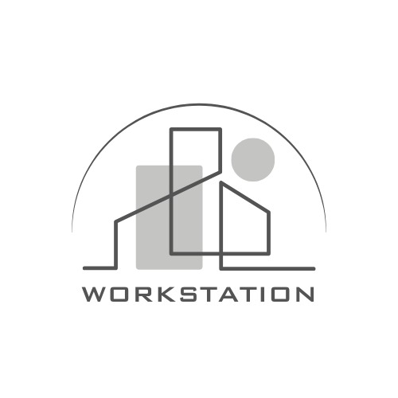                                                                                                                                                                                                                                                                                                                                                                                                                                                                                                       |                                                                                                                                                                                                                                                                                |                                                                                                                                                                                          | 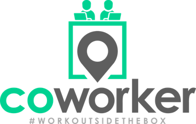                                                                                                                                                                                                                                                                                                                                                                                                                                                                                            |                                                                                                                                                                                                                                                                     |
| **_Perfil_**              | Overview                                                    | Una aplicación web y móvil que ofrece servicios de su arrendaciones a empresas, freelances o startups a nivel mundial.                                                                                                                                                                                                                                                                                                                                                                                                                             | Una aplicación web y móvil que ofrece servicios de su arrendaciones a empresas, freelances o startups a nivel mundial.                                                                                                                                                                                       | Una aplicación web y móvil que ofrece servicios de su arrendaciones a empresas, freelances o startups a nivel mundial.                                                                                                 | Una aplicación web y móvil que ofrece servicios de su arrendaciones a empresas, freelances o startups a nivel mundial.                                                                                                                                                                                                                                                                                                                                                                                                        | Una aplicación web y móvil que ofrece servicios de su arrendaciones a empresas, freelances o startups a nivel mundial.                                                                                                                                                                                    |
|                           | **_Ventaja competitiva ¿Qué valor ofrece a los clientes?_** | Su propósito es conectar a freelancers, trabajadores remotos, startups y empresas de todos los tamaños con espacios de coworking disponibles en su ciudad o alrededor del mundo. La plataforma permitirá a los usuarios buscar, comparar y reservar escritorios, salas de reuniones, oficinas privadas y otros recursos disponibles en tiempo real. Cada espacio contará con información detallada como ubicación, precios, horarios, disponibilidad, fotos, servicios incluidos (Wi-Fi, café, impresoras, etc.), y valoraciones de otros usuarios | Además de servicios básicos como internet de alta velocidad, oficinas en buen estado, impresoras y cafetería ilimitada, también posee espacios flexibles y con diseños modernos, una comunidad global que permite el acceso a evento, networking y acceso a que los miembros del equipo conecten fácilmente. | Posee contratos cortos, membresías mensuales o planes flexibles que beneficien a los clientes. Oficinas con servicios adicionales, ergonómicos y decoración innovadora que ha resaltado al ganar un premio sobre eso.  | Sus funcionalidades mas resaltantes son la búsqueda inteligente que permite a los usuarios buscar y comprar precios de espacios coworking al rededor de mas de 170 paises. Ofrecen un sistema de reseñas y ratings para la comunidad. Asimismo brindan recursos para nómadas digitales, cómo guías de las ciudades de los mejores espacios coworking e información de visas o papeleo. Por ultimo, da la opción de una membresía llamada "Coworker Pass" que brinda acceso casi ilimitado a espacios y descuentos exclusivos. | Busqueda avanzada, como filtros o tipos de espacios. Asimismo birnda una visualizacion de fotos y videos 360. Ofrece oficinas virtuales, que brindan serivicio de gestion de correo y atencion personalizada de llamadas. UNa gran Flexibilidad de contratos desde horas hasta meses sin compromisos.<br> |
| **_Perfil de Marketing_** | **_Mercado objetivo_**                                      | Startups, emprendedores, freelancers, nomadas digitales o empresas tradicionales. Ademas de propietarios de inmuebles que deseen una optimizacion de ocupacion de sus ambientes.                                                                                                                                                                                                                                                                                                                                                                   | Startups, emprendedores, freelancers, nomadas digitales o empresas tradicionales.                                                                                                                                                                                                                            | Startups, emprendedores, freelancers, nómadas digitales.                                                                                                                                                               | Startups, emprendedores, freelancers, nómadas digitales o empresas tradicionales.                                                                                                                                                                                                                                                                                                                                                                                                                                             | Startups, emprendedores, freelancers, nómadas digitales o empresas tradicionales.                                                                                                                                                                                                                         |
|                           | **_Estrategias de marketing_**                              | Las propuestas que tenemos como marketing son las siguientes; anunciar la aplicación web por Google ads y redes sociales como Facebook, Instagram o en grupos de Telegram de Freelancers o Startups.                                                                                                                                                                                                                                                                                                                                               | Se promocionan por redes sociales queriendo expandir su estilo de vida creativo e innovacion en su comunidad de trabajo. Asimismo tienen eventos gracias a sus alianzas estrategicas con Microsoft y Salesforce. Por ultimo, algunos anuncios en Google Ads y SEO.                                           | Contenido en redes sociales, alianzas estratégicas, enfoque de diseño y experiencia y eventos que llaman a los clientes rápidamente.<br><br>                                                                           | La aplicación se promociona con optimización de búsquedas simples en el navegador, publica artículos y reportes acerca del coworking flexible, tiene una gran presencia en redes sociales y posee alianzas estratégicas con Selina, Outside o Airbnb for work.                                                                                                                                                                                                                                                                | Posee una presencia digital activa, con redes sociales y comunidades empresariales en Linkedin y Facebook. Tienen publicidad en Google Ads y remarketing. Por ultimo, tienen alianzas con espacios asociados en eventos conjuntos.                                                                        |
| **_Perfil de Producto_**  | **_Productos & Servicios_**                                 | Ofrecer la comunicación entre freelancers o startups con los propietarios de los inmuebles.                                                                                                                                                                                                                                                                                                                                                                                                                                                        | Ofrecen sus propias oficinas para el uso de cualquier empresa, startup o que su mercado objetivo necesite.                                                                                                                                                                                                   | Ofrecen sus propias oficinas para el uso de cualquier empresa, startup o que su mercado objetivo necesite.                                                                                                             | Ofrecen oficinas de cualquier parte del mundo para el uso de cualquier empresa, startup o que su mercado objetivo necesite.                                                                                                                                                                                                                                                                                                                                                                                                   | Ofrecen oficinas de cualquier parte del mundo para el uso de cualquier empresa, startup o que su mercado objetivo necesite.                                                                                                                                                                               |
|                           | **_Precios & Costos_**                                      | Los precios variaran dependiendo de los propietarios, ellos decidirán el tiempo que puede estar disponible el inmueble y el precio. Asimismo, se incluirán descuentos dependiendo de las fechas o si alguno de las startups o freelancers posee una membresía con nuestra propuesta.                                                                                                                                                                                                                                                               | Los precios varian entre los diferentes paquetes que posee. Los escritorios compartidos varian entre $250 a $500. Mientras que las oficinas privadas desde $800 a $3000. Pero asimismo poseen planes de solo un dia, que varian entre $25 a $30.                                                             | Varian dependiendo de la ubicación, duracion del contrato o tipo de espacio. SIn embargo, Spaces posee una membrecia llamada "Spaces Global Pass" con acceso a multiples ubicaciones que varian desde $400 a $800.<br> | La búsqueda de espacios es gratuita y disponible para todos, sin embargo la membresía tiene un costo de $50 aproximadamente. <br><br>                                                                                                                                                                                                                                                                                                                                                                                         | La empresa cobra a los espacios una comisión del 10-20%, dependiendo del costo del inmueble.<br>                                                                                                                                                                                                          |
|                           | **_Canales de distribución (Web y/o Móvil)_**               | Los canales que usan son su aplicacion web.                                                                                                                                                                                                                                                                                                                                                                                                                                                                                                        | Web/Móvil                                                                                                                                                                                                                                                                                                    | Los canales que usan son su aplicacion web y movil. Asimismo tienen ventas B2B, aliados coorporativos cmom aceleradoras, bancos y gremios empresariales.                                                               | Los canales que usan son su aplicacion web y movil. Sus redes de afiliados, como sus socios apoyan su distribucion.                                                                                                                                                                                                                                                                                                                                                                                                           | Los canales que usan son una aplicación web y móvil que ofrece servicios de su arrendaciones a empresas, freelances o startups a nivel mundial. Agentes telefónicos y aliados comerciales con inmobiliarias y desarrolladores de oficinas.                                                                |
| **_Análisis SWOT_**       | **_Fortalezas_**                                            | Startup innovadora, precios flexibles, diseno innovador y modelo escalable para futuras actualizaciones.                                                                                                                                                                                                                                                                                                                                                                                                                                           | Marca reconocida globalmente, flexibilidad y escalabilidad, red de comunidades profesionales y diseño innovador                                                                                                                                                                                              | Respaldo de IWG (solvencia financiera), diseño premium y experiencia de usuario, red global con sinergias (Regus, Signature) y modelo escalable y rentable                                                             | Modelo escalable sin costos de operar espacios físicos, base de datos global más amplia que competidores, ideal para nómadas digitales (mercado en crecimiento) y reseñas transparentes y comparación de precios                                                                                                                                                                                                                                                                                                              | Enfoque en Latinoamérica (conocimiento local), amplia red de espacios asociados, Asesoría personalizada sin costo y modelo sin costos fijos de operar espacios                                                                                                                                            |
|                           | **_Debilidades_**                                           | Pocos fondos, sin alianzas poderosas, bajos conocimientos del mercado y competidores mas experimentados en el rubro,                                                                                                                                                                                                                                                                                                                                                                                                                               | Dependencia de arrendamientos caros, alto endeudamiento, mala gestión financiera histórica y perdida de confianza post-bancarrota                                                                                                                                                                            | Menor reconocimiento global vs. WeWork, precios más altos que competidores locales, menor enfoque en "comunidad" que WeWork y crecimiento más lento que startups independientes                                        | Dependencia de espacios asociados (calidad variable), menor reconocimiento frente a marcas como WeWork, ingresos limitados si no aumenta volumen de reservas y Competencia con plataformas de reservas de espacios (ej. Deskpass)                                                                                                                                                                                                                                                                                             | Menor reconocimiento fuera de la región, dependencia de la calidad de los espacios listados, Competencia con plataformas globales (Coworker.com) y rentabilidad limitada si no escala el volumen de transacciones                                                                                         |
|                           | **_Oportunidades_**                                         | Expansion en un mercado emergente como lo seria Latino america, ideas frescas para revolucionar el mercado y futuras alianzas en camino.                                                                                                                                                                                                                                                                                                                                                                                                           | Modelo híbrido post-pandemia, expansión en mercados emergentes y alianzas con gobiernos para espacios públicos                                                                                                                                                                                               | Demanda de espacios híbridos post-pandemia, expansión en Asia y Latinoamérica y alianzas con grandes corporaciones                                                                                                     | Crecimiento del trabajo remoto y nómadas digitales, alianzas con gobiernos para promocionar destinos "workation" y expansión a mercados emergentes (Asia, Latinoamérica)                                                                                                                                                                                                                                                                                                                                                      | Crecimiento del trabajo híbrido en LATAM, alianzas con gobiernos para impulsar emprendimiento y expansión a ciudades secundarias con demanda creciente                                                                                                                                                    |
|                           | **_Amenazas_**                                              | Competencia, pocos recursos que no se puedan recuperar a corto plazo y cambios en tendencias laborales.                                                                                                                                                                                                                                                                                                                                                                                                                                            | Competencia (Spaces o locales independientes), crisis económicas reducen demanda y cambios en tendencias laborales (remote-first)                                                                                                                                                                            | Competencia de WeWork (reestructurada) y actores locales, recesión económica afecta demanda de espacios premium y cambio hacia el trabajo remoto permanente                                                            | Espacios que prefieren vender directamente (evitar comisiones), plataformas más grandes (ej. Airbnb) integrando coworking y saturación de marketplaces de coworking                                                                                                                                                                                                                                                                                                                                                           | Espacios que prefieren gestionar reservas directamente, entrada de competidores globales (ej. WeWork), crisis económicas que reduzcan la demanda de oficinas                                                                                                                                              |

### 2.1.2. Estrategias y tácticas frente a competidores

| **_MATRIZ FODA y C.A.M.E_**                                                   | **Oportunidades:** Modelo hibrido post pandemia                                                                                                                                               | **Amenazas:** posibles cambios a trabajo remoto permanentemente                                                                                                |
| ----------------------------------------------------------------------------- | --------------------------------------------------------------------------------------------------------------------------------------------------------------------------------------------- | -------------------------------------------------------------------------------------------------------------------------------------------------------------- |
| **Fortalezas:** Innovacion, publico objetivo más amplio y mayor escalabilidad | Debido al modelo hibrido podríamos expandirnos debido a que nuestro publico objetivo llega a ser mas amplio que otros competidores, además de poder innovar en este mercado no tan explorado. | Tener en cuenta que habran mas espacios libres para otros rubros, por lo que se podrian usar de maneras diferentes en otras actividades que puedan ser utiles. |
| **Debilidades:** Sin alianzas poderosas como los competidores.                | Utilizar la oportunidad de modelo hibrido para promocionar nuestra aplicación a otras y así poder formar alianzas que puedan apoyar al crecimiento de nuestra startup                         | Debido al posible cambio a trabajo remoto permanente, las alianzas que se puedan tener en un futuro pueden seguir utilizandolas para otros rubros.             |

## 2.2. Entrevistas

### 2.2.1. Diseño de entrevistas

**PROPIETARIOS DE INMUEBLES**

 1. Nombre completo
 2. Edad
 3. Distrito de residencia
 4. Profesión
 5. Actualmente, ¿tiene propiedades adicionales disponibles o sin uso en su vivienda actual?
 6. ¿Qué hace con esa(s) propiedad(es)? ¿Tiene algo planeado para hacer?
 7. ¿Qué piensa de los alquileres de oficina como espacios de coworking?
 8. ¿Qué opinaría de una aplicación que conecta a dueños de espacios en alquiler con empresas que buscan alquilar estos espacios? Estaría dispuesto(a) a usarla?
 9.  Que beneficios le gustaría tener a usted dentro de el trato entre usted y la compañía que trabaje en la propiedad?
 10. Que comportamientos o hábitos no estarían dispuesto(a) a aceptar de la compañía/startup que trabaje en su propiedad?
 11. Que funcionalidades le gustaría que tenga esta aplicación web?
 12. ¿De que manera buscaría hacer este espacio uno seguro para ambos?

**FREELANCERS/STARTUPS**

 1. Nombre completo
 2. Edad
 3. Distrito de residencia
 4. Profesión
 5. Actualmente, ¿desde donde trabaja?
 6.  Cree que el lugar donde trabajan afecta la productividad de su trabajo?
 7. Que es lo que busca en un lugar de trabajo?
 8. ¿Ha escuchado hablar de los espacios de coworking?
 9. ¿Qué opinaría de alquilar un espacio destinado para trabajar?
 10. ¿Qué opinaría de una aplicación que le ofrezca la posibilidad de conectarlo con varios de estos espacios disponibles?
 11. Que funcionalidades cree que debería tener una aplicación como esta?
 12. ¿De que manera buscaría hacer este espacio uno seguro para ambas partes?

### 2.2.2. Registro de entrevistas

**Segmento 1 - Propietario de inmuebles**

[](https://upcedupe-my.sharepoint.com/:v:/g/personal/u202312447_upc_edu_pe/EcZwK3uJNLBBu4dhWzNRIj4BEVNuC39nTnqBl2JJrdevFA?e=6FLXLY&nav=eyJyZWZlcnJhbEluZm8iOnsicmVmZXJyYWxBcHAiOiJTdHJlYW1XZWJBcHAiLCJyZWZlcnJhbFZpZXciOiJTaGFyZURpYWxvZy1MaW5rIiwicmVmZXJyYWxBcHBQbGF0Zm9ybSI6IldlYiIsInJlZmVycmFsTW9kZSI6InZpZXcifX0%3D)

**Entrevistada:** Uziel procopio 
**Edad:** 25 años  
**Ocupación:** Desarrollador full stack y dueño de un arbnb  
**Ubicación:** México – cancún  
**Medio:** Discord  
**Entrevistador:** Arturo Saravia

🎬 **Inicio del video:** 0:04  
⏱️ **Duración:** 10 minutos 

Enlace del video de la entrevista:https://upcedupe-my.sharepoint.com/:v:/g/personal/u202312447_upc_edu_pe/EcZwK3uJNLBBu4dhWzNRIj4BEVNuC39nTnqBl2JJrdevFA?e=6FLXLY&nav=eyJyZWZlcnJhbEluZm8iOnsicmVmZXJyYWxBcHAiOiJTdHJlYW1XZWJBcHAiLCJyZWZlcnJhbFZpZXciOiJTaGFyZURpYWxvZy1MaW5rIiwicmVmZXJyYWxBcHBQbGF0Zm9ybSI6IldlYiIsInJlZmVycmFsTW9kZSI6InZpZXcifX0%3D

[](https://upcedupe-my.sharepoint.com/:v:/g/personal/u202312447_upc_edu_pe/EeL9eXkRxqJCm57X7HqQ1doBe2BQ7qy3Bc249YAmjYvEMA?e=AChHuQ&nav=eyJyZWZlcnJhbEluZm8iOnsicmVmZXJyYWxBcHAiOiJTdHJlYW1XZWJBcHAiLCJyZWZlcnJhbFZpZXciOiJTaGFyZURpYWxvZy1MaW5rIiwicmVmZXJyYWxBcHBQbGF0Zm9ybSI6IldlYiIsInJlZmVycmFsTW9kZSI6InZpZXcifX0%3D)

**Entrevistada:** Ivan Antonio Almeida Aguilar 
**Edad:** 20 años  
**Ocupación:** Dueño de un arbnb  
**Ubicación:** Lima - San Miguel 
**Medio:** Discord  
**Entrevistador:** Arturo Saravia

🎬 **Inicio del video:** 0:04  
⏱️ **Duración:** 10 minutos 

Enlace de la entrevista: https://upcedupe-my.sharepoint.com/:v:/g/personal/u202312447_upc_edu_pe/EeL9eXkRxqJCm57X7HqQ1doBe2BQ7qy3Bc249YAmjYvEMA?e=AChHuQ&nav=eyJyZWZlcnJhbEluZm8iOnsicmVmZXJyYWxBcHAiOiJTdHJlYW1XZWJBcHAiLCJyZWZlcnJhbFZpZXciOiJTaGFyZURpYWxvZy1MaW5rIiwicmVmZXJyYWxBcHBQbGF0Zm9ybSI6IldlYiIsInJlZmVycmFsTW9kZSI6InZpZXcifX0%3D


**Segmento 2 - Freelancers**


**Link de la entrevista:** [Link-Entrevista](https://youtu.be/SHj6_AyGAPc)
**Entrevistado:** Miguel Quijada
**Edad:** 44 años  
**Ocupación:** Ingeniero de Software
**Ubicación:** Lima – Ate  
**Medio:** Zoom  
**Entrevistador:** Jeremy Quijada


**Link de la entrevista:** https://upcedupe-my.sharepoint.com/:v:/g/personal/u202311912_upc_edu_pe/Efz2Y4-1p-hLj_WNhkofgtMBCQkmof5CpqvoXhucUzjrCg?nav=eyJyZWZlcnJhbEluZm8iOnsicmVmZXJyYWxBcHAiOiJTdHJlYW1XZWJBcHAiLCJyZWZlcnJhbFZpZXciOiJTaGFyZURpYWxvZy1MaW5rIiwicmVmZXJyYWxBcHBQbGF0Zm9ybSI6IldlYiIsInJlZmVycmFsTW9kZSI6InZpZXcifX0%3D&e=0r0VKH

**Entrevistado:** Sonia Rengifo 

**Edad:** 54 años  

**Ocupación:** Ingeniero de Sistemas

**Ubicación:** Lima – Pueblo libre  

**Medio:** Zoom  

**Entrevistador:** Leonardo Cumba


### 2.2.3. Análisis de entrevistas

#### Freelancers

En las entrevistas para este segmento objetivo, los usuarios han utilizado con anterioridad espacios coworking para trabajar en las empresas que trabajan o de forma independiente para sus propias necesidades. Con las preguntas hemos logrado identificar que ellos estarian interesados en una aplicacion como esta y añaden que las funcionalidades que se esperan son las siguientes:

- Localicacion de espacios de trabajo
- Filtros de busqueda personalizados (Filtros como, cantidad de aforo, funcionalidad del espacio y facilidades servicios incluidos (Wi-Fi, café, impresoras, etc.))
- Valoraciones por otros usuarios
- Fotos de los inmuebles
- Calendario de disponibilidad para reservas

#### Propietarios de inmuebles

En las entrevistas de este segmento objetivo, recalcan que la aplicacion seria de mucha ayuda para encontrar a los inquilinos correctos de manera rapida, debido a que pueden decidir de una gran variedad de personas o empresas para que puedan usar estos lugares. Asimismo, Creen que la aplicacion web deberia ser de facil entendimiento para que puedan recibir los pagos adecuadamente. Algunas funcionalidades que agregaron para la aplicacion serian las siguientes:

- Contrato flexible
- Que se pueda modificar las publicaciones de manera sencilla
- Verificacion de perfiles para mas seguridad
- Sistema de pago seguro
- Chat para que haya una comunicacion activa

## 2.3. Needfinding

### 2.3.1. User Personas

Para esta sección hemos tomado en cuenta dos User Persona que corresponden a los dos segmentos objetivos nombrados anteriormente: los propietarios de inmuebles y los trabajadores independientes.


### 2.3.2. User Task Matrix (AS-IS)

Estamos considerando los segmentos objetivos **"Propietario de Inmueble"** y **"Trabajador independiente / Freelancer"** como fueron definidos anteriormente en los User Personas.

#### **Leyenda — Escalas**
- **Importancia:** 1 (Baja) · 2 (Moderada) · 3 (Importante) · 4 (Muy importante) · 5 (Crítica)  
- **Frecuencia:** D (Diaria), S (Semanal), M (Mensual), O (Ocasional), R (Rara)  
- **Cómo se calcula Prioridad:** combinación heurística de Importancia + Frecuencia → **Alta / Media / Baja**


#### a) Trabajador independiente / Freelancer (AS-IS)
| Tarea (hoy) | Importancia (1–5) | Frecuencia | Prioridad | Canal actual | Dolor / Riesgo | Acción recomendada (AS-IS) |
|---|---:|:---:|:---:|---|---|---|
| Buscar espacios en Google / Maps | 5 | D | Alta | Buscador / Maps | Información dispersa, resultados irrelevantes | Documentar fuentes frecuentes; usar búsquedas guiadas |
| Pedir recomendaciones a colegas / grupos | 4 | S | Alta | Grupos FB / WhatsApp / LinkedIn | Respuestas sesgadas o tardías | Mantener lista de contactos confiables; validar referencias |
| Revisar fotos, precios y descripciones en webs/IG | 4 | O | Media | Webs/Instagram / Facebook | Fotos malas o info incompleta | Solicitar más fotos; preguntar por detalles antes de reservar |
| Contactar al local para confirmar disponibilidad | 5 | O | Alta | WhatsApp / llamada / formulario | Respuestas lentas, errores en horarios | Confirmar horario y guardar captura de la conversación |
| Negociar precio y condiciones | 4 | O | Media | Chat / llamada | Malentendidos; políticas poco claras | Acordar condiciones por escrito (mensaje/email) |
| Pagar (transferencia/e-wallet) y recibir comprobante | 5 | O | Alta | Transferencia banc., Yape, efectivo | Comprobantes perdidos; conciliación manual | Guardar comprobante; solicitar confirmación escrita |
| Llegar y hacer check-in (revisión del espacio) | 3 | O | Media | Presencial / recepción | Reglas no claras, conflictos por uso | Tomar fotos al ingreso; revisar reglas por escrito |
| Reportar incidencias (wifi, ruido, limpieza) | 4 | O | Media | WhatsApp / teléfono | Tiempos de respuesta largos | Documentar incidencias; escalar si no hay respuesta |
| Dejar reseña o feedback (si procede) | 2 | R | Baja | Google / redes sociales | Baja tasa de reseñas → menos confianza colectiva | Incentivar feedback (recordatorio tras uso) |
| Guardar favoritos / hacer seguimiento de una opción | 2 | S | Baja | Marcadores del navegador / notas | Difícil seguir cambios de disponibilidad | Mantener registro propio con URLs y capturas |

---

#### b) Propietario de inmueble / Host (AS-IS)
| Tarea (hoy) | Importancia (1–5) | Frecuencia | Prioridad | Canal actual | Dolor / Riesgo | Acción recomendada (AS-IS) |
|---|---:|:---:|:---:|---|---|---|
| Preparar fotos y descripción del espacio | 5 | O | Alta | Cámara / Canva / Word | Fotos de baja calidad que reducen interés | Crear checklist mínimo de fotos y descripción |
| Publicar anuncio (FB, Marketplace, OLX, IG) | 5 | S | Alta | FB Marketplace / Grupos / OLX / IG | Moderaciones, baja visibilidad, esfuerzo manual | Registrar plantillas de publicación para reutilizar |
| Responder consultas de potenciales inquilinos | 5 | D | Alta | WhatsApp / llamadas / mensajes privados | Respuestas tardías → pérdida de leads | Establecer horario de respuesta y mensajes plantilla |
| Llevar disponibilidad en agenda o Excel | 4 | S | Alta | Excel / Google Calendar / Agenda física | Doble reserva, errores humanos | Sincronizar calendarios; rutinas de control diario |
| Confirmar y gestionar reservas (manual) | 5 | D | Alta | WhatsApp / llamada / transferencia | Cancelaciones, no-shows, falta de trazabilidad | Solicitar depósito/anticipo; registrar comprobantes |
| Cobrar y conciliar pagos | 5 | M | Alta | Transferencia / Yape / Efectivo | Impagos o dificultad para conciliar | Mantener registro de pagos; comprobantes digitales |
| Verificar perfil del inquilino (informal) | 4 | O | Media | Solicitar DNI / referencias | Riesgo de fraude o daño al inmueble | Solicitar referencias y/o depósito de seguridad |
| Entregar llaves / acceso y check-in | 4 | O | Media | Presencial / portería / encargo | No-show o retrasos que afectan al siguiente cliente | Confirmar horario de llegada y plan alterno |
| Atender incidencias y mantenimiento | 4 | O | Media | WhatsApp / proveedor de servicios | Costos operativos y tiempos de respuesta | Tener lista de proveedores y SLA informal |
| Revisar y responder reseñas | 3 | M | Media | Google / Facebook / IG | Baja interacción → percepción pobre del servicio | Responder reseñas clave; solicitar feedback activo |

---

**Conclusión (AS-IS):**  
La mayoría de las tareas actuales de freelancers y propietarios se realizan de forma **manual y distribuida en múltiples canales** (WhatsApp, Google, redes, Excel). Esto provoca fricción: demora en confirmaciones, riesgo de doble reserva, mala calidad de información y dificultad para conciliar pagos. Las acciones recomendadas en esta matriz son medidas prácticas y aplicables hoy para mitigar riesgos sin depender de una solución técnica inmediata (ej. plantillas, checklist, captura de comprobantes, sincronización de calendarios).

### 2.3.3. User Journey Mapping
Este conjunto de Customer Journey Maps presenta de forma conjunta el recorrido end-to-end de los dos segmentos clave: usuarios buscadores de espacios (freelancers y startups) y propietarios/hosts. El mapa cubre las etapas principales del ciclo de valor y articula, para cada etapa, acciones, pensamientos, emociones, puntos de contacto y problemas. Su objetivo es revelar los momentos donde la fricción impacta conversión, ocupación y satisfacción, y a su vez identificar oportunidades concretas. Use este mapa para derivar user stories, priorizar intervenciones por impacto y definir los KPIs iniciales a medir.

#### Customer Journey Map — Freelancers / Startups
<p align="center">
  
</p>

#### Customer Journey Map — Propietarios / Hosts
<p align="center">

</p>

### 2.3.4. Empathy Mapping

**Freelancers**
<p align="center">
  
</p>

**Propietarios de Inmuebles**

<p align="center">

</p>

### 2.3.5. As-is Scenario Mapping
**Freelancers**
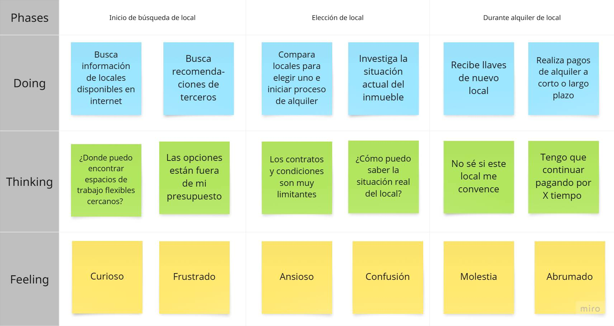

**Propietarios de Inmuebles**
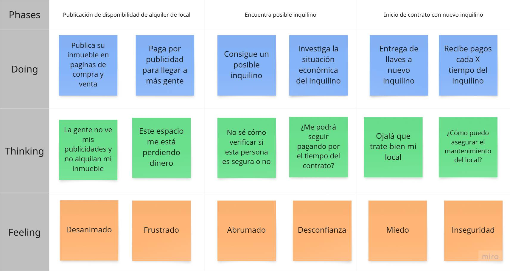

## 2.4. Big Picture Event Storming. 
El Big Event Storybranding es una metodología estratégica que permite construir marcas sólidas y memorables a través de una narrativa coherente y emocionalmente conectada con el público. Este enfoque integra análisis de mercado, definición de identidad, y planificación de comunicación para transformar cada interacción con la marca en una experiencia significativa. A través de este logramos realizar lo siguiente:


La imagen muestra el proceso de Storybranding dividido por colores y etapas. Los colores representan los diferentes niveles de detalle y la narrativa se divide en etapas para crear una experiencia emocionalmente conectada con el público.

## 2.5. Ubiquitous Language

| Término      | Definición                                                                                                  |
| ------------ | ----------------------------------------------------------------------------------------------------------- |
| Workspace    | Un espacio físico disponible para alquiler como sitio de trabajo.                                           |
| Coworking    | Una modalidad de trabajo donde personas de distintas empresas comparten un mismo workspace.                 |
| Host         | La persona que ofrece su propiedad en alquiler.                                                             |
| Renter       | La persona que alquila este espacio.                                                                        |
| Booking      | Confirmación de un alquiler hecho por un Renter de un Workspace por un periodo de tiempo.                   |
| Rate         | La tarifa por día o por semana para alquilar el Workspace.                                                  |
| Amenities    | Adicionales que ofrezca el host como parte del Workspace. Por ejemplo, WiFi, café, aire acondicionado, etc. |
| Listing      | La publicación de un Workspace disponible incluyendo detalles como ubicación, fotos, Rates y Amenities.     |
| Check-in     | El momento en que comienza el uso del Workspace.                                                            |
| Check-out    | El momento en el que finaliza el uso del Workspace.                                                         |
| Cancellation | La anulación de una reserva, por parte de Host o Renter.                                                    |
| Contract     | El contrato que se realiza entre Renter y Host.                                                             |
| Review       | Las reseñas dadas del Renter al Host después del uso del Workspace, visibles para otros usuarios.           |

# Capitulo III: Requirements Specification

## 3.1. User Stories


| User Story ID | Título | Descripción | Criterios de Aceptación | Epic ID |
| :---- | :---- | :---- | :---- | :---- |
| US-01 | Búsqueda en Hero | Como visitante, quiero buscar por distrito/ciudad y fecha desde el hero para ver espacios disponibles. | Escenario 1: Búsqueda desde Hero. Como usuario, Dado que estoy en la landing, Cuando escribo 'Miraflores' y fecha/hora y presiono Buscar, Entonces soy redirigido a Resultados con filtros aplicados. Escenario 2: Sugerencias de ubicación. Como usuario, Dado que tipeo 3+ caracteres, Cuando existen coincidencias, Entonces veo sugerencias y puedo seleccionarlas. | EP-01 |
| US-02 | Header claro | Como visitante, quiero un header con enlaces Explorar, Publica tu espacio e Ingresar para orientarme fácilmente. | Escenario 1: Header sticky. Como usuario, Dado que hago scroll, Cuando la página se desplaza, Entonces el header permanece visible. Escenario 2: Accesibilidad. Como usuario, Dado que navego con teclado, Cuando tabulo por el header, Entonces puedo acceder a todos los enlaces con foco visible. | EP-01 |
| US-03 | Espacios destacados | Como visitante, quiero ver tarjetas de espacios destacados con imagen, precio desde y CTA. | Escenario 1: Cards visibles. Como usuario, Dado que cargo la landing, Cuando hay destacados, Entonces veo al menos 4 cards con imagen, título, precio y botón. Escenario 2: Navegar a resultados. Como usuario, Dado que presiono 'Descubre más', Cuando hago clic, Entonces navego a Resultados con el filtro correspondiente. | EP-01 |
| US-04 | Sección testimonios | Como visitante, quiero ver testimonios reales para ganar confianza antes de registrarme. | Escenario 1: Carrusel accesible. Como usuario, Dado que estoy en la sección, Cuando uso teclas de flecha o swipe, Entonces el carrusel avanza. Escenario 2: Datos visibles. Como usuario, Dado que hay testimonios, Cuando se renderizan, Entonces cada slide muestra nombre, foto y calificación. | EP-01 |
| US-05 | FAQ acordeón | Como visitante, quiero un acordeón de preguntas frecuentes para resolver dudas. | Escenario 1: Expandir/cerrar. Como usuario, Dado que estoy en FAQ, Cuando hago clic o presiono Enter en una pregunta, Entonces se expande y cierra otras abiertas. Escenario 2: Filtro de preguntas. Como usuario, Dado que escribo en el buscador, Cuando hay coincidencias, Entonces solo se muestran las preguntas que coinciden. | EP-01 |
| US-06 | Footer con políticas y contacto | Como visitante, quiero acceder a términos, privacidad y contactos desde el pie de página. | Escenario 1: Enlaces correctos. Como usuario, Dado que presiono un enlace del footer, Cuando navego, Entonces llego a la página de política seleccionada. Escenario 2: Redes sociales. Como usuario, Dado que selecciono un ícono de red, Cuando se abre, Entonces se abre en nueva pestaña el perfil oficial. | EP-01 |
| US-07 | SEO básico | Como visitante, quiero títulos, metadescripciones y etiquetas OG correctas para que la página se comparta bien. | Escenario 1: Metadatos presentes. Como usuario, Dado que inspecciono la landing, Cuando reviso el head, Entonces existen title, description e imagen OG válidos. Escenario 2: Vista previa social. Como usuario, Dado que comparto la URL, Cuando un bot lee, Entonces se muestra la vista previa con imagen y texto. | EP-01 |
| US-08 | Banner de cookies | Como visitante, quiero aceptar o rechazar cookies opcionales para controlar mi privacidad. | Escenario 1: Aceptar cookies. Como usuario, Dado que aparece el banner, Cuando presiono 'Aceptar', Entonces se guarda el consentimiento y desaparece. Escenario 2: Configurar cookies. Como usuario, Dado que presiono 'Configurar', Cuando desactivo analíticas, Entonces la preferencia queda guardada. | EP-01 |
| US-09 | Animaciones sutiles | Como visitante, quiero microinteracciones en UI sin afectar el rendimiento. | Escenario 1: Hover en cards. Como usuario, Dado que paso el mouse sobre una card, Cuando ocurre la interacción, Entonces se eleva con sombra suave. Escenario 2: Performance. Como usuario, Dado que corro una auditoría, Cuando reviso p95, Entonces no se degrada por las animaciones. | EP-01 |
| US-10 | Barra global de búsqueda | Como usuario, quiero autocompletado de ciudades, distritos y espacios para acelerar la búsqueda. | Escenario 1: Autocompletar. Como usuario, Dado que escribo, Cuando existen coincidencias, Entonces veo sugerencias y puedo elegir una. Escenario 2: Historial reciente. Como usuario, Dado que ya busqué antes, Cuando enfoco el campo, Entonces veo mis búsquedas recientes. | EP-02 |
| US-11 | Lista \+ mapa sincronizados | Como usuario, quiero una lista de resultados y un mapa sincronizado para explorar por zona. | Escenario 1: Sincronía. Como usuario, Dado que muevo el mapa, Cuando cambia el viewport, Entonces la lista se actualiza con los espacios visibles. Escenario 2: Popover de marcador. Como usuario, Dado que hago clic en un marcador, Cuando se abre el popover, Entonces veo precio, capacidad y enlace a la ficha. | EP-02 |
| US-12 | Filtros con chips | Como usuario, quiero filtrar por capacidad, precio, tipo y amenities y ver chips activos. | Escenario 1: Aplicar filtro. Como usuario, Dado que abro filtros, Cuando selecciono capacidad y Wi‑Fi, Entonces se actualizan resultados y aparecen chips. Escenario 2: Limpiar filtros. Como usuario, Dado que hay filtros activos, Cuando presiono 'Limpiar todo', Entonces desaparecen los chips y vuelven resultados generales. | EP-02 |
| US-13 | Ordenamiento | Como usuario, quiero ordenar resultados por precio, distancia y rating para priorizar opciones. | Escenario 1: Precio ascendente. Como usuario, Dado que elijo 'Precio ascendente', Cuando se actualiza la lista, Entonces las cards aparecen de menor a mayor precio. Escenario 2: Mantener filtros. Como usuario, Dado que ya apliqué filtros, Cuando cambio el orden, Entonces los filtros se conservan. | EP-02 |
| US-14 | Paginación / Infinite scroll | Como usuario, quiero cargar más resultados sin recargar la página para una navegación fluida. | Escenario 1: Auto-carga. Como usuario, Dado que llego al final de la lista, Cuando hago scroll, Entonces se cargan más resultados automáticamente. Escenario 2: Estado final. Como usuario, Dado que no hay más elementos, Cuando llego al final, Entonces se muestra 'No hay más resultados'. | EP-02 |
| US-15 | State in URL y compartir | Como usuario, quiero que filtros, orden y página se reflejen en la URL para compartir la búsqueda. | Escenario 1: Parámetros en URL. Como usuario, Dado que aplico filtros, Cuando copio la URL, Entonces incluye los parámetros activos. Escenario 2: Restaurar búsqueda. Como usuario, Dado que abro la URL compartida, Cuando cargo la página, Entonces los filtros vuelven a aplicarse. | EP-02 |
| US-16 | Geolocalización 'cerca de mí' | Como usuario, quiero centrar el mapa cerca de mi ubicación para ver opciones cercanas. | Escenario 1: Permiso concedido. Como usuario, Dado que acepto compartir ubicación, Cuando presiono 'Cerca de mí', Entonces el mapa centra y filtra por radio cercano. Escenario 2: Permiso denegado. Como usuario, Dado que rechazo permisos, Cuando presiono 'Cerca de mí', Entonces veo un mensaje con alternativa de ingresar distrito. | EP-02 |
| US-17 | Cards de resultados | Como usuario, quiero cards con foto, nombre, precio desde y rating para comparar rápidamente. | Escenario 1: Skeletons. Como usuario, Dado que los datos aún no llegan, Cuando se renderiza la página, Entonces veo skeletons en lugar de cards. Escenario 2: Navegación a ficha. Como usuario, Dado que hago clic en una card, Cuando la selecciono, Entonces navego a la ficha del espacio. | EP-02 |
| US-18 | Comparar hasta 3 espacios | Como usuario, quiero seleccionar hasta 3 espacios para compararlos en una vista lado a lado. | Escenario 1: Agregar a comparación. Como usuario, Dado que estoy en resultados, Cuando marco dos o más espacios, Entonces aparece el botón 'Comparar'. Escenario 2: Vista de comparación. Como usuario, Dado que abro comparar, Cuando se muestra la tabla, Entonces veo columnas con precio, capacidad, amenities y rating. | EP-02 |
| US-19 | Vista de impresión de resultados | Como usuario, quiero imprimir un listado corto de espacios con datos clave. | Escenario 1: Estilos de impresión. Como usuario, Dado que abro 'Imprimir', Cuando se abre el diálogo, Entonces la página usa estilos printer‑friendly. Escenario 2: Selección limitada. Como usuario, Dado que selecciono 1–5 ítems, Cuando imprimo, Entonces solo se incluyen los seleccionados. | EP-02 |
| US-20 | Ficha: galería y detalles | Como usuario, quiero una galería de fotos y descripción completa para evaluar el espacio. | Escenario 1: Navegación de galería. Como usuario, Dado que abro la ficha, Cuando uso teclado o swipe, Entonces puedo recorrer al menos 5 imágenes. Escenario 2: Información clave. Como usuario, Dado que desplazo la página, Cuando llego a detalles, Entonces veo precio, ubicación, amenities y políticas. | EP-03 |
| US-21 | Ficha: calendario de disponibilidad | Como usuario, quiero seleccionar fecha y horas disponibles antes de reservar. | Escenario 1: Selección válida. Como usuario, Dado que hay disponibilidad, Cuando elijo fecha y rango, Entonces el resumen de reserva se actualiza. Escenario 2: Slots ocupados. Como usuario, Dado que existen bloqueos, Cuando veo el calendario, Entonces esos slots aparecen deshabilitados con tooltip y se respetan zonas horarias. | EP-03 |
| US-22 | Ficha: CTA reservar sticky | Como usuario, quiero tener siempre visible el botón 'Reservar' para continuar el flujo. | Escenario 1: Sticky CTA. Como usuario, Dado que hago scroll, Cuando el CTA original sale de vista, Entonces aparece un CTA flotante. Escenario 2: Datos al checkout. Como usuario, Dado que seleccioné fecha/horas, Cuando presiono Reservar, Entonces paso al checkout con datos precargados. | EP-03 |
| US-23 | Checkout paso a paso | Como usuario, quiero un flujo guiado (resumen → datos → pago) con indicador de progreso. | Escenario 1: Progreso persistente. Como usuario, Dado que completo un paso, Cuando regreso atrás o refresco, Entonces los datos permanecen. Escenario 2: Recalcular total. Como usuario, Dado que aplico un cupón o cambio horas, Cuando modifico datos, Entonces el total se actualiza al instante. | EP-03 |
| US-24 | Pago con SDK | Como usuario, quiero ingresar tarjeta de forma segura usando el SDK de la pasarela. | Escenario 1: Validación y 3DS. Como usuario, Dado que escribo mi tarjeta, Cuando el SDK valida y requiere 3‑DS, Entonces completo la autenticación y vuelvo al flujo. Escenario 2: Idempotencia. Como usuario, Dado que refresco en pago, Cuando reintento con el mismo checkoutId, Entonces no se duplica el cobro. | EP-03 |
| US-25 | Confirmación de reserva | Como usuario, quiero ver una pantalla de éxito con código de reserva y CTA para ver mis reservas. | Escenario 1: Datos visibles. Como usuario, Dado que finalizo el pago, Cuando llego a la confirmación, Entonces veo código, fecha/hora y monto. Escenario 2: Agregar a calendario. Como usuario, Dado que presiono 'Agregar a calendario', Cuando elijo proveedor, Entonces se abre con los datos precargados. | EP-03 |
| US-26 | Registro e inicio de sesión | Como usuario, quiero registrarme/iniciar sesión con validaciones y feedback claros. | Escenario 1: Validaciones. Como usuario, Dado que ingreso datos inválidos, Cuando envío el formulario, Entonces veo mensajes debajo de cada campo. Escenario 2: Login exitoso. Como usuario, Dado que mis credenciales son válidas, Cuando envío, Entonces accedo y retorno al flujo previo. | EP-04 |
| US-27 | Recuperar contraseña | Como usuario, quiero poder restablecer mi contraseña vía correo. | Escenario 1: Solicitud enviada. Como usuario, Dado que ingreso mi email, Cuando envío, Entonces recibo confirmación. Escenario 2: Restablecimiento. Como usuario, Dado que abro el enlace del correo, Cuando creo nueva contraseña, Entonces puedo iniciar sesión. | EP-04 |
| US-28 | Perfil del usuario | Como usuario, quiero ver y editar mis datos básicos (nombre, teléfono, foto). | Escenario 1: Editar perfil. Como usuario, Dado que modifico el nombre o teléfono, Cuando guardo, Entonces veo el cambio reflejado. Escenario 2: Subir avatar. Como usuario, Dado que cargo una imagen, Cuando la previsualizo, Entonces puedo recortarla y guardar. | EP-04 |
| US-29 | Preferencias y notificaciones | Como usuario, quiero configurar idioma y notificaciones por email. | Escenario 1: Idioma. Como usuario, Dado que selecciono EN o ES, Cuando confirmo, Entonces toda la UI cambia sin recargar. Escenario 2: Notificaciones. Como usuario, Dado que activo 'Recordatorios', Cuando guardo, Entonces la preferencia queda aplicada. | EP-04 |
| US-30 | Mis reservas (listado) | Como usuario, quiero ver mi historial y próximos eventos con estados claros. | Escenario 1: Estados. Como usuario, Dado que abro 'Mis reservas', Cuando hay registros, Entonces veo 'Confirmada', 'Pendiente' o 'Cancelada'. Escenario 2: Estado vacío. Como usuario, Dado que no tengo reservas, Cuando abro la sección, Entonces veo un mensaje con CTA 'Buscar espacios'. | EP-05 |
| US-31 | Cancelar reserva (UI) | Como usuario, quiero cancelar mi reserva seleccionando el motivo y viendo la política aplicable. | Escenario 1: Motivo y política. Como usuario, Dado que abro 'Cancelar', Cuando elijo un motivo, Entonces se muestra la ventana gratuita o cargo aplicable antes de confirmar. Escenario 2: Estado actualizado. Como usuario, Dado que confirmo cancelación, Cuando vuelvo a Mis reservas, Entonces el estado aparece como 'Cancelada'. | EP-05 |
| US-32 | Recibos/Comprobante imprimible | Como usuario, quiero ver mi comprobante en una vista imprimible/descargable (PDF). | Escenario 1: Vista y estilos. Como usuario, Dado que abro una reserva, Cuando presiono 'Ver comprobante', Entonces se abre un modal/URL con versión de impresión legible. Escenario 2: PDF descargable. Como usuario, Dado que presiono 'Descargar', Cuando se procesa, Entonces obtengo el PDF con logo, RUC, moneda e impuestos. | EP-05 |
| US-33 | Favoritos (wishlist) | Como usuario, quiero guardar y quitar favoritos para decidir más tarde. | Escenario 1: Guardar favorito. Como usuario, Dado que estoy en una card, Cuando presiono el icono de estrella, Entonces el espacio queda en Favoritos. Escenario 2: Quitar favorito. Como usuario, Dado que tengo favoritos, Cuando abro la lista, Entonces puedo quitar elementos. | EP-06 |
| US-34 | Reseñar un espacio | Como usuario, quiero calificar con estrellas y escribir un comentario tras mi estancia. | Escenario 1: Calificación requerida. Como usuario, Dado que intento enviar sin rating, Cuando presiono 'Publicar', Entonces aparece un error indicando completar la calificación. Escenario 2: Publicación exitosa. Como usuario, Dado que completo rating y comentario, Cuando envío, Entonces veo la reseña creada y el promedio se actualiza. | EP-06 |
| US-35 | Centro de ayuda (UI) | Como usuario, quiero buscar artículos de ayuda y abrir un ticket por canal definido. | Escenario 1: Buscar artículo. Como usuario, Dado que escribo en el buscador, Cuando hay coincidencias, Entonces se listan artículos relevantes. Escenario 2: Contactar soporte. Como usuario, Dado que no resuelvo mi duda, Cuando presiono 'Contactar soporte', Entonces puedo abrir un ticket o email. | EP-06 |
| US-36 | Selector de moneda | Como usuario, quiero elegir mi moneda para ver precios entendibles. | Escenario 1: Cambio de moneda. Como usuario, Dado que elijo USD en el selector, Cuando se actualiza, Entonces los precios se muestran en USD con redondeo visible. Escenario 2: Persistencia. Como usuario, Dado que cierro sesión, Cuando vuelvo, Entonces la preferencia de moneda se recuerda. | EP-07 |
| US-37 | Dark mode | Como usuario, quiero alternar entre modo claro y oscuro para comodidad visual. | Escenario 1: Toggle. Como usuario, Dado que presiono el switch de tema, Cuando cambio a oscuro, Entonces la UI aplica el nuevo tema. Escenario 2: Persistencia. Como usuario, Dado que elijo oscuro, Cuando regreso a la app, Entonces se mantiene el modo. | EP-07 |
| US-38 | Breadcrumbs | Como usuario, quiero migas de pan para saber dónde estoy y volver fácilmente. | Escenario 1: Rastro visible. Como usuario, Dado que estoy en la ficha, Cuando miro el encabezado, Entonces veo Inicio \> Resultados \> Ficha. Escenario 2: Retorno a resultados. Como usuario, Dado que hago clic en 'Resultados', Cuando navego, Entonces retorno a la lista con filtros preservados. | EP-07 |
| US-39 | Accesibilidad: navegación por teclado | Como usuario con movilidad reducida, quiero operar toda la UI con teclado. | Escenario 1: Orden lógico. Como usuario, Dado que tabulo por la página, Cuando avanzo, Entonces el foco sigue un orden lógico y visible. Escenario 2: Saltar al contenido. Como usuario, Dado que uso teclado, Cuando presiono 'Skip to content', Entonces salto a la sección principal. | EP-08 |
| US-40 | Accesibilidad: ARIA y lectores | Como usuario de lector de pantalla, quiero etiquetas y roles adecuados. | Escenario 1: Roles correctos. Como usuario, Dado que reviso componentes, Cuando uso lector, Entonces los roles/labels están correctos. Escenario 2: Alertas en vivo. Como usuario, Dado que ocurre un error de validación, Cuando aparece el mensaje, Entonces se anuncia por aria-live. | EP-08 |
| US-41 | Rendimiento: imágenes responsivas | Como usuario, quiero que las imágenes usen srcset/lazy-loading para cargar más rápido. | Escenario 1: Lazy load. Como usuario, Dado que hago scroll, Cuando una imagen entra al viewport, Entonces se carga en ese momento. Escenario 2: LCP móvil. Como usuario, Dado que entro a Resultados o Ficha, Cuando se mide rendimiento, Entonces LCP ≤ 2.5s en móvil típico. | EP-08 |
| US-42 | Rendimiento: caching y skeletons | Como usuario, quiero ver skeletons y aprovechar cache para percibir rapidez. | Escenario 1: Skeleton visible. Como usuario, Dado que abro Resultados, Cuando aún no hay datos, Entonces veo skeletons. Escenario 2: Cache al volver. Como usuario, Dado que regreso a una lista vista, Cuando vuelvo atrás, Entonces la UI muestra datos desde cache mientras revalida. | EP-08 |
| US-43 | Responsive design | Como usuario móvil, quiero que todas las vistas sean usables en pantallas pequeñas. | Escenario 1: Breakpoints. Como usuario, Dado que uso un dispositivo \<640px, Cuando navego, Entonces la UI no desborda ni se corta. Escenario 2: Áreas táctiles. Como usuario, Dado que estoy en móvil, Cuando interactúo con CTAs, Entonces tienen área táctil mínima recomendada. | EP-08 |
| US-44 | Design System base | Como equipo, quiero un set de componentes reutilizables (botones, inputs, cards, modales). | Escenario 1: Catálogo. Como usuario, Dado que abro el catálogo, Cuando reviso un componente, Entonces veo ejemplos y props. Escenario 2: Consistencia. Como usuario, Dado que renderizo pantallas, Cuando las comparo, Entonces se mantiene tipografía, colores y espaciados. | EP-08 |
| US-45 | Manejo de errores global | Como usuario, quiero mensajes de error consistentes con opción de reintento. | Escenario 1: Error API. Como usuario, Dado que ocurre 5xx, Cuando ocurre, Entonces veo banner con 'Reintentar'. Escenario 2: Páginas 404/500. Como usuario, Dado que ingreso ruta inválida, Cuando carga, Entonces veo página de error con enlace a Inicio. | EP-08 |
| US-46 | PWA: instalación | Como usuario, quiero instalar la app como PWA para acceso rápido. | Escenario 1: Instalación. Como usuario, Dado que estoy en Chrome Android, Cuando presiono 'Agregar a inicio', Entonces la app se instala con icono y splash. Escenario 2: Actualización SW. Como usuario, Dado que hay nueva versión, Cuando el SW la detecta, Entonces veo aviso para actualizar. | EP-09 |
| US-47 | Offline básico (fallback) | Como usuario, quiero ver un fallback útil cuando estoy sin conexión. | Escenario 1: Vista offline. Como usuario, Dado que pierdo conexión, Cuando navego a una ruta, Entonces aparece una página offline con opción 'Reintentar'. Escenario 2: Caché de shell. Como usuario, Dado que abro la app sin red, Cuando el SW tiene shell cacheado, Entonces la UI base carga y comunica estado offline. | EP-09 |
| US-48 | Notificaciones opt‑in (reservas) | Como usuario, quiero recibir notificaciones sobre cambios de mis reservas si acepto permisos. | Escenario 1: Opt‑in. Como usuario, Dado que acepto notificaciones, Cuando se registra el token, Entonces recibo un aviso de prueba. Escenario 2: Opt‑out. Como usuario, Dado que desactivo notificaciones, Cuando guardo, Entonces dejo de recibir avisos. | EP-09 |
| US-49 | Copiar enlace/Compartir | Como usuario, quiero copiar el enlace de una ficha o búsqueda desde la UI. | Escenario 1: Copiar enlace. Como usuario, Dado que presiono 'Copiar', Cuando el navegador lo permite, Entonces el enlace queda en el portapapeles con toast. Escenario 2: Compartir nativo. Como usuario, Dado que estoy en móvil compatible, Cuando presiono 'Compartir', Entonces se abre el sheet del sistema. | EP-06 |
| US-50 | Scroll a anclas en landing | Como visitante, quiero ir a secciones de la landing con un scroll suave al hacer clic en el menú. | Escenario 1: Scroll suave. Como usuario, Dado que hago clic en 'Servicios', Cuando cargue la sección, Entonces se hace scroll suave hasta ella. Escenario 2: Foco accesible. Como usuario, Dado que se completa el scroll, Cuando llego a la sección, Entonces el foco se coloca en el encabezado. | EP-01 |
| US-51 | Previsualización de avatar | Como usuario, quiero ver una vista previa antes de guardar mi foto de perfil. | Escenario 1: Vista previa. Como usuario, Dado que selecciono un archivo, Cuando es válido, Entonces se muestra la miniatura en el formulario. Escenario 2: Error de formato. Como usuario, Dado que el archivo no es soportado, Cuando intento subir, Entonces veo un mensaje de formato inválido. | EP-04 |
| US-52 | Persistir filtros en sesión | Como usuario, quiero que mis filtros recientes se recuerden durante la sesión actual. | Escenario 1: Volver a resultados. Como usuario, Dado que navego a una ficha, Cuando vuelvo atrás, Entonces la lista mantiene filtros aplicados. Escenario 2: Cerrar pestaña. Como usuario, Dado que cierro el navegador, Cuando regreso en la misma sesión, Entonces se restablecen los filtros desde storage. | EP-02 |
| US-53 | API Auth: registro & login | Como integrador frontend, quiero endpoints POST /auth/register y POST /auth/login para obtener JWT y acceder a recursos protegidos. | Escenario 1: Login exitoso. Como integrador frontend, Dado payload válido, Cuando invoco /auth/login, Entonces recibo 200 con {accessToken, refreshToken, exp}. Escenario 2: Credenciales inválidas. Como integrador frontend, Dado usuario/clave incorrectos, Cuando invoco, Entonces recibo 401 en formato problem+json. | EP-04 |
| US-54 | API Auth: refresh token | Como integrador frontend, quiero POST /auth/refresh para renovar el access token antes de su expiración. | Escenario 1: Refresh válido. Como integrador frontend, Dado refresh vigente, Cuando envío, Entonces recibo 200 con nuevo accessToken. Escenario 2: Refresh inválido. Como integrador frontend, Dado token caducado o revocado, Cuando envío, Entonces recibo 401 y se solicita re-login. | EP-04 |
| US-55 | API Password reset | Como integrador frontend, quiero POST /auth/request-reset y POST /auth/reset para restablecer contraseñas. | Escenario 1: Solicitud enviada. Como integrador frontend, Dado email existente, Cuando solicito reset, Entonces recibo 202 y se emite correo con token. Escenario 2: Token inválido. Como integrador frontend, Dado token expirado, Cuando ejecuto reset, Entonces recibo 400 problem+json. | EP-04 |
| US-56 | API Autocompletado de búsqueda | Como integrador frontend, quiero GET /search/suggest?q= para sugerir ciudades, distritos y espacios. | Escenario 1: Respuestas top 10\. Como integrador frontend, Dado q='mir', Cuando consulto, Entonces recibo 200 con hasta 10 sugerencias ordenadas. Escenario 2: Límite de tasa. Como integrador frontend, Dado muchas solicitudes, Cuando supero el umbral, Entonces recibo 429 con Retry-After. | EP-02 |
| US-57 | API Búsqueda de espacios | Como integrador frontend, quiero GET /spaces con filtros (city,dateFrom,dateTo,capacity,amenities,sort,page) para listar resultados. | Escenario 1: Paginación. Como integrador frontend, Dado filtros válidos, Cuando consulto, Entonces recibo 200 con {items,page,pageSize,total}. Escenario 2: Parámetro inválido. Como integrador frontend, Dado page=-1, Cuando consulto, Entonces recibo 400 problem+json. | EP-02 |
| US-58 | API Mapa por bounding box | Como integrador frontend, quiero GET /spaces/map?bbox= para obtener marcadores dentro del viewport. | Escenario 1: GeoJSON. Como integrador frontend, Dado bbox válido, Cuando invoco, Entonces recibo 200 con FeatureCollection GeoJSON. Escenario 2: Falta parámetro. Como integrador frontend, Dado sin bbox, Cuando invoco, Entonces recibo 400\. | EP-02 |
| US-59 | API Disponibilidad de espacio | Como integrador frontend, quiero GET /spaces/{id}/availability?date= para obtener slots libres/ocupados normalizados a la TZ del espacio. | Escenario 1: OK. Como integrador frontend, Dado fecha válida, Cuando invoco, Entonces recibo 200 con \[{start,end,status}\]. Escenario 2: Rango inválido. Como integrador frontend, Dado fecha fuera de rango, Cuando invoco, Entonces recibo 400\. | EP-03 |
| US-60 | API Crear reserva (transaccional) | Como integrador frontend, quiero POST /bookings con {spaceId,start,end,price,currency} para crear una reserva atómica. | Escenario 1: Creada. Como integrador frontend, Dado rango libre, Cuando creo, Entonces recibo 201 con bookingId y status='PENDING\_PAYMENT'. Escenario 2: Conflicto. Como integrador frontend, Dado solapamiento, Cuando creo, Entonces recibo 409 sin crear registro. | EP-03 |
| US-61 | API Intent de pago e idempotencia | Como integrador frontend, quiero POST /payments/intent con cabecera Idempotency-Key para iniciar el cobro con el PSP. | Escenario 1: Intent creado. Como integrador frontend, Dado payload válido, Cuando envío, Entonces recibo 200 con clientSecret/preferenceId. Escenario 2: Reintento idempotente. Como integrador frontend, Dado misma Idempotency-Key, Cuando reenvío, Entonces recibo 200 con el mismo intent (sin duplicar cobro). | EP-03 |
| US-62 | Webhook de pagos (PSP) | Como integrador frontend, quiero POST /webhooks/payments para confirmar pagos firmados por el PSP. | Escenario 1: Firma válida. Como integrador frontend, Dado evento payment\_succeeded, Cuando llega, Entonces respondemos 200 y booking pasa a 'CONFIRMED'. Escenario 2: Firma inválida. Como integrador frontend, Dado header incorrecto, Cuando llega, Entonces respondemos 400 y no cambiamos estados. | EP-03 |
| US-63 | API Confirmación y comprobante | Como integrador frontend, quiero GET /bookings/{id} y GET /bookings/{id}/receipt.pdf para mostrar confirmación y comprobante. | Escenario 1: Confirmación. Como integrador frontend, Dado booking existente, Cuando consulto, Entonces recibo 200 con código, fechas y monto. Escenario 2: PDF disponible. Como integrador frontend, Dado reserva pagada, Cuando descargo, Entonces recibo 200 con PDF; si no, 404\. | EP-03 |
| US-64 | API Cancelación con política | Como integrador frontend, quiero POST /bookings/{id}/cancel con reason para cancelar aplicando política y reembolsos. | Escenario 1: Ventana gratuita. Como integrador frontend, Dado cancelación 24h antes, Cuando envío, Entonces recibo 200 con refundAmount=total. Escenario 2: Tardía. Como integrador frontend, Dado fuera de ventana, Cuando envío, Entonces recibo 200 con fee y refundAmount calculados. | EP-05 |
| US-65 | API Perfil y preferencias | Como integrador frontend, quiero GET/PUT /me y GET/PUT /preferences (idioma, moneda) para cuenta de usuario. | Escenario 1: Actualización. Como integrador frontend, Dado body válido, Cuando hago PUT, Entonces recibo 200 y cambios persisten. Escenario 2: No autorizado. Como integrador frontend, Dado sin JWT, Cuando consulto, Entonces recibo 401\. | EP-04 |
| US-66 | API Favoritos | Como integrador frontend, quiero GET /favorites y POST/DELETE /favorites/{spaceId} para manejar la wishlist. | Escenario 1: Idempotencia. Como integrador frontend, Dado que ya es favorito, Cuando POST repite, Entonces recibo 200 sin duplicados. Escenario 2: Eliminación. Como integrador frontend, Dado favorito existente, Cuando DELETE, Entonces recibo 204 y se remueve. | EP-06 |
| US-67 | API Reseñas | Como integrador frontend, quiero POST /spaces/{id}/reviews y GET /spaces/{id}/reviews para ratings y comentarios. | Escenario 1: Elegibilidad. Como integrador frontend, Dado usuario sin estancia completada, Cuando publica, Entonces recibo 403\. Escenario 2: Listado. Como integrador frontend, Dado espacio con reseñas, Cuando consulto, Entonces recibo 200 con avgRating y paginación. | EP-06 |
| US-68 | API Fotos del espacio | Como integrador frontend, quiero GET /spaces/{id}/photos con URLs firmadas/variantes para galería responsive. | Escenario 1: Variantes. Como integrador frontend, Dado solicitud, Cuando recibo, Entonces cada foto trae srcset (thumb, md, lg). Escenario 2: Sin fotos. Como integrador frontend, Dado espacio sin imágenes, Cuando consulto, Entonces recibo 200 con arreglo vacío. | EP-03 |
| US-69 | API Health y readiness | Como integrador/ops, quiero GET /health y GET /ready para monitorear la salud del servicio. | Escenario 1: OK. Como integrador, Dado servicios sanos, Cuando consulto, Entonces recibo 200 con {status:'ok'}. Escenario 2: Degradado. Como integrador, Dado DB caída, Cuando consulto, Entonces recibo 503 con detalle del componente. | EP-08 |
| US-70 | Errores estándar y CORS | Como integrador frontend, quiero que todas las APIs usen RFC 7807 (problem+json) y CORS seguro. | Escenario 1: Formato de error. Como integrador frontend, Dado error de validación, Cuando ocurre, Entonces recibo 400 con {type,title,detail,errors\[\]}. Escenario 2: CORS. Como integrador frontend, Dado origen permitido, Cuando hago preflight, Entonces recibo 200 con headers de CORS esperados. | EP-08 |


Epicas
| Epic ID | Título | Descripción |
| :---- | :---- | :---- |
| EP-01 | Landing Page & Marketing | Todo lo necesario para atraer y orientar al visitante: héroe de búsqueda, destacados, testimonios, FAQ, footer, privacidad/SEO y navegación entre secciones. |
| EP-02 | Exploración, Búsqueda y Resultados | Experiencia de descubrimiento con lista \+ mapa, autocompletado, filtros/orden, comparación y herramientas para compartir/persistir búsquedas. |
| EP-03 | Ficha del Espacio y Flujo de Reserva | Página de detalle del espacio (galería, info, reseñas, disponibilidad), CTA de reserva y el flujo de checkout hasta la confirmación. |
| EP-04 | Autenticación, Perfil y Preferencias | Acceso a la plataforma y gestión básica de cuenta (registro/login, recuperación, perfil, idioma/notificaciones). |
| EP-05 | Mis Reservas y Post-compra | Gestión posterior a la compra: listado de reservas y documentos de soporte imprimibles/descargables. |
| EP-06 | Interacción Social, Ayuda y Compartir | Capacidades para decidir con confianza y coordinar: favoritos, chat con propietario, reseñas, centro de ayuda y compartir enlaces/estado. |
| EP-07 | Localización, Moneda y Apariencia | Adaptación cultural/visual de la interfaz: i18n, formatos/moneda y modo oscuro. |
| EP-08 | Calidad de la Interfaz (A11y, Performance, Diseño, Errores) | Fundamentos transversales: accesibilidad, rendimiento, responsive, design system, manejo de errores y productividad. |
| EP-09 | PWA, Offline & Notificaciones | Experiencia instalada y resiliente: instalación como PWA, funcionamiento básico offline y notificaciones push opt‑in. |


## 3.2. Impact Mapping

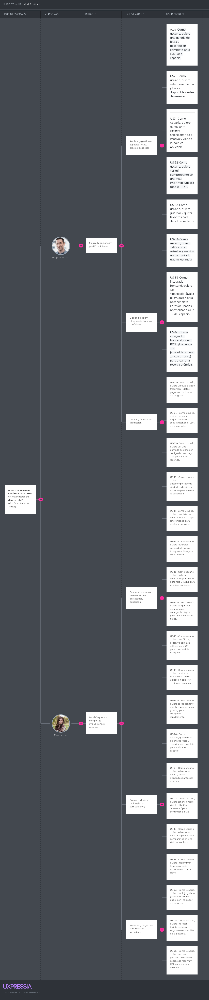
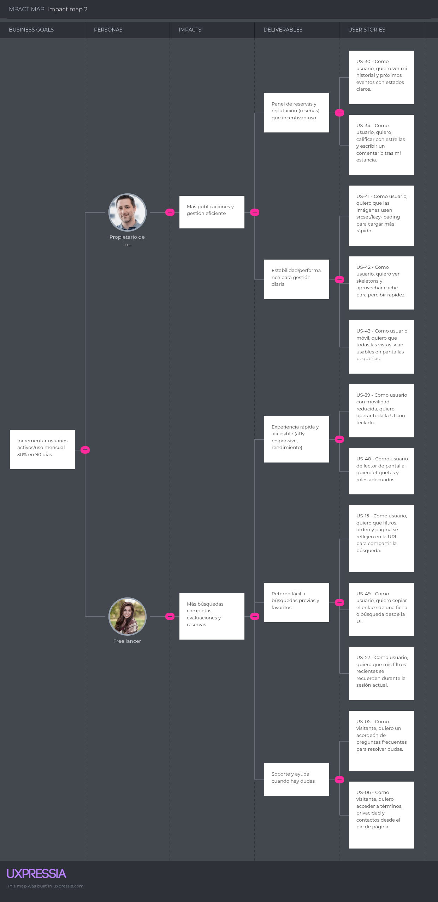
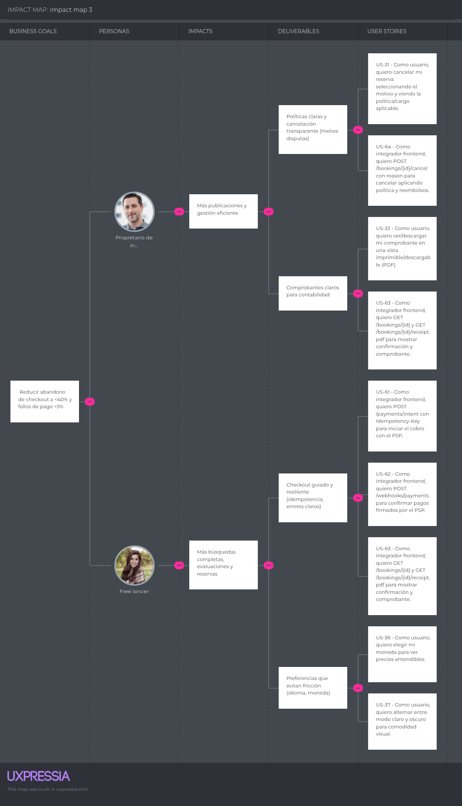

## 3.3. Product backlog

| User Story Id | Título | Descripción | Story Points (1/2/3/5/8) |
| :---- | :---- | :---- | :---- |
| US-01 | Búsqueda en Hero | Como visitante, quiero buscar por distrito/ciudad y fecha desde el hero para ir directo a los resultados. | 3 |
| US-02 | Header claro | Como visitante, quiero un header con enlaces Explorar, Publica tu espacio e Ingresar para orientarme fácilmente. | 2 |
| US-03 | Espacios destacados | Como visitante, quiero ver tarjetas de espacios destacados con imagen, precio desde y CTA. | 2 |
| US-04 | Sección testimonios | Como visitante, quiero ver testimonios reales para ganar confianza antes de registrarme. | 2 |
| US-05 | FAQ acordeón | Como visitante, quiero un acordeón de preguntas frecuentes para resolver dudas. | 2 |
| US-06 | Footer con políticas y contacto | Como visitante, quiero acceder a términos, privacidad y contactos desde el pie de página. | 1 |
| US-07 | SEO básico | Como visitante, quiero títulos, metadescripciones y etiquetas OG correctas para compartir bien. | 3 |
| US-08 | Banner de cookies | Como visitante, quiero aceptar o rechazar cookies opcionales para controlar mi privacidad. | 2 |
| US-09 | Animaciones sutiles | Como visitante, quiero microinteracciones en UI sin afectar el rendimiento. | 2 |
| US-50 | Scroll a anclas en landing | Como visitante, quiero navegar a secciones con scroll suave al hacer clic en el menú. | 1 |
| US-30 | Mis reservas (listado) | Como usuario, quiero ver mi historial y próximos eventos con estados claros. | 3 |
| US-31 | Cancelar reserva (UI) | Como usuario, quiero cancelar mi reserva viendo política y cargo aplicable. | 3 |
| US-32 | Recibos/Comprobante imprimible | Como usuario, quiero ver/descargar mi comprobante en PDF legible. | 3 |
| US-33 | Favoritos (wishlist) | Como usuario, quiero guardar y quitar favoritos para decidir más tarde. | 3 |
| US-34 | Reseñar un espacio | Como usuario, quiero calificar con estrellas y comentar tras mi estancia. | 3 |
| US-10 | Barra global de búsqueda | Como usuario, quiero autocompletado de ciudades/distritos/espacios para acelerar la búsqueda. | 5 |
| US-12 | Filtros con chips | Como usuario, quiero filtrar por capacidad, precio, tipo y amenities y ver chips activos. | 5 |
| US-13 | Ordenamiento | Como usuario, quiero ordenar resultados por precio, distancia y rating. | 3 |
| US-16 | Geolocalización 'cerca de mí' | Como usuario, quiero centrar el mapa en mi ubicación para ver opciones cercanas. | 3 |
| US-15 | State in URL y compartir | Como usuario, quiero que filtros/orden/página se reflejen en la URL para compartir. | 3 |
| US-14 | Paginación / Infinite scroll | Como usuario, quiero cargar más resultados sin recargar la página. | 3 |
| US-11 | Lista \+ mapa sincronizados | Como usuario, quiero una lista de resultados y un mapa sincronizado para explorar por zona. | 5 |
| US-17 | Cards de resultados | Como usuario, quiero cards con foto, nombre, precio desde y rating. | 2 |
| US-18 | Comparar hasta 3 espacios | Como usuario, quiero seleccionar hasta 3 espacios para compararlos lado a lado. | 5 |
| US-19 | Vista de impresión de resultados | Como usuario, quiero imprimir un listado corto con datos clave. | 2 |
| US-20 | Ficha: galería y detalles | Como usuario, quiero una galería de fotos y descripción completa del espacio. | 3 |
| US-22 | Ficha: CTA reservar sticky | Como usuario, quiero tener siempre visible el botón 'Reservar'. | 2 |
| US-21 | Ficha: calendario de disponibilidad | Como usuario, quiero seleccionar fecha y horas disponibles antes de reservar. | 5 |
| US-23 | Checkout paso a paso | Como usuario, quiero un flujo guiado (resumen → datos → pago) con indicador de progreso. | 5 |
| US-24 | Pago con SDK | Como usuario, quiero ingresar tarjeta de forma segura usando el SDK de la pasarela. | 5 |
| US-25 | Confirmación de reserva | Como usuario, quiero ver una pantalla de éxito con código de reserva y CTA para mis reservas. | 2 |
| US-52 | Persistir filtros en sesión | Como usuario, quiero que mis filtros recientes se recuerden durante la sesión actual. | 2 |
| US-49 | Copiar enlace/Compartir | Como usuario, quiero copiar el enlace de una ficha/búsqueda desde la UI. | 2 |
| US-53 | API Auth: registro & login | Como integrador frontend, quiero endpoints POST /auth/register y POST /auth/login para obtener JWT y acceder a recursos protegidos. | 5 |
| US-54 | API Auth: refresh token | Como integrador frontend, quiero POST /auth/refresh para renovar el access token antes de su expiración. | 3 |
| US-55 | API Password reset | Como integrador frontend, quiero POST /auth/request-reset y POST /auth/reset para restablecer contraseñas. | 3 |
| US-56 | API Autocompletado de búsqueda | Como integrador frontend, quiero GET /search/suggest?q= para sugerir ciudades, distritos y espacios. | 3 |
| US-57 | API Búsqueda de espacios | Como integrador frontend, quiero GET /spaces con filtros para listar resultados paginados. | 5 |
| US-58 | API Mapa por bounding box | Como integrador frontend, quiero GET /spaces/map?bbox= para obtener marcadores en el viewport. | 3 |
| US-59 | API Disponibilidad de espacio | Como integrador frontend, quiero GET /spaces/{id}/availability?date= para obtener slots libres/ocupados. | 5 |
| US-60 | API Crear reserva (transaccional) | Como integrador frontend, quiero POST /bookings para crear una reserva atómica. | 5 |
| US-61 | API Intent de pago e idempotencia | Como integrador frontend, quiero POST /payments/intent con Idempotency-Key para iniciar cobro. | 5 |
| US-62 | Webhook de pagos (PSP) | Como integrador frontend, quiero POST /webhooks/payments para confirmar pagos firmados por el PSP. | 5 |
| US-63 | API Confirmación y comprobante | Como integrador frontend, quiero GET /bookings/{id} y /bookings/{id}/receipt.pdf para confirmar y emitir comprobante. | 3 |
| US-64 | API Cancelación con política | Como integrador frontend, quiero POST /bookings/{id}/cancel con reason para cancelar aplicando política y reembolsos. | 5 |
| US-68 | API Fotos del espacio | Como integrador frontend, quiero GET /spaces/{id}/photos con URLs firmadas/variantes. | 3 |
| US-69 | API Health y readiness | Como integrador/ops, quiero GET /health y GET /ready para monitoreo. | 2 |
| US-70 | Errores estándar y CORS | Como integrador frontend, quiero que todas las APIs usen RFC 7807 y CORS seguro. | 3 |
| US-26 | Registro e inicio de sesión | Como usuario, quiero registrarme/iniciar sesión con validaciones y feedback claros. | 3 |
| US-27 | Recuperar contraseña | Como usuario, quiero poder restablecer mi contraseña vía correo. | 2 |
| US-28 | Perfil del usuario | Como usuario, quiero ver y editar mis datos básicos (nombre, teléfono, foto). | 3 |
| US-29 | Preferencias y notificaciones | Como usuario, quiero configurar idioma y notificaciones por email. | 2 |
| US-36 | Selector de moneda | Como usuario, quiero elegir mi moneda para ver precios entendibles. | 3 |
| US-37 | Dark mode | Como usuario, quiero alternar entre modo claro y oscuro. | 2 |
| US-48 | Notificaciones opt-in (reservas) | Como usuario, quiero recibir notificaciones sobre cambios de mis reservas si acepto permisos. | 3 |
| US-51 | Previsualización de avatar | Como usuario, quiero ver una vista previa antes de guardar mi foto de perfil. | 2 |
| US-39 | Accesibilidad: navegación por teclado | Como usuario con movilidad reducida, quiero operar toda la UI con teclado. | 3 |
| US-40 | Accesibilidad: ARIA y lectores | Como usuario de lector de pantalla, quiero etiquetas y roles adecuados. | 3 |
| US-41 | Rendimiento: imágenes responsivas | Como usuario, quiero srcset/lazy-loading para cargar más rápido. | 3 |
| US-42 | Rendimiento: caching y skeletons | Como usuario, quiero skeletons y cache para percibir rapidez. | 3 |
| US-43 | Responsive design | Como usuario móvil, quiero vistas usables en pantallas pequeñas. | 3 |
| US-44 | Design System base | Como equipo, quiero un set de componentes reutilizables. | 5 |
| US-45 | Manejo de errores global | Como usuario, quiero mensajes de error consistentes y opción de reintentar. | 3 |
| US-46 | PWA: instalación | Como usuario, quiero instalar la app como PWA para acceso rápido. | 3 |
| US-47 | Offline básico (fallback) | Como usuario, quiero un fallback útil cuando no hay conexión. | 3 |
| US-35 | Centro de ayuda (UI) | Como usuario, quiero buscar artículos de ayuda y abrir un ticket por canal definido. | 3 |


## Capítulo IV: Product Design

### 4.1. Style Guidelines

En este capítulo se mostrará el desarrollo de las interfaces y procesos relacionados a la aplicación. Se tiene como objetivo ser llamativa y simple para el usuario. Para ello, se usaron colores atractivos, uso del espacio de manera dinámica independiente del dispositivo enfocado, uso de imágenes y texto que no sobrecarga de información al usuario y la separación de las herramientas según su grupo determinado.

#### 4.1.1. General Style Guidelines

##### Branding:
El branding de WorkStation combina la confianza profesional de Booking con la calidez comunitaria de Airbnb. El logo es un ícono estilizado de un escritorio con líneas fluidas que evocan colaboración y flexibilidad, acompañado del nombre "WorkStation" en tipografía moderna.

- **Logo Principal**: Texto + ícono para headers; ícono solo para apps y favicons.
- **Uso**: Espacio libre de 16px alrededor; no alterar proporciones ni colores.

| Elemento | Descripción | Dimensión Recomendada |
|----------|-------------|-----------------------|
| Logo Principal | WorkStation + Ícono | Ancho: 180px (escalable) |
| Espacio de Respiración | Padding alrededor | 16px mínimo |

##### Typography
Adoptamos Circular Pro (al estilo de Airbnb) por su look moderno y amigable, con fallback a Roboto (Google Fonts) para accesibilidad web. Su versatilidad soporta múltiples idiomas, clave para el enfoque global de WorkStation. La jerarquía, inspirada en Booking, guía al usuario en búsquedas rápidas con tamaños escalables asegurando legibilidad en pantallas móviles y desktop.

- **Headings (H1-H6)**: Circular Pro Bold, tamaños escalables (H1: 40px, H2: 28px, etc.).
- **Body Text**: Circular Pro Regular, 16px base.
- **Captions / Labels**: Circular Pro Medium, 14px.
- **Line Height**: 1.6 para body; 1.3 para headings.
- **Alineación**: Izquierda; centrada para CTAs destacados.

| Tipo | Fuente | Peso | Tamaño | Uso Ejemplo |
|------|--------|------|--------|-------------|
| H1 | Circular Pro | Bold | 40px / 2.5rem | Títulos de landing |
| Body | Circular Pro | Regular | 16px / 1rem | Descripciones de espacios |
| Label | Circular Pro | Medium | 14px / 0.875rem | Filtros y etiquetas |

##### Colors
La paleta combina azules confiables (Booking) y tonos cálidos (Airbnb) en un esquema 60-30-10 para equilibrio visual. El azul refuerza fiabilidad en transacciones, mientras que el coral evoca comunidad, alineado con el espíritu de coworking. 

- **Primario**: Azul Confiable (#003580) – CTAs, links.
- **Secundario**: Coral Comunitario (#FF5733) – Disponibilidad, énfasis.
- **Neutros**:
  - Blanco (#FFFFFF) – Fondos.
  - Gris Suave (#F7F7F7) – Fondos secundarios.
  - Gris Oscuro (#4A4A4A) – Texto principal.
- **Acentos**: Verde Éxito (#00A699) para confirmaciones; Rojo Alerta (#D0021B) para errores.
- **Modo Oscuro**: Ajustes automáticos (Primario: #005B99).

| Categoría | Color | Hex | Uso | Rol |
|-----------|-------|-----|-----|-----|
| Primario | Azul Confiable | #003580 | Botones reserva | Acción principal |
| Secundario | Azul Comunitario | #070230ff | Indicadores | Énfasis/Disponibilidad |
| Neutro | Negro | #000000ff | Texto principal | Legibilidad |

##### Spacing
Un grid de 8px, inspirado en Airbnb, crea un ritmo visual predecible con múltiplos (8px, 16px, 24px). Esto optimiza desarrollo (consistencia) y UX (evita clutter), con un 25% más de padding en móvil para toques precisos, siguiendo patrones táctiles de Booking. Las sombras suaves añaden profundidad sin sobrecargar.

- **Padding/Margin Base**: 16px para contenedores.
- **Espaciado entre Elementos**: 8px para íconos; 32px para secciones.
- **Grid**: 12-columnas responsive (mobile: 4-col; desktop: 12-col).
- **Sombras**: Suaves (0 2px 4px rgba(0,0,0,0.1)) para profundidad.

| Escala | Valor (px) | Uso Ejemplo |
|--------|------------|-------------|
| XS | 4 | Bordes finos |
| S | 8 | Espacio entre elementos pequeños |
| M | 16 | Padding de cards |
| L | 24 | Márgenes de secciones |
| XL | 32 | Espaciado hero |

##### Tone of Communication and Language
El tono es entusiasta y acogedor, inspirado en la calidez de Airbnb y la claridad accionable de Booking. Diseñado para freelancers y startups, usa lenguaje inclusivo y motivador, con mensajes cortos  para claridad.

- **Divertido/Serio**: Divertido en marketing (emojis sutiles), serio en reservas.
- **Formal/Casual**: Casual (voz activa, contracciones), profesional en legal.
- **Respetuoso/Irreverente**: Respetuoso (neutral de género), toque irreverente en campañas.
- **Entusiasta/Sereno**: Entusiasta en CTAs; sereno en confirmaciones.

###### Ejemplos
- **CTA**: "¡Reserva tu espacio ideal en 2 clics! 🚀"
- **Confirmación**: "Todo listo. Tu escritorio te espera. ¡A trabajar!"
- **Marketing**: "Adiós distracciones, hola coworking vibes."

#### 4.1.2. Web Style Guidelines. 
##### Diseño Responsive
El diseño responsive asegura que WorkStation sea visualmente atractivo, funcional y comprensible en todos los dispositivos, desde smartphones hasta pantallas grandes. Utilizamos **media queries** para adaptar el layout.

##### Breakpoints
El sistema de breakpoints está alineado con los estándares de la industria:

| Dispositivo       | Ancho Mínimo | Ejemplo de Uso            |
|-------------------|--------------|---------------------------|
| Mobile            | ≥320px       | Smartphones (iPhone SE)   |
| Tablet            | ≥768px       | iPad, tablets genéricas   |
| Laptop            | ≥1024px      | Laptops, monitores pequeños|
| Wide Screen       | ≥1440px      | Monitores 2K, TVs         |

### 4.2. Information Architecture

La arquitectura de información de WorkStation organiza el contenido de la experiencia web y móvil para conectar freelancers, startups y propietarios con espacios de coworking de manera intuitiva

#### 4.2.1. Organization Systems

La organización del contenido en WorkStation utiliza una combinación de sistemas visuales y esquemas de categorización para garantizar claridad y accesibilidad en el Landing Page y la Web Application. Las decisiones reflejan las necesidades de dos audiencias principales: **freelancers** (que buscan espacios) y **propietarios** (que gestionan locales), optimizando la experiencia según sus objetivos.

##### Sistemas Visuales
- **Jerárquica (Visual Hierarchy)**: Utilizada en el Landing Page y las páginas principales de la aplicación para priorizar información clave. Por ejemplo, en el Landing Page, el CTA "Explorar Espacios" (en `#003580`) se destaca con un botón grande y tipografía Circular Pro Bold 20px, mientras que secciones como "Reseñas" o "Contacto" usan tipografía secundaria (14px). Esto guía al usuario hacia acciones primarias (reservar o publicar) antes que información secundaria, siguiendo patrones de Booking para alta conversión.
- **Secuencial (Step-by-Step)**: Aplicada en flujos críticos como el registro, inicio de sesión, y proceso de reserva. Por ejemplo, el flujo de reserva para freelancers sigue pasos claros: 
    - Buscar espacio, 
    - Seleccionar fechas, 
    - Reservar. 

#####  Esquemas de Categorización
- **Por Tópicos**: Usado en la Web para organizar contenido según funciones. Para freelancers: **Home**, **Explorar Espacios**, **Reservas**, **Perfil**. Para propietarios: **Home**, **Publicar Local**, **Gestión de Locales**, **Perfil**. Esto refleja las tareas clave de cada audiencia, facilitando el acceso a funcionalidades relevantes.
- **Por Audiencia**: El contenido se divide explícitamente entre **freelancers** y **propietarios** tras el inicio de sesión, mostrando interfaces personalizadas. Por ejemplo, freelancers ven recomendaciones de espacios, mientras que propietarios ven estadísticas de ocupación, alineado con la personalización de Airbnb.
- **Alfabético**: Usado en listas secundarias, como ciudades en la barra de búsqueda o servicios (Wi-Fi, café) en filtros, para facilitar la exploración rápida.

Estas decisiones aseguran que el contenido esté organizado de forma lógica y predecible, reduciendo el tiempo de búsqueda y mejorando la experiencia del usuario.

#### 4.2.2. Labeling Systems

Los sistemas de etiquetado utilizan nombres cortos, claros y consistentes para representar conjuntos de información y sus asociaciones, evitando confusión. 

##### Etiquetas del Landing Page
| Sección            | Etiqueta        | Contenido                                                                 |
|--------------------|-----------------|---------------------------------------------------------------------------|
| Rent With Us       | Alquila         | Cómo freelancers encuentran y reservan espacios fácilmente.               |
| Host With Us       | Publica         | Información para propietarios que desean listar sus locales.              |
| Reviews            | Reseñas         | Opiniones y valoraciones de usuarios para generar confianza.              |
| Contact Us         | Contacto        | Formulario, soporte y FAQs para asistencia directa.                       |

##### Etiquetas de la Web Application (Freelancers)
| Sección            | Etiqueta        | Contenido                                                                 |
|--------------------|-----------------|---------------------------------------------------------------------------|
| Home               | Inicio          | Recomendaciones y espacios destacados.                                    |
| Explore Spaces     | Explorar        | Búsqueda de espacios con filtros (ubicación, precio, servicios).          |
| My Bookings        | Reservas        | Historial y gestión de reservas activas/pasadas.                          |
| Profile            | Perfil          | Configuración de cuenta, pagos y preferencias.                            |
| Help & Support     | Ayuda           | Centro de asistencia, FAQs y soporte.                                     |

##### Etiquetas de la Web Application (Propietarios)
| Sección            | Etiqueta        | Contenido                                                                 |
|--------------------|-----------------|---------------------------------------------------------------------------|
| Home               | Inicio          | Estadísticas de ocupación e ingresos.                                     |
| Publish a Space    | Publicar        | Registro de nuevos espacios con fotos y tarifas.                          |
| Manage Spaces      | Gestionar       | Administración de anuncios, reservas y precios.                           |
| Profile            | Perfil          | Información de cuenta y datos de pago.                                    |
| Help & Support     | Ayuda           | Guías y recursos para gestionar espacios.                                 |

#### 4.2.3. SEO Tags and Meta Tags

Los **SEO Tags** y **Meta Tags** optimizan la visibilidad de WorkStation en motores de búsqueda. Se definen para el **Landing Page** (sitio estático) y la **Web Application**, con etiquetas claras y descriptivas.

##### Landing Page
```html
<title>WorkStation | Espacios de coworking para freelancers</title>
<meta name="description" content="Encuentra y reserva espacios de coworking, oficinas privadas y salas de reuniones con WorkStation, perfectos para freelancers y startups.">
<meta name="keywords" content="coworking, freelancers, espacios de trabajo, reservas, oficinas, startups">
<meta name="author" content="WorkStation Team">
<meta name="robots" content="index, follow">
<meta property="og:title" content="WorkStation | Espacios para trabajar">
<meta property="og:description" content="Conecta con espacios de coworking ideales para freelancers y startups en todo el mundo.">
<meta property="og:image" content="https://www.workstation.com/assets/og-image.jpg">
<meta property="og:url" content="https://www.workstation.com">
```

##### Web Application
```html
<title>WorkStation | Gestiona tus reservas de coworking</title>
<meta name="description" content="Administra reservas, explora espacios y conecta con propietarios en WorkStation, la plataforma para freelancers y dueños de espacios.">
<meta name="keywords" content="coworking, reservas, freelancers, espacios de trabajo, gestión de locales">
<meta name="author" content="WorkStation Team">
<meta name="robots" content="index, follow">
<meta property="og:title" content="WorkStation | Plataforma de coworking">
<meta property="og:description" content="Optimiza tu experiencia de coworking con reservas fáciles y gestión eficiente.">
<meta property="og:image" content="https://app.workstation.com/assets/app-og-image.jpg">
<meta property="og:url" content="https://app.workstation.com">
```

#### 4.2.4. Searching Systems

El sistema de búsqueda de WorkStation está diseñado para evitar que los usuarios se sientan abrumados por el volumen de información, ofreciendo herramientas claras y filtros avanzados.

##### Barra de Búsqueda Inteligente
- **Ubicación**: Barra global en la parte superior para ciudades, barrios o direcciones. Placeholder: "Busca tu espacio ideal".
- **Funcionalidad**: Debounce de 300ms para sugerencias en tiempo real, mostradas en un dropdown.

##### Filtros Avanzados
Los filtros permiten personalizar búsquedas según las necesidades de los freelancers, con un diseño claro y colapsable (modal en mobile).

- **Precio**: Rango ajustable con slider (mínimo/máximo).
- **Tipo de Espacio**: Coworking, oficinas privadas, salas de reuniones.
- **Servicios**: Wi-Fi, café, impresoras, estacionamiento.
- **Valoraciones**: Filtro por estrellas (4+), ordenado por relevancia.

#### 4.2.5. Navigation Systems  
Los sistemas de navegación guían a los usuarios a través del Landing Page y la Web Application, asegurando que cumplan sus objetivos (reservar espacios, gestionar locales) con mínimo esfuerzo. 

### Landing Page Navigation
El Landing Page usa un diseño limpio con un menú fijo superior.

- **Menú Superior**: Incluye Alquila, Publica, Reseñas, Contacto. 
- **Scroll Suave**: Transiciones  para conectar secciones, con anclas a Alquila, Publica, etc.
- **Enlaces Internos**: Reseñas vinculan a testimonios específicos, Contacto a un formulario modal.

**Flujo**:
1. Usuarios llegan al Landing Page y exploran información general.
2. Registro/Iniciar Sesión lleva a la Web Application.
3. Reseñas y Contacto generan confianza y soporte.

##### 4.2. Web Application Navigation
La navegación se personaliza según el rol (**freelancers** o **propietarios**) tras el inicio de sesión, con un menú lateral dinámico y búsqueda global.

- **Menú Lateral**: En desktop, visible con opciones específicas (e.g., "Explorar" para freelancers, "Publicar" para propietarios). En mobile, integrado al menú hamburguesa.
- **Búsqueda Global**: Barra superior con ícono de lupa, accesible desde cualquier página.
- **Atajos Contextuales**: Botones en cards (e.g., "Reservar") con feedback visual (ícono corazón en `#FF5733`).

**Flujo para Freelancers**:
1. **Inicio**: Dashboard con espacios recomendados.
2. **Explorar**: Búsqueda con filtros (ubicación, precio).
3. **Reservas**: Gestión de reservas activas/pasadas.
5. **Perfil**: Configuración y pagos.

**Flujo para Propietarios**:
1. **Inicio**: Estadísticas de ocupación.
2. **Publicar**: Registro de nuevos espacios.
3. **Gestionar**: Administración de reservas y precios.
5. **Perfil**: Datos de cuenta.

### 4.3. Landing Page UI Design

#### 4.3.1. Landing Page Wireframe

<p align="center">
  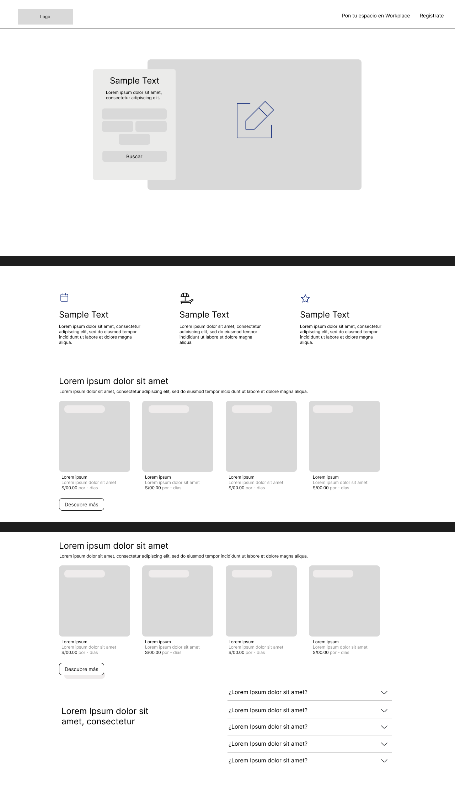
</p>

#### 4.3.2. Landing Page Mock-up

<p align="center">
  
</p>

<p align="center">
  
</p>

### 4.4. Web Applications UX/UI Design

#### 4.4.1. Web Applications Wireframes

<p align="center">
  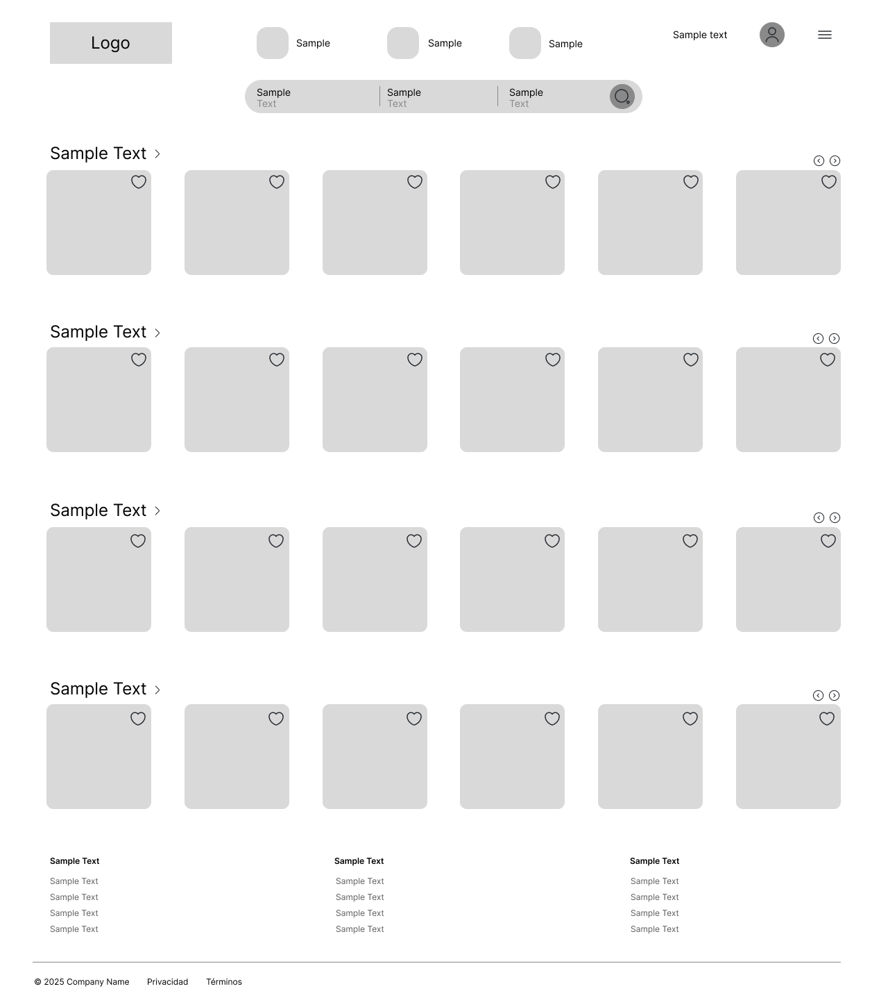
</p>

<p align="center">
  
</p>

#### 4.4.2. Web Applications Wireflow Diagrams

<p align="center">
  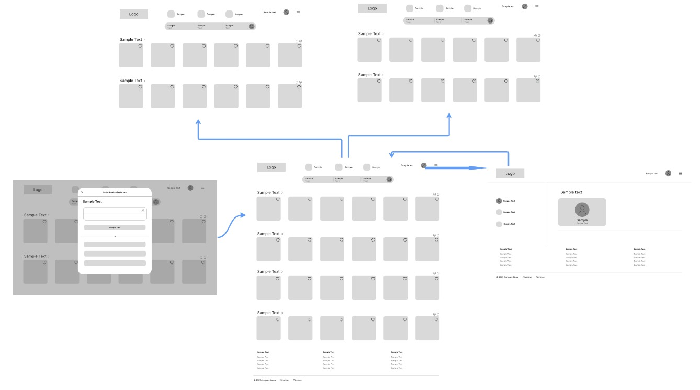
</p>

#### 4.4.2. Web Applications Mock-ups

<p align="center">
  
</p>

#### 4.4.3. Web Applications User Flow Diagrams

<p align="center">
  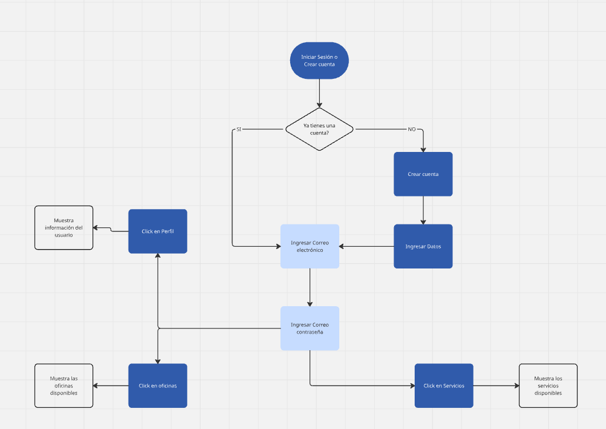
</p>

### 4.5. Web Applications Prototyping

<p align="center">
  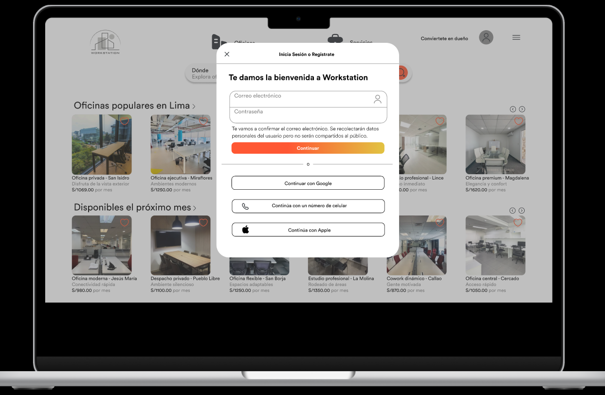
</p>

https://www.figma.com/proto/8L021g8KuL6tNMxxyLNEa4/Workstation-Landing-Mockup?node-id=2009-319&p=f&t=zWtc5Zn6GgK9iT52-0&scaling=scale-down&content-scaling=fixed&page-id=0%3A1&starting-point-node-id=2009%3A319

### 4.6. Domain-Driven Software Architecture

#### 4.6.1. Design-Level Event Storming

**Identity and Access Management:**


**Profiles and Preferences Management:**


**Space Design and Planning Management:**


**Resource and Asset Managementt:**


**Booking Execution and Monitoring Management:**


**Payment Management:**


https://miro.com/app/board/uXjVJI6oqFo=/?share_link_id=929784522141

#### 4.6.2. Software Architecture Context Diagram

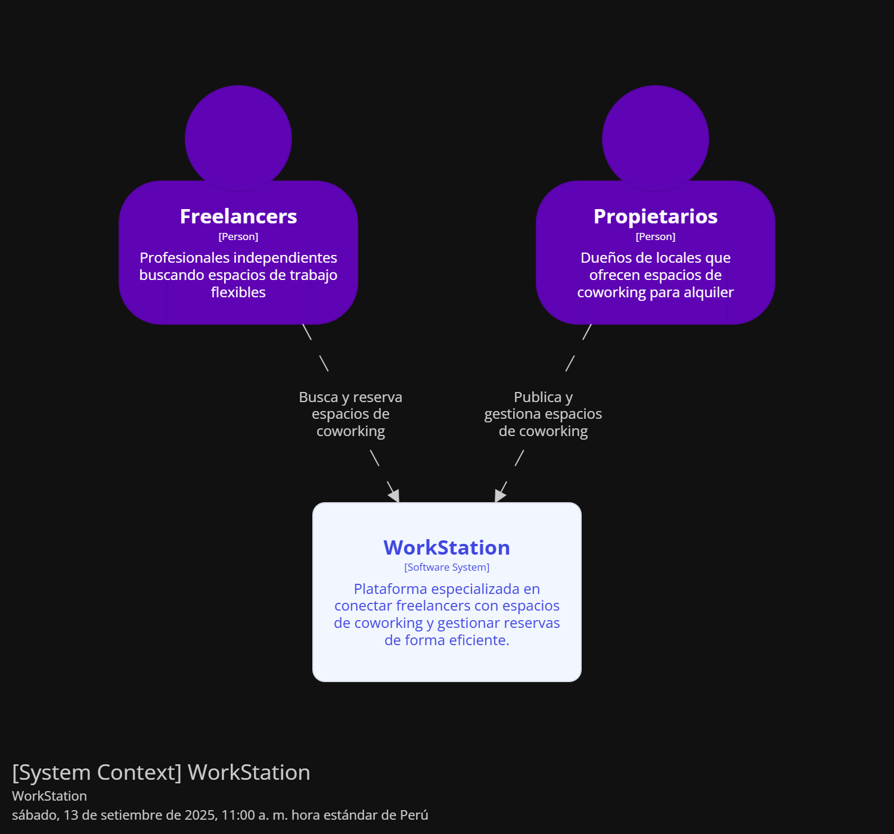

#### 4.6.3. Software Architecture Container Diagrams

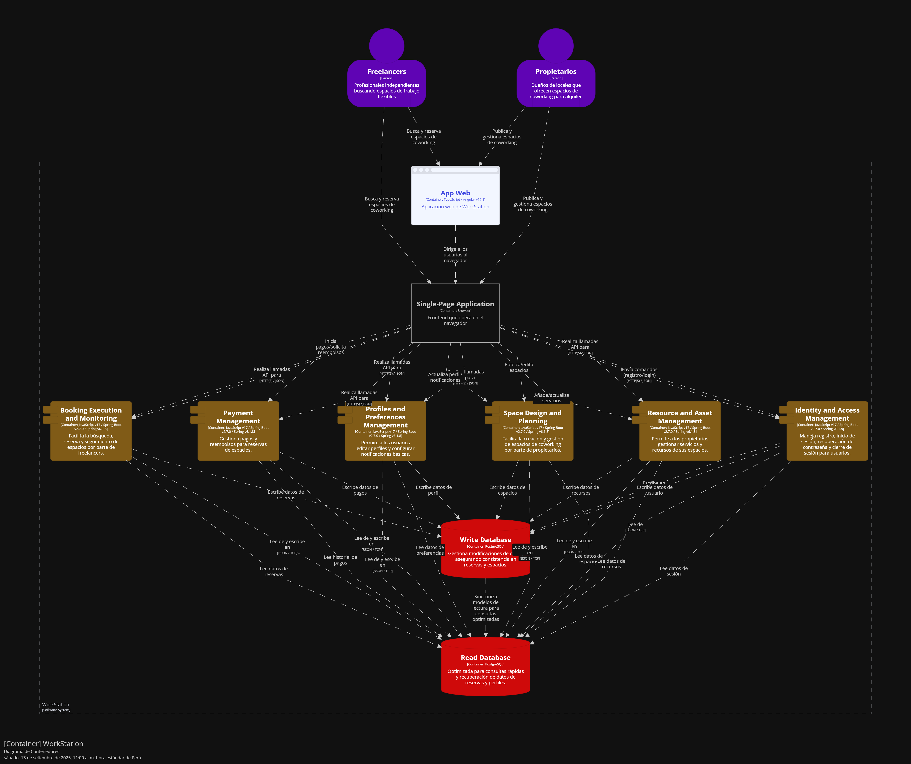

#### 4.6.4. Software Architecture Components Diagrams

**Identity and Access Management:**


**Profiles and Preferences Management:**

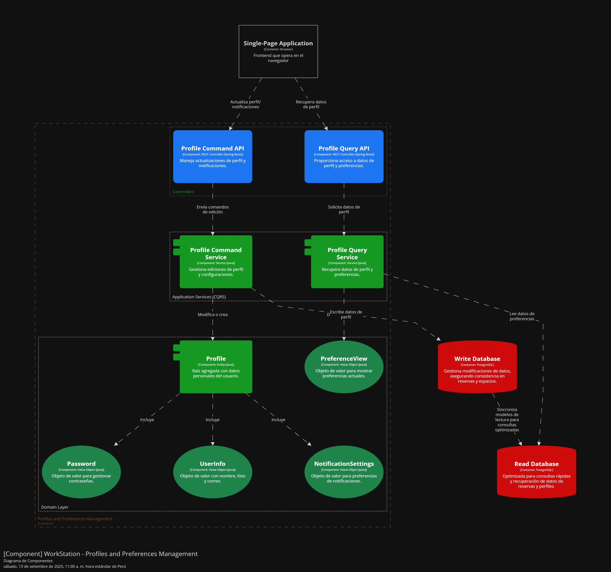

**Space Design and Planning Management:**

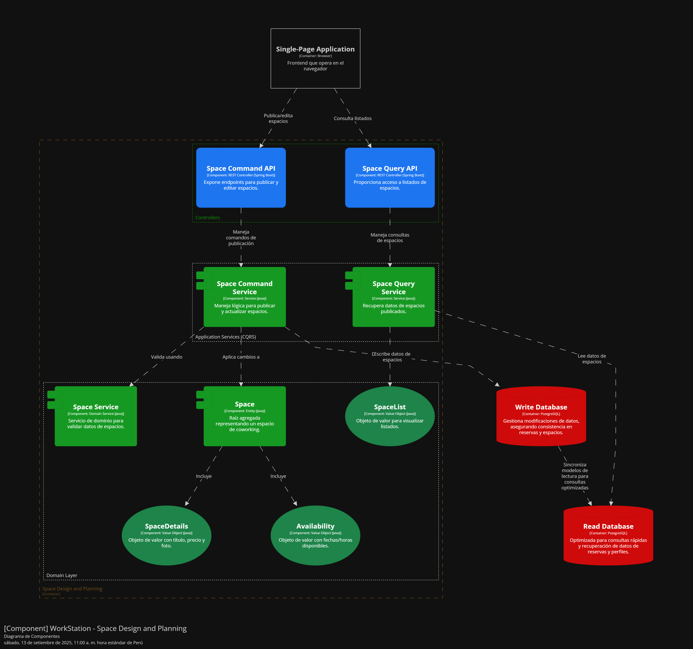

**Resource and Asset Management:**

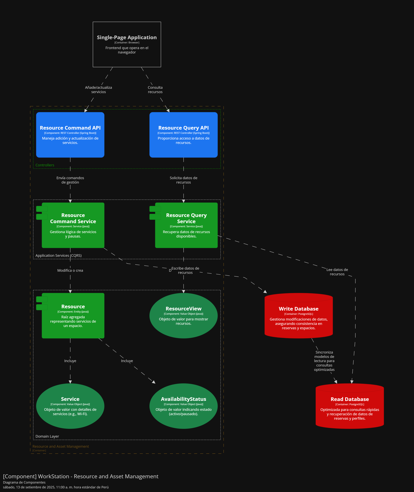

**Booking Execution and Monitoring Management:**

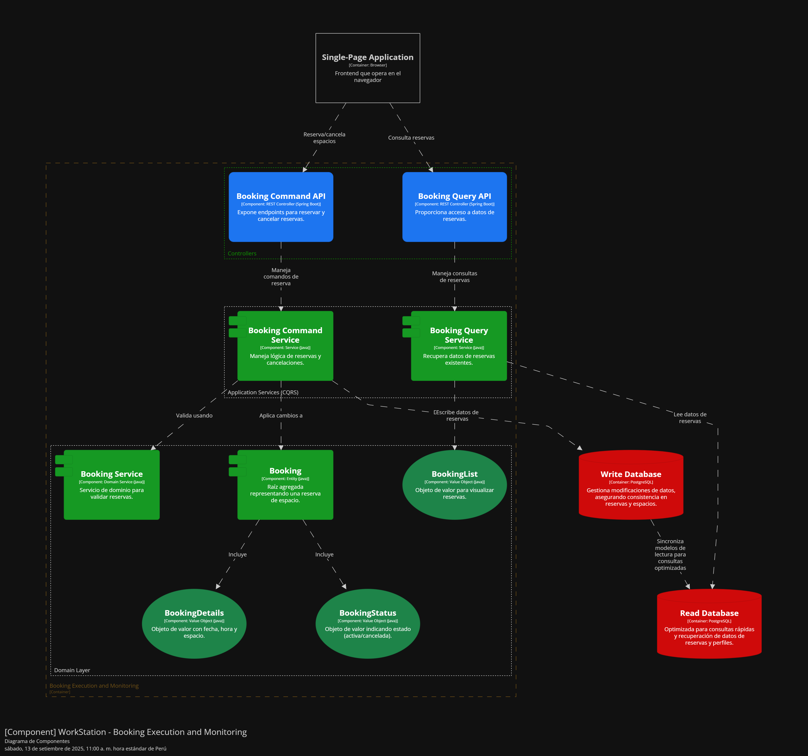

**Payment Management:**

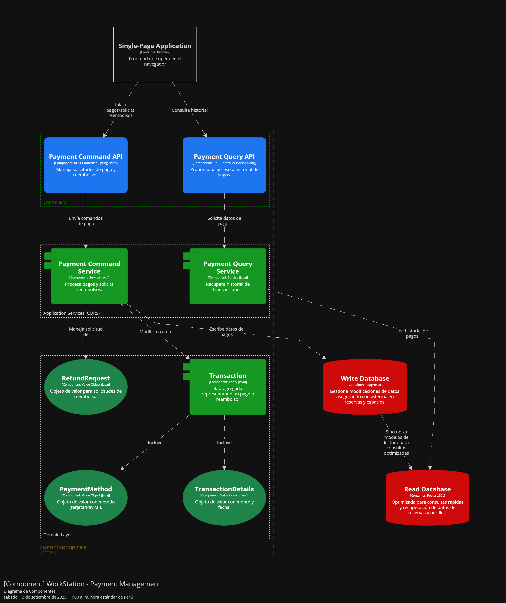


### 4.7. Software Object-Oriented Design

Este Diagrama de Clases UML establece el modelo de datos estático para una plataforma de gestión de espacios de trabajo compartido (coworking).

El sistema se estructura en torno a las siguientes funcionalidades clave:

| Dominio            | Clases Principales        | Relaciones Clave                                                |
|--------------------|-----------------|---------------------------------------------------------------------------|
| Actores       | User, Owner, Freelancer        | Herencia (EXTENDS) para roles especializados.                   |
| Infraestructura       | Space, Workstation, Location        | Asociación para definir dónde y qué se reserva.                   |
| Transacciones       | Booking, Payment, Invoice        | Composición para gestionar el flujo de reserva y pago.                  |
| Servicios       | Service, Availability, Review        | Asociación para describir, calendarizar y evaluar los espacios.                  |


#### 4.7.1. Class Diagrams

<p align="center">
  
</p>

### 4.8. Database Design

Este Diagrama Entidad-Relación (ERD) define la estructura de la base de datos para una plataforma de coworking (gestión de espacios de trabajo).

El modelo se organiza en estas áreas clave:

| Dominio            | Tablas Principales        | Propósito                                                |
|--------------------|-----------------|---------------------------------------------------------------------------|
| Actores       | 	user, memberships, notifications        | Gestión de cuentas, roles y comunicaciones.                   |
| Inventario       | coworking, spaces, services        | Definición de centros, características y disponibilidad de los espacios.                  |
| Transacciones       | booking, payments, booking_history        | Registro y seguimiento del ciclo completo de reservas, pagos y su historial de estados.                  |

La estructura utiliza Claves Primarias (PK) y Claves Foráneas (FK) para asegurar la integridad referencial y la coherencia de los datos en todas las operaciones del sistema.

### 4.8.1. Database Diagrams

<p align="center">
  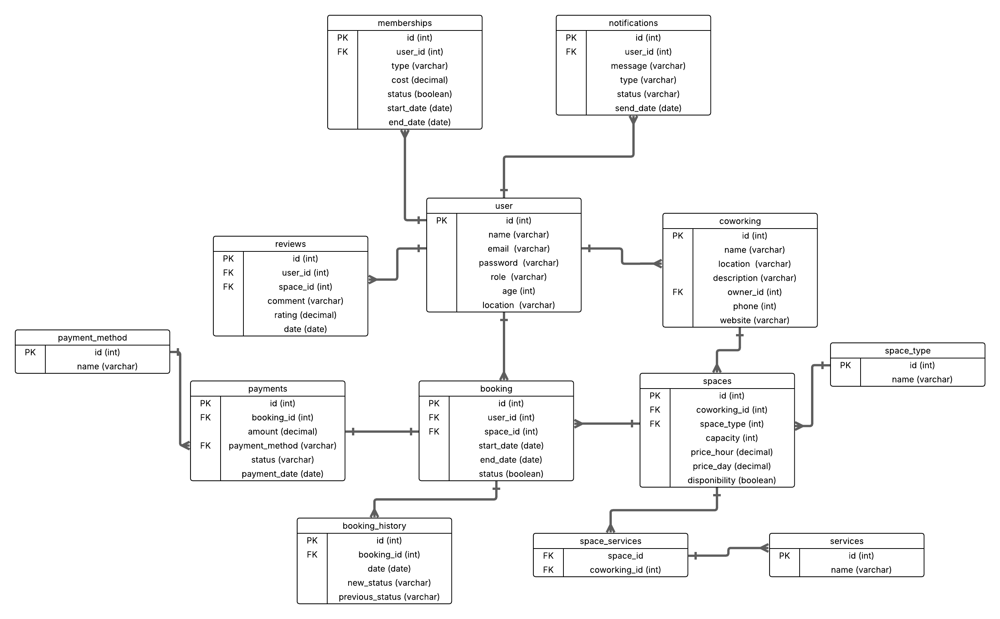
</p>


## Capítulo V: Product Implementation, Validation & Deployment

### 5.1. Software Configuration Management

En este apartado se establecen los lineamientos y procedimientos adoptados durante el desarrollo y publicación del sitio web de AgeCare, con el propósito de asegurar la coherencia y estabilidad del software desde sus primeras etapas hasta su implementación y posterior mantenimiento.

### 5.1.1. Software Development Environment Configuration

#### Project Management

Para una gestión eficiente del proyecto, se hizo necesaria la implementación de un conjunto de herramientas destinadas a la asignación de tareas, la facilitación de reuniones y la colaboración entre los integrantes. Asimismo, se empleó un repositorio centralizado para consolidar los avances de manera coordinada. A continuación, se presentan las plataformas seleccionadas junto con su respectivo propósito dentro del marco del proyecto.
- **Centro de organización de trabajo:** Github  
- **Planificación de tareas:** Trello  
- **Reuniones de equipo:** Google Meet  
- **Coordinación grupal:** WhatsApp  

#### Requirement Management

Durante el desarrollo del proyecto se recurrió a diversas herramientas que facilitaron la definición, análisis y representación visual de los requerimientos técnicos y funcionales. Estas plataformas promovieron una planificación estructurada y una mayor claridad en el diseño conceptual del sistema:

| Herramienta   | Descripción                                                                                                     | Enlace                                      |
|---------------|-----------------------------------------------------------------------------------------------------------------|---------------------------------------------|
| **Trello**        | Herramienta de organización de proyectos basada en tableros y tarjetas, empleada para distribuir tareas entre los miembros del equipo y hacer seguimiento al progreso de cada fase del desarrollo. | [trello.com](https://trello.com/)           |
| **Uxpressia**     | Aplicación digital utilizada para el diseño de mapas estratégicos, como *Impact Mapping*, lo cual permitió vincular los objetivos del negocio con las funcionalidades del producto de forma clara y visual. | [uxpressia.com](https://uxpressia.com/)     |
| **Structurizr**   | Plataforma de modelado arquitectónico que facilita la construcción de diagramas C4, permitiendo representar la estructura lógica del sistema y su interacción entre componentes de manera estandarizada. | [structurizr.com](https://www.structurizr.com/) |
| **Lucidchart**    | Entorno colaborativo de diagramación empleado para desarrollar modelos técnicos como diagramas de clases y estructuras de bases de datos, fundamentales en la definición de la arquitectura del sistema. | [lucidchart.com](https://www.lucidchart.com/) |

---

#### Product UX/UI Design

El diseño de la experiencia de usuario y de la interfaz visual se abordó mediante herramientas especializadas que posibilitaron la creación de prototipos gráficos y esquemas de navegación. Esto permitió validar la estructura de la aplicación antes de su implementación:

| Herramienta | Descripción                                                                                          | Enlace                              |
|-------------|------------------------------------------------------------------------------------------------------|-------------------------------------|
| **Figma**   | Plataforma de diseño colaborativo en línea que permitió a los miembros del equipo crear y editar en tiempo real wireframes y mockups, asegurando la coherencia visual y funcional de la landing page. | [figma.com](https://www.figma.com/) |

---

#### Software Development

Para el desarrollo de la página web, se emplearon lenguajes de programación y etiquetado esenciales para crear la estructura, el diseño y las funcionalidades del sistema. A continuación, se describen las herramientas utilizadas:

| Herramienta    | Descripción                                                                                              | Enlace                                                       |
|----------------|----------------------------------------------------------------------------------------------------------|--------------------------------------------------------------|
| **HTML**       | Lenguaje de marcado fundamental para estructurar el contenido y la disposición de los elementos en la web. | [https://www.w3schools.com/html/default.asp](https://www.w3schools.com/html/default.asp)           |
| **CSS**        | Lenguaje de diseño que permite aplicar estilos visuales a los elementos estructurados en HTML, mejorando su presentación. | [https://www.w3schools.com/css/default.asp](https://www.w3schools.com/css/default.asp)             |
| **JavaScript** | Lenguaje de programación orientado a objetos utilizado para agregar interactividad y funcionalidades dinámicas a la página web. | [https://www.w3schools.com/js/default.asp](https://www.w3schools.com/js/default.asp)       |

---

#### Software Documentation

La gestión y documentación del proyecto se llevó a cabo utilizando herramientas que facilitaron la organización y el acceso a la información técnica, asegurando la transparencia y la trazabilidad del desarrollo:

| Herramienta    | Descripción                                                                                              | Enlace                                                       |
|----------------|----------------------------------------------------------------------------------------------------------|--------------------------------------------------------------|
| **GitHub**     | Plataforma de desarrollo colaborativo que también se utilizó para gestionar y alojar la documentación del proyecto. | [https://github.com/SmartFinance-OpenSource/Report](https://github.com/SmartFinance-OpenSource/Report)  |
| **Markdown**   | Formato de texto ligero utilizado para escribir y estructurar la documentación técnica del proyecto de forma clara y legible. | [https://markdown.es/](https://markdown.es/)                          |

---

#### Software Deployment

Para el despliegue de la landing page, se optó por una plataforma de hosting que permite la publicación directa desde un repositorio de GitHub, garantizando una gestión eficiente del ciclo de vida de la aplicación:

| Herramienta     | Descripción                                                                                              | Enlace                                                       |
|-----------------|----------------------------------------------------------------------------------------------------------|--------------------------------------------------------------|
| **GitHub Pages** | Servicio de GitHub que permite desplegar la aplicación directamente desde el repositorio, facilitando la visualización pública de la página. | [https://pages.github.com/](https://pages.github.com/)                   |


### 5.1.2. Source Code Management

#### Producto y Repositorio

| Producto             | Repositorio        | URL                                                       |
|----------------------|--------------------|------------------------------------------------------------|
| WorkStation-Landing Page         | WorkStation-Landing Page| [https://github.com/TemuCoders/Landing-Page](https://github.com/TemuCoders/Landing-Page)     |
| WorkStation-Report        | Report| [https://github.com/TemuCoders/Report-WorkStation](https://github.com/TemuCoders/Report-WorkStation)     |
| WorkStation-BackEnd         | BackEnd| [https://github.com/TemuCoders/BackEnd](https://github.com/TemuCoders/BackEnd)     |
| WorkStation-FrontEnd         | FrontEnd| [https://github.com/TemuCoders/FrontEnd](https://github.com/TemuCoders/FrontEnd)     |

#### Estructura del Repositorio

Hemos organizado el repositorio en ramas específicas para diferentes etapas del desarrollo, garantizando un flujo de trabajo ordenado y eficiente. La estructura de ramas es la siguiente:

- **Main branch** (rama principal): Contiene la versión estable y lista para producción del software.
- **Develop branch**: Contiene el código en desarrollo que se integrará en la rama principal después de ser probado y validado.

Además, para el desarrollo de nuevas funcionalidades, creamos ramas específicas siguiendo las convenciones de nomenclatura:

- **Feature branches**: Ramas dedicadas al desarrollo de nuevas características. La nomenclatura para estas ramas es `feature/nueva-funcionalidad`.

Implementamos **GitFlow**, un modelo de ramificación diseñado por Vincent Driessen, que incluye las siguientes ramas:

- **Main branch**: Rama principal que alberga el código estable y preparado para producción.
- **Develop branch**: Rama de desarrollo donde se integran nuevas funcionalidades y correcciones antes de ser fusionadas a la rama principal.
- **Feature branches**: Creadas a partir de `develop` para añadir nuevas características, siguiendo la nomenclatura `feature/nueva-funcionalidad`.
- **Release branches**: Preparadas para la liberación de nuevas versiones, permitiendo pruebas finales y corrección de errores antes del despliegue a producción.
- **Hotfix branches**: Utilizadas para corregir errores críticos en producción, siguiendo la nomenclatura `hotfix/correccion-critica`.


#### Flujo de trabajo GitFlow

- Una rama de **producción** (`main`).
- Una rama de **pruebas** (`develop`).
- Rama de **hotfix** para corrección de errores críticos (`hotfix/*`).
- Rama de **release** para estabilización y pruebas previas al despliegue (`release/*`).
- Ramas para **features** (`feature/*`).
- Cada cambio en **producción** se considera una nueva versión.
- Cambios en `main` y `develop` requieren aprobación.


#### Mensajes de Commits

Adoptamos el estándar **Conventional Commits** para los mensajes de nuestros commits, lo que facilita la comprensión del historial de cambios y la automatización de versiones. Ejemplos de mensajes son:

- `feat`: Añadir nueva funcionalidad, por ejemplo, `feat: implementar sistema de notificaciones`.
- `fix`: Corregir errores, por ejemplo, `fix: solucionar problema con la validación de datos`.
- `docs`: Actualizar documentación, por ejemplo, `docs: actualizar guía de instalación`.
- `style`: Aplicar formato, por ejemplo, `style: ajustar estilo de código según las pautas`.
- `refactor`: Mejorar el código sin cambiar su funcionalidad, por ejemplo, `refactor: optimizar el rendimiento del módulo de usuario`.
- `test`: Añadir o modificar pruebas, por ejemplo, `test: añadir pruebas para la funcionalidad de autenticación`.


#### Documentación

La documentación del proyecto se encuentra en el archivo `README.md` dentro del repositorio. Este archivo proporciona detalles sobre la configuración, el uso del software y las guías para contribuir al proyecto.


### 5.1.3. Source Code Style Guide & Conventions

El equipo adopta convenciones de estilo consistentes y basadas en estándares reconocidos para facilitar la lectura, el mantenimiento y la colaboración en la landing page. El idioma de los identificadores (nombres de archivos, variables, funciones y clases) es **inglés**, manteniendo coherencia con el código existente en `js/lang.js` y `js/java.js`. A continuación, se detallan las referencias y convenciones aplicadas para cada lenguaje utilizado (HTML, CSS, JavaScript, TypeScript, Java).

#### Referencias Adoptadas
- **HTML**: Especificación HTML5 del W3C [https://html.spec.whatwg.org/](https://html.spec.whatwg.org/). Se elige esta referencia porque proporciona la norma oficial para la estructura y semántica del HTML5, asegurando compatibilidad con navegadores modernos y cumplimiento de estándares web actuales.
- **HTML**: Guía de Accesibilidad de la WAI-ARIA [https://www.w3.org/WAI/ARIA/](https://www.w3.org/WAI/ARIA/). Esta guía se adopta para garantizar que la landing page sea accesible para usuarios con discapacidades, alineándose con las mejores prácticas de inclusión y normativas como WCAG.
- **CSS**: CSS Specification del W3C [https://www.w3.org/Style/CSS/](https://www.w3.org/Style/CSS/). Se selecciona por ser la fuente autoritativa de las especificaciones CSS, permitiendo un desarrollo robusto y compatible con diversas plataformas.
- **CSS**: MDN Web Docs [https://developer.mozilla.org/en-US/docs/Web/CSS](https://developer.mozilla.org/en-US/docs/Web/CSS). Se utiliza por su documentación detallada y ejemplos prácticos que facilitan la implementación de estilos responsivos y modernos.
- **JavaScript**: Guías de Estilo de JavaScript de Airbnb [https://github.com/airbnb/javascript](https://github.com/airbnb/javascript). Esta guía se adopta por sus convenciones ampliamente aceptadas en la industria, promoviendo código limpio y mantenible.
- **JavaScript**: Especificaciones de ECMAScript [https://www.ecma-international.org/publications-and-standards/standards/ecma-262/](https://www.ecma-international.org/publications-and-standards/standards/ecma-262/). Se elige como base técnica para garantizar que el código JavaScript cumpla con los estándares más recientes.
- **TypeScript**: Guía de Estilo de TypeScript de Google [https://google.github.io/styleguide/tsguide.html](https://google.github.io/styleguide/tsguide.html). Se selecciona por sus directrices claras para tipado y estructura, ideales para proyectos escalables.
- **TypeScript**: Recomendaciones Oficiales de TypeScript [https://www.typescriptlang.org/docs/handbook/style-guide.html](https://www.typescriptlang.org/docs/handbook/style-guide.html). Se adopta para complementar con las mejores prácticas oficiales del lenguaje.
- **Java**: Guía de Estilo de Código de Google para Java [https://google.github.io/styleguide/javaguide.html](https://google.github.io/styleguide/javaguide.html). Se elige por su enfoque en consistencia y legibilidad en proyectos grandes.
- **Java**: Convenciones de Codificación de Java de Oracle [https://www.oracle.com/java/technologies/javase/codeconventions.html](https://www.oracle.com/java/technologies/javase/codeconventions.html). Se utiliza como estándar histórico y ampliamente aceptado en el ecosistema Java.

#### Estructura del proyecto

```
/ (repo root)
├─ imgs/
│ ├─ concepto-faq_23-2148162317.jpg
│ ├─ contactanos.avif
│ ├─ fondo-menu.jpg
│ └─ logo.jpg
├─ js/
│ ├─ java.js ← módulo principal (ES module)
│ └─ lang.js ← traducciones (export const traduccion)
├─ index.html
└─ style.css
```


#### Convenciones y prácticas aplicadas

- **HTML**
  - Uso de etiquetas semánticas (`<header>`, `<nav>`, `<main>`, `<section>`, `<article>`, `<footer>`) conforme a la **Especificación HTML5 del W3C**.
  - Identificadores (`id`) estables y descriptivos (e.g., `WorkStation-title`, `srv-booking`) siguiendo la convención de nombres claros y específicos para i18n y manipulación DOM.
  - Atributos `alt` descriptivos en todas las imágenes para cumplir con los estándares de accesibilidad **WCAG 2.1**.

- **CSS**
  - Clases en **kebab-case** (e.g., `.nav-links`, `.header-content`, `.menu-btn`) según las **Recomendaciones de MDN**.
  - Organización por bloques (header, hero, services, faq, contact, footer) en `style.css`, alineada con las prácticas de **BEM (Block Element Modifier)**.
  - Preferencia por clases sobre selectores complejos, con preparación para evolución a SCSS si fuera necesario, siguiendo las **Guías de CSS de Airbnb**.

- **JavaScript**
  - Uso de módulos ES6 (`import` / `export`) conforme a las **Especificaciones de ECMAScript**.
  - Nombres en **camelCase** para variables y funciones (e.g., `menuBtn`, `updateLanguage`) según la **Guía de JavaScript de Airbnb**.
  - Separación clara entre la tabla de traducciones (`lang.js`) y la lógica de manipulación del DOM (`java.js`), siguiendo el principio de responsabilidad única.

- **TypeScript**
  - Nombres de interfaces y tipos en **PascalCase** (e.g., `UserProfile`, `BookingData`) y variables en **camelCase**, según la **Guía de Estilo de TypeScript de Google**.
  - Uso de tipos explícitos y anotaciones para mejorar la mantenibilidad, alineado con las **Recomendaciones Oficiales de TypeScript**.

- **Java**
  - Clases y interfaces en **UpperCamelCase** (e.g., `UserService`, `BookingManager`), variables y métodos en **lowerCamelCase**, según la **Guía de Estilo de Código de Google para Java**.
  - Uso de bloques de código indentados con 2 espacios y manejo de excepciones explícito, siguiendo las **Convenciones de Codificación de Java de Oracle**.

- **Internacionalización (i18n)**
  - Traducciones mantenidas en `lang.js` como `export const traduccion` con claves que coinciden con los `id` del HTML.
  - Traducción dinámica que actualiza `innerText`, `placeholder` y `value` según el tipo de elemento.

- **Accesibilidad (A11y)**
  - Formularios con `label` o `aria-label` y controles navegables por teclado, conforme a **WCAG 2.1**.
  - Acordeón del FAQ con cambio visual claro; se recomienda mantener atributos ARIA (`aria-expanded`) al evolucionar la implementación.
  - Contrastes y tamaños de texto orientados a cumplir al menos nivel AA de accesibilidad.

- **Control de calidad**
  - Mensajes de commit siguiendo **Conventional Commits** (`feat:`, `fix:`, `docs:`) según conventionalcommits.org.
  - Flujo de ramas simple: `main` (producción), `develop` (integración) y `feature/*` para trabajo aislado.
  - Uso de linters (ESLint) y formateadores (Prettier) configurados según las **Guías de Airbnb** y **Prettier**.


### 5.1.4. Software Deployment Configuration

La landing page es una aplicación estática que se publica habitualmente mediante GitHub Pages. La configuración actual del repositorio respalda un despliegue directo desde la rama que actúe como producción.

**Consideraciones sobre el despliegue**

- La página principal se sirve desde `index.html` situado en la raíz del repositorio y los recursos se referencian con rutas relativas (`./style.css`, `./js/java.js`, `./imgs/fondo-menu.jpg`), lo que facilita la publicación estática.
- GitHub Pages resulta adecuado para este tipo de contenido: la URL pública asociada al repositorio permite verificar visualmente la landing (`https://temucoders.github.io/Landing-Page/`).
- Si en etapas posteriores se incorpora un proceso de build (Vite, Webpack, etc.), el artefacto resultante (`dist/`) se convierte en la carpeta de publicación y el flujo de CI/CD (por ejemplo GitHub Actions) puede automatizar la construcción y el despliegue.

**Buenas prácticas vinculadas al repositorio**

- Mantener `index.html` en la raíz y las carpetas `js/`, `imgs/` y `style.css` con nombres y rutas consistentes.
- Evitar la inclusión de credenciales en el repositorio; cualquier secreto necesario para workflows debe ubicarse en `GitHub Secrets`.
- Documentar en `README.md` la URL pública, la estructura mínima del repo y los pasos esenciales para comprobar localmente la página (por ejemplo, abrir `index.html` con Live Server).

**Verificación post-publicación**

- Comprobación de que los recursos (imágenes, CSS, JS) retornan 200 y se cargan sin errores en consola.
- Revisión rápida de funcionalidades críticas: cambio de idioma, acordeón FAQ y navegación principal.
- Revisión de rendimiento/accesibilidad básica con herramientas como Lighthouse cuando sea pertinente.

### 5.2. Landing Page, Services & Applications Implementation
#### 5.2.1. Sprint 1
En esta sección se registra el avance del producto y las acciones colaborativas realizadas por el equipo para el Sprint 1.

##### 5.2.1.1. Sprint Planning 1
El Sprint Planning 1 es una reunión esencial para iniciar el primer sprint de un proyecto, donde el equipo define los objetivos y la estrategia para cumplirlos. En este caso, nuestro objetivo principal es implementar la landing page de la aplicación, asegurando una presentación efectiva del producto.

| Sprint \# | Sprint 1 |
| ----- | ----- |
| Date | 2025-09-02 |
| Time | 9:00 PM |
| Location | Virtual \- Meet |
| Prepared By | Jeremy Quijada |
| Attendees (to planning meeting) | Jeremy Quijada, Franco Gabriel Huang Liu, Arturo Axel Saravia Huaricancha, Leonardo Raul Cumba Rengifo y Ivan Jeanpierre La Madrid Lozano |
| Sprint n \- 1 Review Summary | Este es el primer Sprint, por lo que este campo no aplica. |
| Sprint n \- 1 Retrospective Summary | Este es el primer Sprint, por lo que este campo no aplica. |
| Sprint 1 Goal | Nuestra prioridad en este sprint es iniciar con la parte de front end iniciando con la  landing page de nuestra aplicación. Creemos que esto brindará una presentación satisfactoria de nuestro producto a los posibles usuarios. Esto se confirmará cuando las visitas a nuestra landing page superen un cierto índice. |
| Sprint 1 Velocity | Nuestro equipo puede aceptar hasta 18 Story Points. |
| Sum of Story Points | La suma de Story Points atendidos es de 15\. |


##### 5.2.1.2. Aspect Leaders and Collaborators     

Este Sprint se centró exclusivamente en el desarrollo y optimización de la landing page WorkStation, abordando aspectos clave como el diseño y estructura para garantizar una interfaz intuitiva y responsiva mediante HTML semántico y CSS bien organizado, la funcionalidad y dinamismo con JavaScript, la accesibilidad y usabilidad cumpliendo estándares WCAG 2.1, la colaboración y control de calidad mediante un flujo de ramas claro. Todos trabajados en colaboración entre el líder y los colaboradores para alinear las tareas con los objetivos del Sprint.

| Team Member (Last Name, First Name) | GitHub Username | Aspect Name 1 (L/C) |
| ----- | ----- | ----- |
| Quijada Magro Jeremy Alexander | jhonson2021 | L |
| Huang Liu Franco Gabriel | St4rLght05 | C |
| Saravia Huaricancha Arturo Axel |thunder053| C |
| Cumba Rengifo Leonardo Raul | LeonardoC72 | C |
| La Madrid Lozano Ivan Jeanpierre | ivanlamadrid | C |

##### 5.2.1.3. Sprint Backlog 1

Para el primer sprint, desarrollamos la estructura y las funcionalidades básicas de la landing page, así como el diseño visual y la barra de navegación.

| User Story ID | Título | Work-Item ID | Título de la tarea | Descripción | Estimación (h) | Assigned to | Status |
| ----- | ----- | ----- | ----- | ----- | ----- | ----- | ----- |
| **US-01** | Búsqueda rápida en Hero | T01 | Diseñar sección Hero | Wireframe \+ copy (campo ciudad/fecha \+ CTA). | 4 | Quijada Magro Jeremy Alexander  | Done |
|  |  | T02 | Input \+ autocomplete básico | Campo con sugerencias mock (≥3 chars). | 4 | Saravia Huaricancha Arturo Axel | Done |
|  |  | T03 | Enrutamiento a /resultados | Pasar query params (ciudad, fecha). | 4 | Saravia Huaricancha Arturo Axel | Done |
|  |  | T04 | A11y \+ teclado | Labels, role=search, foco y ARIA. | 4 | Saravia Huaricancha Arturo Axel | Done |
|  |  | T05 | Pruebas UI | Casos “sin coincidencias” y enter key. | 4| Saravia Huaricancha Arturo Axel | Done |
| **US-02** | Navegación principal (header) | T06 | Header sticky | Componente fijo, sombra y contenedor. | 4 | Quijada Magro Jeremy Alexander  | Done |
|  |  | T07 | Menú móvil | Drawer/hamburguesa con focus visible. | 3 | Quijada Magro Jeremy Alexander  | Done |
|  |  | T08 | Enlaces y estados | Hover/active, skip-to-content. | 3 | Saravia Huaricancha Arturo Axel | Done |
| **US-03** | Espacios destacados | T09 | Cards de destacados | 4 cards con imagen, precio, CTA. | 3 | Huang Liu Franco Gabriel | Done |
|  |  | T10 | CTA “Descubre más” | Link a /resultados con filtro tipo=desk. | 3 | Huang Liu Franco Gabriel | Done |
| **US-04** | Testimonios | T11 | Carrusel accesible | Carousel con botones prev/next y aria-live=off. | 3 | Huang Liu Franco Gabriel | Done |
|  |  | T12 | Datos mock \+ layout | 3–5 testimonios (nombre, rating, texto). | 3 | Huang Liu Franco Gabriel | Done |
| **US-05** | FAQ (acordeón) | T13 | Acordeón FAQ | Componente con apertura/cierre y focus. | 5 | Quijada Magro Jeremy Alexander  | Done |
|  |  | T14 | Buscador en FAQ | Filtrado por texto en cliente. | 4 | Quijada Magro Jeremy Alexander  | Done |
| **US-06** | Footer \+ contacto | T15 | Footer legal y links | Términos, privacidad, redes, contacto. | 4 | Cumba Rengifo Leonardo Raul | Done |
|  |  | T16 | Formulario de contacto | Nombre, email, mensaje (mock submit). | 3 | Cumba Rengifo Leonardo Raul | Done |
| **US-07** | Descargar brochure PDF | T17 | Archivo \+ descarga | Colocar brochure.pdf y manejo de error. | 3 | La Madrid Lozano Ivan Jeanpierre | Done |
| **US-08** | Banner cookies/privacidad | T18 | Banner y preferencias | Aceptar/Rechazar/Configurar (+ localStorage). | 4 | La Madrid Lozano Ivan Jeanpierre | Done |
|  |  | T19 | Enlace a preferencias | Link persistente en footer. | 4 | Cumba Rengifo Leonardo Raul | Done |
| **US-09** | SEO básico en landing | T20 | Metas y OG tags | title, meta-description, og:image/url. | 3 | La Madrid Lozano Ivan Jeanpierre | Done |
|  |  | T21 | Favicon/robots/sitemap | Favicon set, robots.txt y sitemap básico. | 3 | Cumba Rengifo Leonardo Raul | Done |
| **US-10** | Animaciones sutiles | T22 | Micro-interacciones | Hover en cards/CTAs y reveal suave. | 2 | La Madrid Lozano Ivan Jeanpierre | Done |
|  |  | T23 | Auditoría performance | Verificar no degrada LCP/CLS (Lighthouse). | 3 | Saravia Huaricancha Arturo Axel | Done |
| **US-14** | Scroll a anclas | T24 | Anclas y scroll suave | Menú a secciones (\#servicios, \#faq, \#contacto). | 3 | Saravia Huaricancha Arturo Axel | Done |

##### 5.2.1.4. Development Evidence for Sprint Review

Durante este Sprint, se lograron avances significativos en la implementación de la landing page WorkStation, destacando la creación del frontend estático con una estructura semántica sólida usando HTML, un diseño responsivo y estilizado con CSS, y la incorporación de funcionalidades dinámicas como la traducción internacional y el acordeón de FAQ mediante JavaScript. Los esfuerzos se concentraron en los periodos del 7 al 14 de septiembre de 2025, donde se registraron 22 commits, y del 14 al 21 de septiembre de 2025, con 56 commits, reflejando una intensa actividad de desarrollo y colaboración para completar la base del proyecto.

**Commits del Reporte:**

| Repository | DateTime       | Commit Hash     | Author          | Commit Message                          |
|------------|----------------|-----------------|-----------------|-----------------------------------------|
| WorkStation | 2025-10-07     | 3034fff         | Ivan La Madrid  | feat: Add customer journey map for propietarios/hosts |
| WorkStation | 2025-10-07     | 398362b         | Ivan La Madrid  | feat: Enhance User Journey Mapping section |
| WorkStation | 2025-10-07     | 4a2a514         | Ivan La Madrid  | feat: Clarify Lean UX assumptions section |
| WorkStation | 2025-10-07     | 44b12b3         | Ivan La Madrid  | fix: lean ux problem statements y assumptions |
| WorkStation | 2025-09-19     | 336079c         | jhonson2021     | feat: Merge pull request #8 from TemuCoders/TB1 |
| WorkStation | 2025-09-19     | 05ca32a         | jhonson2021     | fix: inshigth and links                 |
| WorkStation | 2025-09-19     | f74d9f1         | jhonson2021     | feat: Merge pull request #6 from TemuCoders/TB1 |
| WorkStation | 2025-09-19     | 1510737         | Ivan La Madrid  | fix: Revise User Task Matrix and clarify user personas |
| WorkStation | 2025-09-19     | f3df1c2         | Ivan La Madrid  | fix: Update images in Empathy Mapping section |
| WorkStation | 2025-09-19     | 82c0544         | Ivan La Madrid  | fix: Update with project structure details |
| WorkStation | 2025-09-19     | fd55a31         | Ivan La Madrid  | doc: Document project style guide and deployment practices |
| WorkStation | 2025-09-19     | 275d9ba         | LeonardoC72     | feat: Correccion del sprint 1           |
| WorkStation | 2025-09-19     | e4f9858         | LeonardoC72     | feat: Product backlog Correcciones      |
| WorkStation | 2025-09-19     | 9d08022         | LeonardoC72     | feat: userstories correccion            |
| WorkStation | 2025-09-19     | 255aa2a         | LeonardoC72     | feat: Entrevista correccion             |
| WorkStation | 2025-09-19     | d02380f         | LeonardoC72     | feat: Entrevista frelancer              |
| WorkStation | 2025-09-19     | 908187e         | LeonardoC72     | feat: ImagenEntrevista                  |
| WorkStation | 2025-09-19     | 4834314         | jhonson2021     | fix: diagrama de clases                 |
| WorkStation | 2025-09-19     | b160721         | jhonson2021     | fix: Antecedentes y problematica        |
| WorkStation | 2025-09-18     | 062a780         | Thunder         | feat(7377): Añadido dos entrevistas al segmento 1 |
| WorkStation | 2025-09-18     | 472f12e         | LeonardoC72     | feat: userstories epcis                 |
| WorkStation | 2025-09-18     | ea0c8b3         | Ivan La Madrid  | fix: Formateo de estructura de proyecto landing |
| WorkStation | 2025-09-18     | e422b21         | jhonson2021     | feat: Merge pull request #5 from TemuCoders/TB1 |
| WorkStation | 2025-09-18     | 545c5c5         | Ivan La Madrid  | doc: 5.1.3 y 5.1.4 agregados            |
| WorkStation | 2025-09-18     | 09e4e66         | jhonson2021     | feat: Project Report Collaboration Insights |
| WorkStation | 2025-09-18     | 444ffa4         | jhonson2021     | feat: Student Outcome                   |
| WorkStation | 2025-09-18     | b5785ce         | LeonardoC72     | feat: Sprint Backlog horas              |
| WorkStation | 2025-09-18     | 940a15b         | Thunder         | feat(7377): añadido el punto 5.2.1.4 y 5.2.1.5 |
| WorkStation | 2025-09-18     | cf235dc         | Thunder         | feat(7377): añadido el punto 5.2.1.4 y 5.2.1.5 |
| WorkStation | 2025-09-18     | 8d7dc22         | St4rLght05      | fix(chapter4): Landing page wrong image |
| WorkStation | 2025-09-18     | b9c74ca         | LeonardoC72     | feat: Sprint Backlog 1                  |
| WorkStation | 2025-09-18     | 603201a         | LeonardoC72     | feat: Correccion                        |
| WorkStation | 2025-09-18     | a66d08c         | LeonardoC72     | feat: Descripcion de sprint             |
| WorkStation | 2025-09-18     | f6e4665         | jhonson2021     | feat: Insights during Sprint            |
| WorkStation | 2025-09-17     | f8cc5c1         | St4rLght05      | feat: added prototype and userflow      |
| WorkStation | 2025-09-17     | 17d200e         | St4rLght05      | feat: added imgs                        |
| WorkStation | 2025-09-17     | e1a94dc         | St4rLght05      | feat: added class diagram               |
| WorkStation | 2025-09-17     | b3136b4         | St4rLght05      | feat: Add files via upload              |
| WorkStation | 2025-09-17     | 940a362         | jhonson2021     | feat: division del capitulo 5           |
| WorkStation | 2025-09-16     | 7dcb6e4         | Ivan La Madrid  | feat: add foto de perfil de integrante  |
| WorkStation | 2025-09-16     | 8f4f9b4         | Ivan La Madrid  | docs: Agregado de estudiante            |
| WorkStation | 2025-09-16     | 0962cd0         | Thunder         | feat: new img, registro de versiones, perfil de integrante |
| WorkStation | 2025-09-16     | 6c53971         | Thunder         | feat: new img, registro de versiones, perfil de integrante |
| WorkStation | 2025-09-16     | e557d66         | Thunder         | fix: imgs                               |
| WorkStation | 2025-09-16     | 1c72be1         | Ivan La Madrid  | docs: actualizar Customer Journey y Empathy Map |
| WorkStation | 2025-09-15     | c2de007         | Ivan La Madrid  | docs(user-tasks): mejorar User Task Matrix con prioridades, KPIs y riesgos |
| WorkStation | 2025-09-15     | 51cc492         | jhonson2021     | fix: Readme                             |
| WorkStation | 2025-09-15     | a7b8a80         | jhonson2021     | feat: Level Stoarming                   |
| WorkStation | 2025-09-15     | 0d04602         | jhonson2021     | fix: Cap II                             |
| WorkStation | 2025-09-15     | becbb93         | St4rLght05      | feat: Add files via upload              |
| WorkStation | 2025-09-13     | 68859f7         | St4rLght05      | feat: Add files via upload              |
| WorkStation | 2025-09-13     | c775f47         | jhonson2021     | fix: imgs                               |
| WorkStation | 2025-09-13     | 6308850         | jhonson2021     | fix: perfil de integrantes              |
| WorkStation | 2025-09-13     | 8903be5         | jhonson2021     | feat: desing-level event storming       |
| WorkStation | 2025-09-13     | bdec415         | jhonson2021     | feat: Domain-Driven Software Architecture |
| WorkStation | 2025-09-12     | f108574         | St4rLght05      | feat: Add files via upload              |
| WorkStation | 2025-09-12     | d6deaba         | jhonson2021     | fix: content                            |
| WorkStation | 2025-09-12     | 71fac1f         | jhonson2021     | feat: Information Architecture          |
| WorkStation | 2025-09-12     | ffb40ad         | jhonson2021     | feat: style guidelines                  |
| WorkStation | 2025-09-12     | f89ca23         | Thunder         | feat: user Hisoties, Impact Maping      |
| WorkStation | 2025-09-12     | 3404aef         | Thunder         | fix: imgs                               |
| WorkStation | 2025-09-12     | 5ad3a2f         | Thunder         | fix: imgs                               |
| WorkStation | 2025-09-08     | a8837b1         | jhonson2021     | feat: presentation and content          |
| WorkStation | 2025-09-08     | b80ad6e         | jhonson2021     | fix: Cap I, II II                       |
| WorkStation | 2025-09-08     | f4931e4         | jhonson2021     | feat: Initial commit                    |

**Commits de la Landing Page:**
| Repository | DateTime       | Commit Hash     | Author          | Commit Message                          |
|------------|----------------|-----------------|-----------------|-----------------------------------------|
| LandingPage | 2025-09-19     | d9c8c9d         | jhonson2021     | feat: Merge pull request #7 from TemuCoders/TB1 |
| LandingPage | 2025-09-18     | e33caaa         | Thunder         | feat(7377): optimización del html y js del proyecto |
| LandingPage | 2025-09-17     | 8c12f06         | Thunder         | feat(7377): recontruscción del sistema de traducción e implementación del logo de la imagen |
| LandingPage | 2025-09-17     | b3980c8         | jhonson2021     | fix: v1                                 |
| LandingPage | 2025-09-15     | 50347d9         | jhonson2021     | feat: java and css                      |
| LandingPage | 2025-09-15     | 447b6a9         | jhonson2021     | feat: creating html and css             |
| LandingPage | 2025-09-15     | d03b1b5         | jhonson2021     | feat: Initial commit                    |

**Evidencias visuales:**
En este punto evidenciamos el desarrollo y el apoyo por parte de los integrantes del equipo en la construcción del frontend estático de la Landing Page y el reporte teniendo en cuenta el avance en el desarrollo visto en los commits presentados.
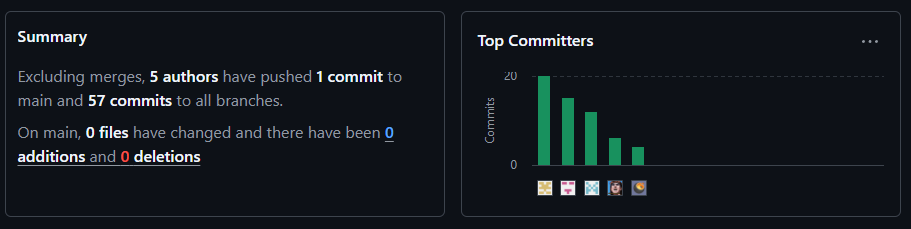


##### 5.2.1.5. Execution Evidence for Sprint Review
| **Epic / Story ID** | **Título**                     | **Criterios de Aceptación**                                                                                                                        |
| ------------------- | ------------------------------ | -------------------------------------------------------------------------------------------------------------------------------------------------- |
| US-02               | Navegación principal (header) | Dado que el usuario hace scroll en la página, cuando el header sale de la vista, entonces este permanece fijo en la parte superior. Además, los enlaces del menú permiten navegar suavemente hacia las secciones correspondientes. |
| US-05              | FAQ (acordeón)    | Dado que el usuario abre la sección de preguntas frecuentes, cuando hace clic sobre una pregunta, entonces se despliega su respuesta, cerrando las demás preguntas activas.                               |
| US-06                | Footer con políticas y contacto          | Dado que el usuario se desplaza hasta el final de la página, cuando hace clic en cualquiera de los enlaces del footer, entonces es redirigido a la sección o página correspondiente (términos, privacidad, contacto, redes sociales).                     |
|US-10                | Animaciones sutiles | Dado que el usuario interactúa con botones o cards, cuando pasa el mouse sobre ellos, entonces se aplican microinteracciones (hover, elevación, sombra) sin afectar el rendimiento.                                           |
|US-14                | Scroll a anclas en landing | Dado que el usuario selecciona un ítem del menú, cuando hace clic en él, entonces se ejecuta un scroll suave hacia la sección correspondiente (Servicios, FAQ, Contacto).                                           |

En este sprint, la Landing Page logró cubrir de manera completa las funcionalidades básicas de navegación, búsqueda y presentación de información, cumpliendo con los criterios definidos en el backlog.

Enlace de la Landing Page desplegada: https://temucoders.github.io/Landing-Page/

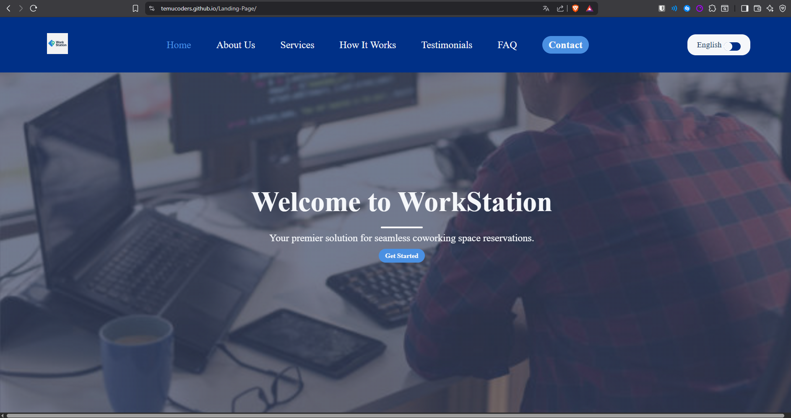
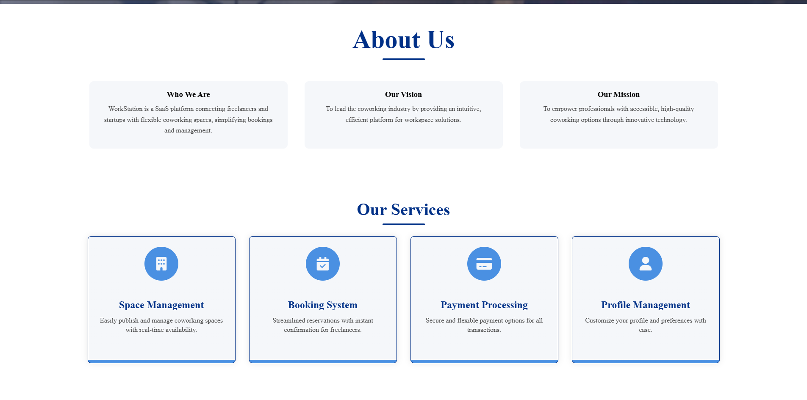
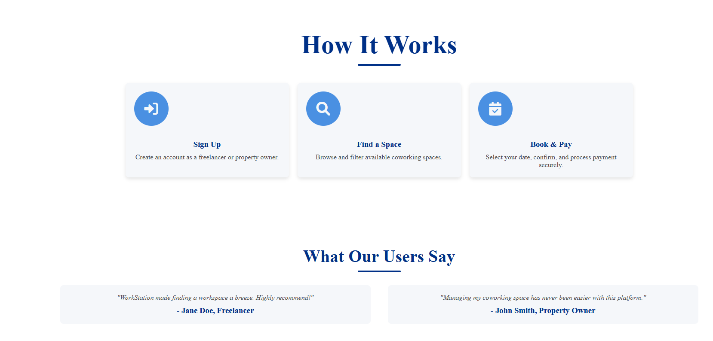
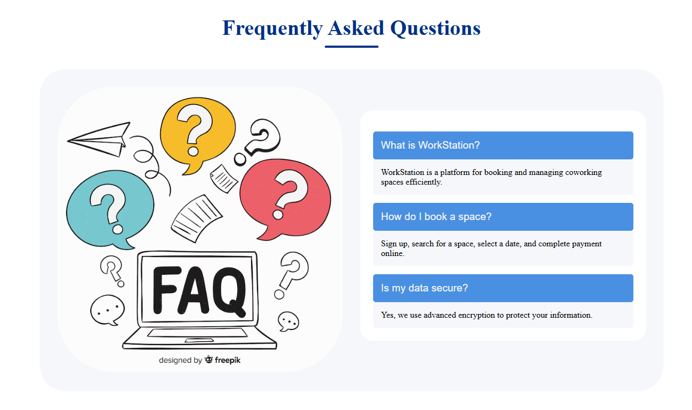
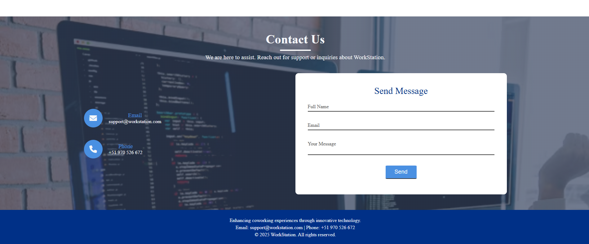

#### 5.2.1.6. Services Documentation Evidence for Sprint Review.

Durante este Sprint, nos enfocamos exclusivamente en el desarrollo del frontend estático de la Landing Page del proyecto WorkStation. En consecuencia, no se implementaron endpoints ni funcionalidades relacionadas con servicios web o APIs RESTful.

La creación de la documentación de Web Services mediante OpenAPI/Swagger se programará para Sprints futuros, una vez que comience la implementación del backend del sistema.


##### 5.2.1.7. Software Deployment Evidence for Sprint Review

Se realizó el despliegue de la **landing page** del proyecto *AgeCare*, marcando el primer paso hacia la publicación progresiva de los productos del sistema. Este trabajo tuvo como objetivo validar visualmente los avances en diseño e interacción con el cliente y el equipo docente.

##### Actividades Realizadas

- Configuración del repositorio **GitHub** y definición de la estructura inicial de carpetas.
- Implementación del flujo de trabajo **Git Flow**, manteniendo los cambios en la rama *develop*.
- Realización de un **merge** desde *develop* hacia la rama *main*, siguiendo las convenciones definidas en la sección *5.1.2*.
- Activación de **GitHub Pages** como servicio de despliegue estático, apuntando al contenido de la rama *main*.
- Publicación exitosa de la **landing page**, accesible mediante una URL pública.

##### Evidencias Visuales

* Configuración del repositorio GitHub y estructura inicial de carpetas.

  * Creamos un repositorio para la landing page dentro de la organizacion. La configuramos para que sea de tipo publico:

    <p align="center">
      
    </p>

  * Una vez dentro copiamos la direccion HTTPS del repositorio y la clonamos en nuestro entorno local con el comando git clone. Preparamos una estructura de carpetas similar a la siguiente en nuestra maquina:

    <p align="center">
      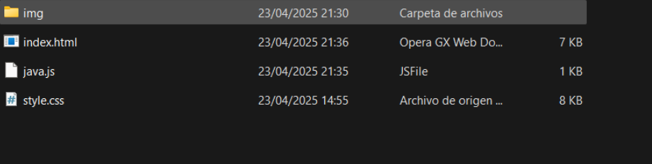
    </p>

* Implementación de flujo de trabajo con Git Flow, manteniendo los cambios en la rama develop.

  * Desde la consola, creamos un push inicial en la rama remota main usando el comando git push origin main con un mensaje commit descriptivo. initial-commit-landing

  * El siguiente paso es crear la rama local develop usando el comando git checkout -b develop, la creamos de manera remota con git push origin develop. Las ramas feature/* se crearan de la misma forma, pero hay que tener en cuenta que siempre se deben crear a partir de la rama develop, por lo que un paso previo es asegurarnos que estamos en la rama correcta con git checkout develop.

*  Realización de un merge desde develop hacia la rama main, de acuerdo a las convenciones definidas en la sección 5.1.2.

  *  Activación de GitHub Pages como servicio de despliegue estático, apuntando al contenido de la rama main.

  * Se realizaron pruebas manuales usando la extension Live Server para verificar la funcionalidad de la landing page antes de fusionar los cambios.

* Activación de GitHub Pages como servicio de despliegue estático, apuntando al contenido de la rama main.

  * En la configuración del repositorio, se seleccionó la rama main como fuente para GitHub Pages. Esto se realizó desde la pestaña "Settings" > "Pages" en GitHub.

  * Se verificó que la URL generada por GitHub Pages estuviera activa y mostrara correctamente el contenido de la landing page.

  <p align="center">
      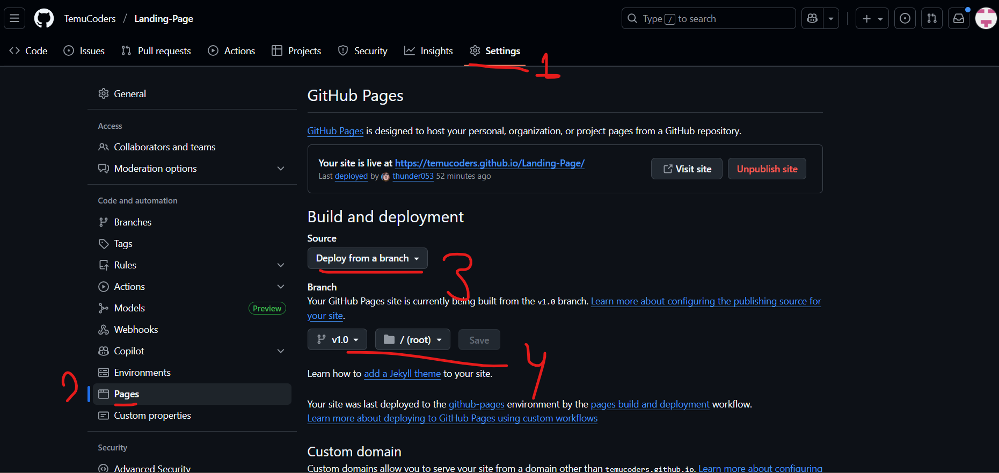
    </p>


* Publicacion exitosa de la Landing Page


##### 5.2.1.8. Team Collaboration Insights during Sprint

Para este Sprint, las tareas de diseño, implementación y documentación de la landing page se distribuyeron entre los integrantes del equipo. La implementación y despliegue de la landing page fue llevado a cabo por todo el equipo, siguiendo un enfoque colaborativo que involucró diversas etapas bien definidas.

Las actividades de implementación se desarrollaron mediante un flujo de trabajo ágil. El proceso comenzó con la planificación inicial, donde se asignaron roles específicos para cada fase. Esto incluyó el diseño de la estructura HTML y los estilos CSS, que se iniciaron con commits iniciales para establecer la base del proyecto.

<p align="center">
  
</p>


Posteriormente, se integraron funcionalidades dinámicas con JavaScript, junto con la optimización del código y los ajustes necesarios para la traducción internacional. Las tareas se coordinaron a través de reuniones diarias, permitiendo priorizar actividades, resolver bloqueos y garantizar la calidad del código mediante revisiones de pares.

Finalmente, los avances se registraron en el repositorio con commits regulares, facilitando un seguimiento claro del progreso. Se utilizaron herramientas como ESLint y Prettier para mantener la consistencia y calidad del código, fortaleciendo la colaboración entre los miembros del equipo. 

<p align="center">
  
</p>


### 5.2.2. Sprint 2

En esta sección se registra el avance del producto y las acciones colaborativas realizadas por el equipo para el Sprint 2.

#### 5.2.2.1. Sprint Planning 2

El Sprint Planning 2 es una reunión esencial para iniciar el segundo sprint de un proyecto, donde el equipo define los objetivos y entregables y tareas asignadas para el sprint. A continuación, se presenta un cuadro con los detalles acordados.

| Sprint \# | Sprint 2 |
| ----- | ----- |
| Date | 2025-09-01 |
| Time | 9:00 PM |
| Location | Virtual \- Meet |
| Prepared By | Jeremy Quijada |
| Attendees (to planning meeting) | Jeremy Quijada, Franco Gabriel Huang Liu, Arturo Axel Saravia Huaricancha, Leonardo Raul Cumba Rengifo y Ivan Jeanpierre La Madrid Lozano |
| Sprint 2 \- 1 Review Summary |Se han realizado mejoras en varios aspectos del informe según las sugerencias del profesor, además de haber desarrollado una primera versión de nuestra aplicación Front End, la cual continuará evolucionando en próximas entregas.. |
| Sprint 2 \- 1 Retrospective Summary | Se logró un progreso razonable durante el sprint 2: si bien no se completaron tantas pantallas como se había previsto, el equipo mejoró significativamente en comunicación y trabajo colaborativo, lo que permitió alcanzar un avance satisfactorio en el desarrollo de la aplicación. |
| Sprint 2 Goal | En este sprint, nos enfocamos principalmente en mejorar la calidad de la información presentada en los reportes e implementar la primera versión del Front End de la aplicación. Durante esta fase, desarrollamos diversos módulos con operaciones CRUD (crear, leer, actualizar y eliminar) que permiten gestionar distintos recursos del sistema. Esperamos que esta versión inicial proporcione una visualización clara de las funcionalidades esenciales y del diseño de la interfaz. La efectividad de este avance se validará mediante la interacción de los usuarios con las funcionalidades desarrolladas y la retroalimentación positiva sobre la experiencia de uso. |
| Sprint 2 Velocity | Nuestro equipo puede aceptar hasta - Story Points. |
| Sum of Story Points | La suma de Story Points atendidos es de -. |

#### 5.2.2.2. Aspect Leaders and Collaborators
Durante este sprint, nuestro objetivo fue definir nuestros puntos base para realizar una solucion acertada a lo que el usuario necesite. La investigacion, entrevistas y datos recolectados ayudaron a que se pueda generar una vision mas clara del objetivo en el grupo. Por ello aqui se presentan los roles que cada uno de los participantes tuvo a lo largo de este sprint.

| Team Member (Last Name, First Name) | GitHub Username | Aspect Name 1 (L/C) |
| ----- | ----- | ----- |
| Quijada Magro Jeremy Alexander | jhonson2021 | L |
| Ivan La Madrid Lozano | IvanLaMadrid | C |
| Arturo Saravia Huaricancha | thunder053 | C |
| Luis Alberto Cumba Rengifo | LeonardoC72 | C |
| Arturo Saravia Huaricancha | thunder053 | C |
| Luis Alberto Cumba Rengifo | LeonardoC72 | C |


#### 5.2.2.3. Sprint Backlog 2

Esta sección ofrece un resumen del objetivo central del sprint, resaltando las metas propuestas y las funcionalidades que se planean desarrollar. Seguidamente, se incluye una captura del tablero del sprint en la herramienta de gestión elegida, Trello, junto con su enlace público. También se presenta una tabla con las User Stories asignadas al sprint, los Work-items o tareas derivadas, y otras actividades adicionales requeridas para alcanzar los objetivos generales del sprint.

Este es nuestro link de invitación a nuestro Trello:

Colocar los User Stories ---

#### 5.2.2.4. Development Evidence for Sprint Review

En la siguiente tabla se presentan los commits realizados durante el Sprint 2. En este sprint nos enfocamos en corregir observaciones clave de la primera entrega, como reformular los antecedentes y problemáticas, ajustar los Lean UX statements, completar el Impact Mapping y rehacer los diagramas de arquitectura, clases y base de datos. Además, se desarrolló y desplegó una versión inicial del backend con los principales CRUDs.

| Hash      | Autor         | Fecha       | Commit Message                                                        |
|-----------|---------------|-------------|-------------------------------------------------------------------------|
| b816fb4   | jhonson2021   | 2025-10-07  | feat: Big Event Stoarming                                              |
| 73dc520   | jhonson2021   | 2025-10-07  | fix: Mejoras del Cap V                                                 |
| 3034fff   | Ivan La Madrid| 2025-10-07  | Add customer journey map for propietarios/hosts                        |
| 398362b   | Ivan La Madrid| 2025-10-07  | add/Enhance User Journey Mapping section                               |
| 4a2a514   | Ivan La Madrid| 2025-10-07  | Clarify Lean UX assumptions section                                    |
| 44b12b3   | Ivan La Madrid| 2025-10-07  | fix/ lean ux problem statements y assumptions                          |
| 9857a2a   | LeonardoC72   | 2025-10-08  | Correccion Product Backlog                                             |
| bd533f3   | LeonardoC72   | 2025-10-08  | Correcion de Impactmap                                                 |
| 7de0d48   | LeonardoC72   | 2025-10-08  | Rename BG 1.png to BG1.png                                             |
| 7a38a5c   | LeonardoC72   | 2025-10-08  | Correccion de los impact maping                                        |
| e00d945   | LeonardoC72   | 2025-10-08  | Correccion de las US                                                   |
| b6bd321   | LeonardoC72   | 2025-10-08  | Add files via upload                                                   |
| 9d7e860   | St4rLght05    | 2025-10-08  | feat(chapter4): added introduction to Class & Database Diagrams        |
| ca09f6a   | jhonson2021   | 2025-10-09  | fix: typicode                                                          |
| afaf84e   | St4rLght05    | 2025-10-09  | feat(chapter5): Added services documentarion and Software deplyment evidence |
| 454cf04   | jhonson2021   | 2025-10-09  | feat: Execution Evidence for Sprint Review                             |
| 1a8f8a8   | jhonson2021   | 2025-10-09  | feat: Sprint 2                                                         |


#### 5.2.2.5. Execution Evidence for Sprint Review

En esta entrega se realizaron mejoras al Landing Page respecto a la versión presentada en el Sprint 1, optimizando su diseño y funcionalidad. Por otro lado, cada integrante del equipo implementó y desplegó su propio CRUD del backend, consolidando así el progreso técnico del proyecto.

**Landing Page:** 


Enlace de la Landing Page desplegada: https://temucoders.github.io/Landing-Page/

**CRUDS:**

 - **Crud de usuarios:** 

 - **Crud de espacios de trabajo:** 
  

  Link: https://workspaces---workstation.web.app/searching/workspaces

 - **Crud de reservas:** 

 - **Crud de reseñas:** 

 - **Crud de servicios:** 

#### 5.2.2.6. Services Documentation Evidence for Sprint Review.
Durante este sprint, logramos desplegar una aplicación web funcional que consume datos desde un servidor JSON previamente configurado y desplegado. Este servidor, implementado mediante Typicode, simula la base de datos del proyecto y proporciona la información principal visualizada en la interfaz.

| Nombre del Endpoint | Acciones Implementadas      | Sintaxis de Llamada                                                                                                                                          | Especificación de Parámetros | Ejemplo de Llamada                                                           | Explicación del Response                                         |
|---------------------|-----------------------------|--------------------------------------------------------------------------------------------------------------------------------------------------------------|-------------------------------|------------------------------------------------------------------------------|------------------------------------------------------------------|
| `base.service.ts`   | `GET`, `POST`, `PUT`, `DELETE` | ```export const environment = {production: true,platformProviderApiBaseUrl: 'https://my-json-server.typicode.com/jhonson2021/db-server',platformProviderWorkspacesEndpointPath: '/workspaces'};``` | No requiere parámetros         | `https://ca3ae4ce59df808f6d28.free.beeceptor.com/api/v1/doctors/`           | Muestra la información de la base de datos en formato JSON.     |

Además de capturas que muestran el contenido de db.json ya desplegado en typicode:

<p align="center">
  
</p>

#### 5.2.2.7. Software Deployment Evidence for Sprint Review

Landing Page Para hacer el deployment de la landing page se utilizó Github Pages, una funcionalidad de Github que permite hacer el deployment de páginas web de forma rápida y pública. Dentro del repositorio, en el apartado de settings , se encuentra la opcion de Pages.

##### Actividades Realizadas

- Configuración del repositorio **GitHub** y definición de la estructura inicial de carpetas.
- Implementación del flujo de trabajo **Git Flow**, manteniendo los cambios en la rama *develop*.
- Realización de un **merge** desde *develop* hacia la rama *main*, siguiendo las convenciones definidas en la sección *5.1.2*.
- Activación de **GitHub Pages** como servicio de despliegue estático, apuntando al contenido de la rama *main*.
- Publicación exitosa de la **landing page**, accesible mediante una URL pública.

##### Evidencias Visuales

* Configuración del repositorio GitHub y estructura inicial de carpetas.
  * Creamos un repositorio para la landing page dentro de la organizacion. La configuramos para que sea de tipo publico:
  

  * Una vez dentro copiamos la direccion HTTPS del repositorio y la clonamos en nuestro entorno local con el comando git clone. Preparamos una estructura de carpetas similar a la siguiente en nuestra maquina:
  

* Implementación de flujo de trabajo con Git Flow, manteniendo los cambios en la rama develop.

  * Desde la consola, creamos un push inicial en la rama remota main usando el comando git push origin main con un mensaje commit descriptivo.
  initial-commit-landing

  * El siguiente paso es crear la rama local develop usando el comando git checkout -b develop, la creamos de manera remota con git push origin develop. Las ramas feature/* se crearan de la misma forma, pero hay que tener en cuenta que siempre se deben crear a partir de la rama develop, por lo que un paso previo es asegurarnos que estamos en la rama correcta con git checkout develop.

* Realización de un merge desde develop hacia la rama main, de acuerdo a las convenciones definidas en la sección 5.1.2.

  * Antes de realizar el merge, se revisaron los cambios mediante un pull request en GitHub, asegurando que no existieran conflictos y que el código cumpliera con los estándares definidos.

  * Se realizaron pruebas manuales usando la extension Live Server para verificar la funcionalidad de la landing page antes de fusionar los cambios.

* Activación de GitHub Pages como servicio de despliegue estático, apuntando al contenido de la rama main.

  * En la configuración del repositorio, se seleccionó la rama main como fuente para GitHub Pages. Esto se realizó desde la pestaña "Settings" > "Pages" en GitHub.

  * Se verificó que la URL generada por GitHub Pages estuviera activa y mostrara correctamente el contenido de la landing page.

  

  * Publicacion exitosa de la Landing Page

  

  

  
  
  

  

  FrontEnd Para el FrontEnd, se utilizó Firebase para el despliegue de la página.
<p align="center">
  
</p>
Antes del despliegue, debemos crear una cuenta, por lo que continuaremos con google.
<p align="center">
  
</p>
Una vez tenemos la cuenta creada vamos a la parte de arriba a la izquierda "go to console" y creamos un nuevo proyecto de Firebase.
<p align="center">
  
</p>
Le colocamos un nombre correspondiente al proyecto a realizar.
<p align="center">
  
</p>
Una vez tenemos el proyecto creado, desde nuestro editor, en este caso IntelliJ IDEA Ultimate conectamos nuestro proyecto local al proyecto Firebase.
<p align="center">
  
</p>
Al acceder al link, podemos ver la página correctamente desplegada.
<p align="center">
  
</p>

#### 5.2.2.8. Team Collaboration Insights during Sprint


---
### Conclusiones

El proyecto de WorkStation surge debido a la necesidad que se está generando en el mercado laboral de hoy en día, que es la busqueda o la falta de espacios de trabajos flexible, accesibles y adaptables a las modalidades de trabajo tanto remoto como freelance. A partir del problema detectado, se encontró un desligamiento entre las ofertas de espacios de trabajo y la demanda de profesionales que requieren de un ambiente productivo a corto plazo. La solución que tenemos propuesta une varias soluciones en una sola plataforma con funcionalidades en tiempo real, optimizando la experiencia del usuario y del propietario.

Esta propuesta no solo va orientada a la eficiencia operativa a travez de la digitalización de procesos, sino que también promociona la sostenibilidad en los espacios de trabajos. Viendolo de esta perspectiva, WorkStation no solo es un sistema de reservas, sino un herramienta que impulsa la poroductividad en los freelancers y startups, a la vez contribuye al crecimiento en el empredimiento en ciudades.

Como idea final, WorkStation representa la iniciativa tecnológica con impacto social, económico y cultural, que alinea la flexibilidad del trabajo de hoy en día con la optimización digital. El desarrrollo se plantea como un aporte significativo a la transformación digital en el campo laboral, dandose como una solución innovadora y competitiva en el mercado de coworkings en el Perú.


### Anexos

Enlace del Landing Page: https://temucoders.github.io/Landing-Page/

### Bibliografía

Agena, J., Álvarez, L., Bonifaz, A., Briceño  J. (2017). *DESARROLLO DE UN PLAN DE NEGOCIO PARA UNCOWORKING EN LA CIUDAD DE LIMA*. Repositorio de la Universidad San Ignacio de Loyola. <https://repositorio.usil.edu.pe/server/api/core/bitstreams/46283d66-d85c-4e61-99ed-26b1d3f731c7/content>

Aranda G. (2020, 16 de septiembre). *La influencia del Coworking en la Productividad de las empresas de publicidad en Lima Metropolitana, año 2019*. Repositorio Académico UPC. <https://repositorioacademico.upc.edu.pe/bitstream/handle/10757/652964/Aranda_MG.pdf?sequence=3>

Binswanger Perú (2018). Reporte inmoviliario, Coworking y centros de negocio. Binswanger Perú. <https://binswanger.com.pe/Storage/tbl_publicaciones/fld_1027_Archivo_file/699-z9Zm8Yg5Ko5Lg4L.pdf>

Ikeda L. (2019, 25 de octubre). *Coworking y Maker Space en Lima Moderna: un estudio de factibilidad*. Repositorio Académico UPC. <https://repositorioacademico.upc.edu.pe/bitstream/handle/10757/628237/IkedaT_Luc%C3%ADa.pdf?sequence=1>

López, E., Pejerrey, A., Suca, M. (2020, diciembre). *Plan de marketing para el lanzamiento de oficinas coworking en el distrito de Los Olivos*. Repositorio Institucional de la Universidad del Pacífico. <https://repositorio.up.edu.pe/backend/api/core/bitstreams/3ef2451a-0908-4942-9efd-fa08dca41d98/content>
