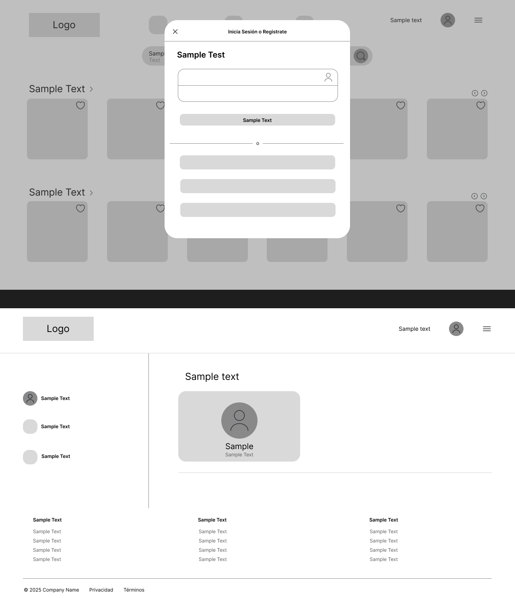

**COURSE PROJECT**

<p align="center">
  
</p>

<p align="center"><strong>Universidad Peruana de Ciencias Aplicadas</strong></p>

<p align="center"><strong>Ingeniería de Software</strong><br>
Desarrollo de Aplicaciones Open Source<br>
<strong>Profesor:</strong> Flores Moroco Juan Antonio</p>

<h2 align="center">INFORME</h2>

<h3 align="center">Startup: WorkStation</h3>
<p align="center"><strong>Producto: WorkState</strong></p>

<h3 align="center">Team Members:</h3>

<div align="center">

 | **Member**                   | **Code**   |
 | ---------------------------- | ---------- |
 | Quijada Magro Jeremy     | U202219657 |
 | Huang Liu Franco      | U201914541 |
 | La Madrid Lozano Ivan         | U202113432 |
 | Saravia Huaricancha Arturo     | U202312447 |
 | Cumba Rengifo Leonardo      | U202311912 |


</div>

<p align="center"><strong>Diciembre 2025</strong></p>

# Registro de Versiones del Informe


| Versión | Fecha       | Autor | Descripción |
|---------|-------------|-------|-------------|
| TB1     | 08/09/2025  | Quijada Magro, Jeremy  | Desarrollé la carátula del repositorio. |
| TB1     | 12/09/2025  | Huang Liu, Franco   | Desarrollo de la database diagram |
| TB1     | 15/09/2025  | Huang Liu, Franco   | Desarrollo de web app wireframes |
| TB1     | 16/09/2025  | Cumba Rengifo,Leonardo Raul   | Desarrollo de las User Stories y Product backlog|
| TB1     | 16/09/2025  | Saravia Huaricancha, Arturo  | Desarrollo de impact mapping y ayuda en el user stories |
| TB1     | 16/09/2025  | La Madrid Lozano, Ivan  | Mejora del User Task Matrix, desarrollo del Customer Journey Map y Empathy Map de hosts |
---

## Contenido
#### Tabla de contenidos

- [Registro de Versiones del Informe](#registro-de-versiones-del-informe)
  - [| TB1     | 16/09/2025  | Saravia Huaricancha, Arturo  | Desarrollo de impact mapping y ayuda en el user stories |](#-tb1------16092025---saravia-huaricancha-arturo---desarrollo-de-impact-mapping-y-ayuda-en-el-user-stories-)
  - [Contenido](#contenido)
      - [Tabla de contenidos](#tabla-de-contenidos)
  - [Student Outcome](#student-outcome)
  - [Capítulo I: Introducción](#capítulo-i-introducción)
    - [1.1. Startup Profile](#11-startup-profile)
    - [1.1.1. Descripción de la Startup](#111-descripción-de-la-startup)
    - [1.1.2. Perfiles de integrantes del equipo](#112-perfiles-de-integrantes-del-equipo)
  - [1.2. Solution Profile](#12-solution-profile)
    - [1.2.1 Antecedentes y problemática](#121-antecedentes-y-problemática)
    - [Descripción de la Problemática](#descripción-de-la-problemática)
    - [1.2.2 Lean UX Process](#122-lean-ux-process)
      - [1.2.2.1. Lean UX Problem Statements](#1221-lean-ux-problem-statements)
        - [Dominio del Problema](#dominio-del-problema)
      - [Segmentos de Cliente](#segmentos-de-cliente)
      - [Puntos de Dolor](#puntos-de-dolor)
      - [Brecha Detectada](#brecha-detectada)
      - [Visión y Estrategia](#visión-y-estrategia)
      - [Segmento Inicial](#segmento-inicial)
      - [1.2.2.2. Lean UX Problem Assumptions](#1222-lean-ux-problem-assumptions)
      - [1.2.2.3. Lean UX Problem Hypothesis Statements](#1223-lean-ux-problem-hypothesis-statements)
      - [1.2.2.4. Lean UX Problem Canvas](#1224-lean-ux-problem-canvas)
      - [1. Business Problem](#1-business-problem)
      - [2. Business Outcomes](#2-business-outcomes)
      - [3. Users](#3-users)
      - [4. User Benefits](#4-user-benefits)
      - [5. Solutions](#5-solutions)
      - [6. Hypotheses](#6-hypotheses)
      - [7. What’s the most important thing we need to learn first?](#7-whats-the-most-important-thing-we-need-to-learn-first)
      - [8. What’s the least amount of work we need to do to learn the next most important thing?](#8-whats-the-least-amount-of-work-we-need-to-do-to-learn-the-next-most-important-thing)
  - [1.3. Segmentos objetivo](#13-segmentos-objetivo)
    - [Propietarios de Inmuebles (Coworkings)](#propietarios-de-inmuebles-coworkings)
      - [Características Demográficas](#características-demográficas)
      - [Datos Relevantes](#datos-relevantes)
      - [Necesidades Clave](#necesidades-clave)
    - [Freelancers y Startups](#freelancers-y-startups)
      - [Características Demográficas](#características-demográficas-1)
      - [Datos Relevantes](#datos-relevantes-1)
      - [Necesidades Clave](#necesidades-clave-1)
  - [Capítulo II: Requirements Elicitation \& Analysis](#capítulo-ii-requirements-elicitation--analysis)
  - [2.1. Competidores](#21-competidores)
    - [2.1.1. Análisis competitivo](#211-análisis-competitivo)
    - [2.1.2. Estrategias y tácticas frente a competidores](#212-estrategias-y-tácticas-frente-a-competidores)
  - [2.2. Entrevistas](#22-entrevistas)
    - [2.2.1. Diseño de entrevistas](#221-diseño-de-entrevistas)
    - [2.2.2. Registro de entrevistas](#222-registro-de-entrevistas)
    - [2.2.3. Análisis de entrevistas](#223-análisis-de-entrevistas)
      - [Freelancers](#freelancers)
      - [Propietarios de inmuebles](#propietarios-de-inmuebles)
  - [2.3. Needfinding](#23-needfinding)
    - [2.3.1. User Personas](#231-user-personas)
    - [2.3.2. User Task Matrix](#232-user-task-matrix)
      - [**Leyenda — Escalas**](#leyenda--escalas)
      - [a) Trabajador independiente / Freelancer](#a-trabajador-independiente--freelancer)
      - [b) Propietario de inmueble / Host](#b-propietario-de-inmueble--host)
    - [2.3.3. User Journey Mapping](#233-user-journey-mapping)
    - [2.3.4. Empathy Mapping](#234-empathy-mapping)
    - [2.3.5. As-is Scenario Mapping](#235-as-is-scenario-mapping)
  - [2.4. Ubiquitous Language](#24-ubiquitous-language)
- [Capitulo III: Requirements Specification](#capitulo-iii-requirements-specification)
  - [3.1. User Stories](#31-user-stories)
  - [**3.1. User Stories**](#31-user-stories-1)
  - [3.2. Impact Mapping](#32-impact-mapping)
  - [Capítulo IV: Product Design](#capítulo-iv-product-design)
    - [4.1. Style Guidelines](#41-style-guidelines)
      - [4.1.1. General Style Guidelines](#411-general-style-guidelines)
        - [Branding:](#branding)
        - [Typography](#typography)
        - [Colors](#colors)
        - [Spacing](#spacing)
        - [Tone of Communication and Language](#tone-of-communication-and-language)
          - [Ejemplos](#ejemplos)
      - [4.1.2. Web Style Guidelines.](#412-web-style-guidelines)
        - [Diseño Responsive](#diseño-responsive)
        - [Breakpoints](#breakpoints)
    - [4.2. Information Architecture](#42-information-architecture)
      - [4.2.1. Organization Systems](#421-organization-systems)
        - [Sistemas Visuales](#sistemas-visuales)
        - [Esquemas de Categorización](#esquemas-de-categorización)
      - [4.2.2. Labeling Systems](#422-labeling-systems)
        - [Etiquetas del Landing Page](#etiquetas-del-landing-page)
        - [Etiquetas de la Web Application (Freelancers)](#etiquetas-de-la-web-application-freelancers)
        - [Etiquetas de la Web Application (Propietarios)](#etiquetas-de-la-web-application-propietarios)
      - [4.2.3. SEO Tags and Meta Tags](#423-seo-tags-and-meta-tags)
        - [Landing Page](#landing-page)
        - [Web Application](#web-application)
      - [4.2.4. Searching Systems](#424-searching-systems)
        - [Barra de Búsqueda Inteligente](#barra-de-búsqueda-inteligente)
        - [Filtros Avanzados](#filtros-avanzados)
      - [4.2.5. Navigation Systems](#425-navigation-systems)
    - [Landing Page Navigation](#landing-page-navigation)
        - [4.2. Web Application Navigation](#42-web-application-navigation)
    - [4.3. Landing Page UI Design](#43-landing-page-ui-design)
      - [4.3.1. Landing Page Wireframe](#431-landing-page-wireframe)
      - [4.3.2. Landing Page Mock-up](#432-landing-page-mock-up)
    - [4.4. Web Applications UX/UI Design](#44-web-applications-uxui-design)
      - [4.4.1. Web Applications Wireframes](#441-web-applications-wireframes)
      - [4.4.2. Web Applications Wireflow Diagrams](#442-web-applications-wireflow-diagrams)
      - [4.4.2. Web Applications Mock-ups](#442-web-applications-mock-ups)
      - [4.4.3. Web Applications User Flow Diagrams](#443-web-applications-user-flow-diagrams)
    - [4.5. Web Applications Prototyping](#45-web-applications-prototyping)
    - [4.6. Domain-Driven Software Architecture](#46-domain-driven-software-architecture)
      - [4.6.1. Design-Level Event Storming](#461-design-level-event-storming)
      - [4.6.2. Software Architecture Context Diagram](#462-software-architecture-context-diagram)
      - [4.6.3. Software Architecture Container Diagrams](#463-software-architecture-container-diagrams)
      - [4.6.4. Software Architecture Components Diagrams](#464-software-architecture-components-diagrams)
    - [4.7. Software Object-Oriented Design](#47-software-object-oriented-design)
      - [4.7.1. Class Diagrams](#471-class-diagrams)
    - [4.8. Database Design](#48-database-design)
      - [4.8.1. Database Diagrams](#481-database-diagrams)
- [Capítulo V: Product Implementation, Validation & Deployment](#capítulo-v-product-implementation-validation--deployment)
  - [5.1. Software Configuration Management](#51-software-configuration-management)
    - [5.1.1. Software Development Environment Configuration](#511-software-development-environment-configuration)
    - [5.1.2. Source Code Management](#512-source-code-management)
    - [5.1.3. Source Code Style Guide & Conventions](#513-source-code-style-guide--conventions)
    - [5.1.4. Software Deployment Configuration](#514-software-deployment-configuration)
  - [5.2. Landing Page, Services & Applications Implementation](#52-landing-page-services--applications-implementation)
    - [5.2.1. Sprint 1](#521-sprint-1)
      - [5.2.1.1. Sprint Planning 1](#5211-sprint-planning-1)
      - [5.2.1.2. Aspect Leaders and Collaborators](#5212-aspect-leaders-and-collaborators)
      - [5.2.1.3. Sprint Backlog 1](#5213-sprint-backlog-1)
      - [5.2.1.4. Development Evidence for Sprint Review](#5214-development-evidence-for-sprint-review)
      - [5.2.1.5. Execution Evidence for Sprint Review](#5215-execution-evidence-for-sprint-review)
      - [5.2.1.6. Services Documentation Evidence for Sprint Review](#5216-services-documentation-evidence-for-sprint-review)
      - [5.2.1.7. Software Deployment Evidence for Sprint Review](#5217-software-deployment-evidence-for-sprint-review)
      - [5.2.1.8. Team Collaboration Insights during Sprint](#5218-team-collaboration-insights-during-sprint)
  
---

## Student Outcome

**ABET – EAC - Student Outcome 3**  
**Criterio:** Capacidad de comunicarse efectivamente con un rango de audiencias.  

En el siguiente cuadro se describen las acciones realizadas y conclusiones del equipo que sustentan el logro del ABET - EAC - Student Outcome 3:

| Criterio específico | Acciones realizadas | Conclusiones |
|---------------------|---------------------|--------------|
| **1. Comunica oralmente con efectividad a diferentes rangos de audiencia** | **TB1:**  | **TB1**:  |
| **2. Comunica por escrito con efectividad a diferentes rangos de audiencia** | **TB1:**  | **TB1:**  |


## Capítulo I: Introducción

### 1.1. Startup Profile

### 1.1.1. Descripción de la Startup

WorkStation es una aplicación web innovadora diseñada para facilitar la reserva eficiente de espacios de trabajo en oficinas compartidas. Su propósito es conectar a freelancers, trabajadores remotos, startups y empresas de todos los tamaños con espacios de coworking disponibles en su ciudad o alrededor del mundo.

La plataforma permitirá a los usuarios buscar, comparar y reservar escritorios, salas de reuniones, oficinas privadas y otros recursos disponibles en tiempo real. Cada espacio contará con información detallada como ubicación, precios, horarios, disponibilidad, fotos, servicios incluidos (Wi-Fi, café, impresoras, etc.), y valoraciones de otros usuarios

Considerando la flexibildad y la adaptabilidad como puntos esenciales para el crecimiento de las startups y los trabajos freelance, WorkStation brinda una solución que compite con la rigidez de los contratos tradicionales, y propone una instancia mucho más moderna para este espacio de trabajo que las empresas necesitan.

### 1.1.2. Perfiles de integrantes del equipo

| Foto                                                                                   | Alumno                         | Descripción                                                                                                                                                                                                                                                                   |
| -------------------------------------------------------------------------------------- | ------------------------------ | ----------------------------------------------------------------------------------------------------------------------------------------------------------------------------------------------------------------------------------------------------------------------------- |
|                                          | Quijada Magro Jeremy Alexander | Estudiante de Ingeniería de Software que planea enfocarse en la gestión de proyectos. Con conocimientos básicos en programación web y bases de datos.                                                                                                                         |
|                                                        | Huang Liu Franco Gabriel    | Estudiante de Ingeniería de Software que quiere enfocarse en full stack. Le gusta aprender  |
|                                                    | Saravia Huaricancha Arturo Axel  |   Estudiante de Ingeniería de Software centrado de desarrollo de apps y juegos idie. Interesado en desarrollo en fivem y apps web.                 |
|                                                          | Cumba Rengifo Leonardo Raul        | Estudiante de Ingeniería de Software que quiere enfocarse en backend o en DBA. En la actualidad me gustaria especialiarse en DBA |
|                                                          | Ivan Jeanpierre La Madrid Lozano         | Estudiante de Ingeniería de Software con enfoque en la solucion de distintos problemas tecnológicos                                                                                         |

## 1.2. Solution Profile

### 1.2.1 Antecedentes y problemática

- **Who (¿Quiénes son los involucrados?)**  
  Los principales usuarios son freelancers, trabajadores remotos, pequeñas empresas, startups y nómadas digitales que requieren espacios de trabajo profesionales, cómodos y flexibles sin necesidad de alquilar una oficina a largo plazo.  
  Además, los propietarios y administradores de espacios de coworking forman parte clave, ya que buscan visibilidad, gestión eficiente de sus reservas y captación de nuevos clientes.

- **What (¿Qué se necesita?)**  
  Se necesita una plataforma centralizada e intuitiva que permita a los usuarios buscar, comparar, reservar y pagar por espacios de coworking en diferentes ubicaciones, con información clara y disponibilidad en tiempo real.  
  Actualmente, el proceso de reserva suele ser manual, lento y disperso en múltiples canales no estandarizados (webs propias, redes sociales, WhatsApp, etc.).

- **Where (¿Dónde ocurre el problema?)**  
  En ciudades con alta actividad profesional y creciente demanda por espacios flexibles, como Lima, Arequipa, Medellín, Bogotá o CDMX. La necesidad puede extenderse a nivel nacional e internacional a medida que el trabajo remoto se consolida.

- **When (¿Cuándo surge esta necesidad?)**  
  La necesidad es continua y puede surgir en cualquier momento. Muchos usuarios requieren espacios por horas, días o semanas. Además, algunos necesitan soluciones de último minuto para reuniones o trabajo inmediato.

- **Why (¿Por qué existe esta necesidad?)**  
  El mundo laboral ha cambiado. La pandemia aceleró el trabajo remoto y la cultura freelance. Las personas necesitan trabajar en ambientes productivos y profesionales, pero sin compromisos de largo plazo. Sin embargo, no existe una solución eficiente y masiva que integre toda la oferta disponible y facilite el proceso de reserva.

- **How (¿Cómo se puede solucionar?)**  
  Mediante el desarrollo de una aplicación web llamada WorkStation, que permita a los usuarios explorar una variedad de espacios de coworking, visualizar disponibilidad, leer reseñas, aplicar filtros, hacer reservas en tiempo real y pagar desde una sola interfaz.

- **How Much (¿Cuánto costaría y cómo se monetiza?)**  
  Los precios varían según ciudad, tipo de espacio, servicios y duración. La plataforma podrá mostrar precios claros y actualizados. El modelo de negocio se sustentará en comisiones por reserva, planes de suscripción para coworking o membresías premium para usuarios frecuentes.

### Descripción de la Problemática

En los últimos años, el trabajo remoto y el modelo freelance han experimentado un crecimiento significativo en Perú y América Latina. Según Statista (2023), más del 20% de los trabajadores peruanos realiza actividades de forma independiente o remota, y esta tendencia continúa en aumento. Sin embargo, este cambio en la modalidad laboral no ha sido acompañado por soluciones tecnológicas que respondan de manera efectiva a las necesidades de espacio físico flexible, accesible y bien ubicado.

Por otro lado, el mercado de espacios coworking también ha crecido rápidamente en Lima, con más de 300 centros operando actualmente, especialmente en distritos como Miraflores, San Isidro y Surco (Andina, 2023). A pesar de esta expansión, muchos de estos espacios enfrentan dificultades para ocupar sus instalaciones de forma constante, especialmente en horarios valle o días con baja demanda. La mayoría de propietarios aún dependen de canales informales (WhatsApp, redes sociales o referidos) para captar nuevos usuarios, lo que limita su visibilidad y su capacidad para escalar comercialmente.

Esta desconexión entre la **alta demanda de espacios temporales de trabajo** y la **oferta disponible sin digitalización adecuada** genera ineficiencias notorias: usuarios que no encuentran espacios adecuados en tiempo real, y propietarios que pierden ingresos por no contar con una plataforma de reservas automatizada. Además, la falta de sistemas de gestión y comparación centralizada crea una experiencia fragmentada, poco confiable y lenta para ambas partes.

En este contexto, **WorkStation** surge como una solución tecnológica que busca cerrar esta brecha, permitiendo a freelancers, startups y profesionales acceder fácilmente a espacios de trabajo mediante una plataforma web intuitiva, al mismo tiempo que otorga a los propietarios herramientas de visibilidad, control de disponibilidad y generación de ingresos más eficientes.

### 1.2.2 Lean UX Process

#### 1.2.2.1. Lean UX Problem Statements

##### Dominio del Problema

El proyecto WorkStation se desarrolla en el dominio de los espacios de trabajo compartidos (coworking), una industria en expansión que responde a la evolución del trabajo remoto, el crecimiento del autoempleo y la economía de los servicios digitales. A pesar de esta expansión, la interacción entre la oferta (espacios disponibles) y la demanda (profesionales independientes o empresas en crecimiento) aún se encuentra fragmentada y desorganizada, especialmente en el mercado peruano, donde no existen plataformas digitales de gran alcance que faciliten esta conexión de manera eficiente.

#### Segmentos de Cliente

1. **Freelancers, startups y profesionales remotos**: Personas entre 22 y 40 años que requieren espacios de trabajo flexibles, temporales y bien ubicados. Este segmento prioriza la autonomía, la conectividad y la comodidad, y espera poder gestionar sus reservas de manera rápida y sencilla desde una plataforma digital.
2. **Propietarios o administradores de espacios coworking**: Emprendedores o pequeñas empresas que buscan visibilidad, gestión automatizada de reservas y canales efectivos para ocupar sus instalaciones durante todo el día. Muchos de estos propietarios no cuentan con sistemas digitales propios y dependen de medios manuales o redes sociales para captar usuarios.

#### Puntos de Dolor

- **Freelancers y startups**:

  - No encuentran una oferta centralizada y confiable de espacios disponibles.
  - Carecen de filtros que les permitan comparar opciones según ubicación, precio o servicios.
  - El proceso de reserva suele ser informal, poco transparente y lento.

- **Propietarios de coworkings**:
  - Alta dependencia de canales informales para captar clientes (WhatsApp, redes sociales).
  - Ausencia de herramientas para gestionar disponibilidad en tiempo real.
  - Pérdida de ingresos por falta de reservas constantes y baja visibilidad.

#### Brecha Detectada

En Perú, no existe actualmente una plataforma digital consolidada que conecte, en tiempo real, a freelancers y startups con espacios coworking disponibles. Esta brecha genera una experiencia ineficiente tanto para quienes buscan un lugar para trabajar como para quienes lo ofrecen. A diferencia de mercados como Estados Unidos o Europa —donde plataformas como LiquidSpace o Deskpass dominan el rubro, el ecosistema local aún carece de soluciones tecnológicas adaptadas al comportamiento y necesidades del mercado peruano.

#### Visión y Estrategia

**Visión**: Crear una plataforma web que actúe como un marketplace digital para espacios de coworking, brindando a los usuarios una experiencia de reserva ágil, confiable y personalizada, y a los propietarios una solución de gestión eficiente que maximice el uso de sus instalaciones.
**Estrategia**:

- Desarrollar un producto mínimo viable (MVP) que permita validar tempranamente la propuesta de valor.
- Enfocarse en la usabilidad, accesibilidad y confiabilidad de la plataforma.
- Establecer alianzas estratégicas con coworkings emergentes de Lima.
- Implementar un modelo de monetización basado en comisión por reserva, con herramientas analíticas para los propietarios.

#### Segmento Inicial

Para validar la propuesta de valor de WorkStation, se priorizará un segmento específico en la etapa inicial del proyecto:

- **Usuarios meta**: Freelancers y profesionales digitales entre 22 y 35 años, ubicados en Lima Metropolitana, que trabajan de forma remota o de manera independiente.
- **Aliados estratégicos**: Coworkings de tamaño pequeño a mediano, ubicados en distritos céntricos como Miraflores, Barranco y San Isidro, que no cuentan con plataformas propias de gestión o marketing digital.

#### 1.2.2.2. Lean UX Problem Assumptions

- Asumimos que los usuarios requieren flexibilidad y comodidad en sus espacios de trabajo.
- Asumimos que los propietarios de espacios de coworking necesitan mayor visibilidad y eficiencia en la gestión de reservas.
- Asumimos que la búsqueda y reserva de espacios de coworking es un proceso fragmentado y poco confiable.
- Asumimos que los usuarios están dispuestos a pagar por una solución eficiente y confiable.
- Asumimos que la digitalización mejorará la eficiencia operativa de los espacios de coworking

#### 1.2.2.3. Lean UX Problem Hypothesis Statements

- **Hipótesis 1:** Si ofrecemos una plataforma centralizada y fácil de usar para reservar espacios de coworking, entonces los freelancers y pequeñas empresas preferirán utilizarla debido a la flexibilidad y la facilidad de acceso a diferentes opciones de trabajo.

- **Hipótesis 2:** Si los propietarios de espacios de coworking obtienen mayor visibilidad y una herramienta para gestionar eficientemente las reservas, entonces experimentarán un aumento en la ocupación de sus espacios y en la satisfacción de sus clientes.

- **Hipótesis 3:** Si los usuarios pueden comparar precios, ver disponibilidad en tiempo real y leer reseñas de otros usuarios, entonces tomarán decisiones de reserva con mayor rapidez y precisión, mejorando la experiencia del cliente.

- **Hipótesis 4:** Si la plataforma cobra una comisión por reserva o un modelo de membresía, entonces se generarán ingresos recurrentes tanto para los propietarios de los espacios como para la plataforma, incentivando la adopción de la herramienta.

- **Hipótesis 5:** Si se digitaliza el proceso de gestión de reservas, entonces los propietarios de espacios de coworking podrán reducir sus costos operativos y mejorar su rentabilidad a largo plazo.

#### 1.2.2.4. Lean UX Problem Canvas

#### 1. Business Problem

- La conexion entre las demandas crecientes de espacios trabajos flexibles y la oferta de coworkings está dividida. La mayoría de usuarios no cuentan con plataformas confiables así como los propietarios carecen de herramientas de gestión.

---

#### 2. Business Outcomes

- Aumentar de los ingresos mediantes comisiones y membresías.
- Disminuir el tiempo promedio de búsqueda de reserva de espacios.
- Ayudar a miles de peruanos a buscar un lugar para trabajar garantizando mejores resultados.

---

#### 3. Users

- Nustros clientes serán Freelancers y trabajadores remotos de entre 22 a 40 años que buscan habitaciones disponibles y acogedoras y con servicios como Wi-Fi, salas de reuniones.
- Startups y equipos pequeños que buscan espacio temporal para trabajos de colaboración o reuniones.
- Propietarios de coworking que desean captar más usuarios y administrar las reservas de manera efectiva.

---

#### 4. User Benefits

- Los usuarios contarán con salas de trabajo para satisfacer sus necesidades especiales (precio, ubicación, servicios).
- Los propietarios logran más actividad con menos esfuerzos de rendimiento y no tendrán incertidumbres.
- Con respecto a los propietarios, se reservan con más frecuencia y recomendarán el servicio a otros.

---

#### 5. Solutions

- Motor de búsqueda y filtrado de coworkings por ciudad, precio, servicios.
- Sistema de reservas con calendario en tiempo real.
- Panel para propietarios con gestión de disponibilidad, estadísticas, reseñas.
- Sistema de notificaciones (email, push) para recordatorios y confirmaciones.

---

#### 6. Hypotheses

- Si centralizamos la oferta de coworkings, los usuarios ahorrarán tiempo y confiarán más en el proceso.

- Si los propietarios digitalizan su gestión de reservas, incrementarán su ocupación y reducirán su carga operativa.

- Si los usuarios pueden ver disponibilidad, precios y reseñas en tiempo real, tomarán decisiones más informadas y rápidas.

- Si cobramos comisiones por reserva o membresías premium, el modelo será rentable y sostenible.

- Si la plataforma es ágil y confiable, se convertirá en el canal principal de reserva para usuarios frecuentes.

---

#### 7. What’s the most important thing we need to learn first?

- Primero necesitamos entender si los usuarios finales desean una plataforma de reserva centralizada, sus preferencias y necesidades para implementarlo y mejorar la experiencia.
- Necesitamos saber si les cómodo de usar ante otros métodos tradicionals.

---

#### 8. What’s the least amount of work we need to do to learn the next most important thing?

- Realizar entrevistas, feedback además de pruebas de usabilidad para explorar la relevancia de las reservas de espacios de trabajo tanto para trabajadores como los propietarios.

## 1.3. Segmentos objetivo

En el proyecto nos enfocamos en dos segmentos principales de usuarios, directamente relacionados con el dominio del problema: los propietarios de espacios de coworking y los usuarios que buscan dichos espacios, como freelancers y startups. A continuación, se describen en detalle ambos perfiles.

### Propietarios de Inmuebles (Coworkings)

Corresponde a personas naturales o jurídicas que administran o alquilan espacios acondicionados para trabajo compartido, como oficinas, salas de reuniones, escritorios flexibles, entre otros.

#### Características Demográficas

- **Ubicación:** Principalmente zonas urbanas de alto flujo empresarial, como Miraflores, San Isidro, Surco (Lima).
- **Edad promedio de los administradores:** 30 a 55 años.
- **Nivel socioeconómico:** Medio-alto a alto.
- **Tipo de propiedad:** Empresas formales, pymes inmobiliarias o propietarios individuales.

#### Datos Relevantes

- En Lima existen más de 150 espacios de coworking activos (Andina, 2023).
- El 67% de estos espacios reporta dificultades para llenar su capacidad total, especialmente en horarios valle (CoworkIntel, 2022).
- La mayoría carece de una plataforma de reservas centralizada, y operan mediante WhatsApp, redes sociales o formularios web.

#### Necesidades Clave

- Mayor visibilidad de su espacio.
- Automatización del proceso de reservas.
- Optimización de la ocupabilidad de sus ambientes.
- Acceso a métricas sobre uso y satisfacción de clientes.

---

### Freelancers y Startups

Este grupo está compuesto por trabajadores independientes, equipos pequeños de desarrollo, marketing, diseño, entre otros, así como emprendedores en etapa inicial.

#### Características Demográficas

- **Edad:** Entre 20 y 40 años.
- **Ubicación:** Centros urbanos con alta conectividad.
- **Nivel educativo:** Técnico o universitario completo.
- **Ocupación:** Diseñadores, desarrolladores, consultores, creadores de contenido, equipos de startups.
- **Ingreso promedio mensual:** S/ 2,000 – S/ 5,000 (varía por actividad y clientes).

#### Datos Relevantes

- Se estima que más de 500,000 peruanos trabajan como freelancers (Statista, 2022), y esta cifra crece con el auge del trabajo remoto postpandemia.
- Según un estudio de WeWork (2021), el 78% de los trabajadores remotos en LATAM buscan espacios fuera de casa al menos una vez por semana.
- El 60% de los freelancers jóvenes en Lima considera los coworkings como espacios que fomentan productividad y networking (PUCP, 2023).

#### Necesidades Clave

- Acceso flexible a espacios profesionales sin necesidad de contrato a largo plazo.
- Precios accesibles, según uso (por horas o días).
- Información clara sobre servicios incluidos (wifi, café, salas, etc.).
- Reseñas de otros usuarios para tomar decisiones confiables.

## Capítulo II: Requirements Elicitation & Analysis


## 2.1. Competidores

**WeWork:**
WeWork, fundada en 2010 en Nueva York por Adam Neumann y Miguel McKelvey, empezó como una startup de espacios de coworking. Su modelo de negocio se basaba en alquilar oficinas a largo plazo, rediseñarlas como espacios colaborativos y flexibles, y alquilarlas a empresas, freelancers y emprendedores a corto plazo.

La compañía creció rápidamente, alcanzando una valoración de $47 mil millones en 2019. Sin embargo su estruendoso intento de salir a la bolsa fracaso debido a la mala gestión y al modelo insostenible que la compañía tenia, además uno de sus fundadores renuncio. Todo esto llevo que WeWork a declararse en bancarrota en noviembre de 2023. Actualmente, bajo la nueva dirección de SoftBank, busca reestructurarse y enfocarse en rentabilidad.

**Spaces:**
Spaces fue fundada en 2008 en Ámsterdam (Países Bajos) como una marca de espacios de coworking y oficinas flexibles, enfocada en diseño innovador y comunidad. En 2016, fue adquirida por IWG plc, lo que le permitió expandirse globalmente con mayor respaldo financiero.

**CoWorker:**

Coworker.com es una plataforma global de búsqueda y comparación de espacios de coworking, fundada en 2015 por Leanne Beesley y Sam Marks . A diferencia de WeWork o Spaces, Coworker no opera sus propios espacios, sino que funciona como un marketplace que conecta a usuarios con miles de espacios de coworking en todo el mundo.

La plataforma surgió para resolver un problema clave: la falta de transparencia y acceso a información sobre espacios de trabajo flexibles. Hoy, Coworker.com lista más de 20,000 espacios en 170+ países, ofreciendo reseñas, precios y disponibilidad en tiempo real.

**Oficinas YA!**

Oficinas YA! es una plataforma líder en América Latina especializada en la búsqueda, comparación y arrendamiento de oficinas y espacios de coworking. Fue fundada en 2015 en México y se ha expandido a otros países como Colombia, Argentina y Chile, con un enfoque en facilitar el proceso de encontrar espacios de trabajo flexibles para empresas y profesionales.

### 2.1.1. Análisis competitivo

| **Competitive Analysis Landscape**        |                                                                                                                                                                                                                                                    |
| ----------------------------------------- | -------------------------------------------------------------------------------------------------------------------------------------------------------------------------------------------------------------------------------------------------- |
| **¿Por qué llevar a cabo este análisis?** | **Escriba en el recuadro la pregunta que busca responder o el objetivo de este análisis.**                                                                                                                                                         |
|                                           | **Identificar que ventajas comerciales podemos obtener por parte de nuestros competidores. Funcionalidades, estrategias de marketing o productos que podriamos agregar, Gracias a esto lograr ser un competidor estable frente a estas companias** |

| **_Competidor_**          |                                                             | WorkStation                                                                                                                                                                                                                                                                                                                                                                                                                                                                                                                                        | WeWork                                                                                                                                                                                                                                                                                                       | Spaces                                                                                                                                                                                                                 | Coworker                                                                                                                                                                                                                                                                                                                                                                                                                                                                                                                      | Oficinas Ya!                                                                                                                                                                                                                                                                                              |
| ------------------------- | ----------------------------------------------------------- | -------------------------------------------------------------------------------------------------------------------------------------------------------------------------------------------------------------------------------------------------------------------------------------------------------------------------------------------------------------------------------------------------------------------------------------------------------------------------------------------------------------------------------------------------- | ------------------------------------------------------------------------------------------------------------------------------------------------------------------------------------------------------------------------------------------------------------------------------------------------------------ | ---------------------------------------------------------------------------------------------------------------------------------------------------------------------------------------------------------------------- | ----------------------------------------------------------------------------------------------------------------------------------------------------------------------------------------------------------------------------------------------------------------------------------------------------------------------------------------------------------------------------------------------------------------------------------------------------------------------------------------------------------------------------- | --------------------------------------------------------------------------------------------------------------------------------------------------------------------------------------------------------------------------------------------------------------------------------------------------------- |
| **_Logo_**                |                                                             |                                                                                                                                                                                                                                                                                                                                                                                                                                                                                                        |                                                                                                                                                                                                                                                                                |                                                                                                                                                                                          |                                                                                                                                                                                                                                                                                                                                                                                                                                                                                             |                                                                                                                                                                                                                                                                     |
| **_Perfil_**              | Overview                                                    | Una aplicación web y móvil que ofrece servicios de su arrendaciones a empresas, freelances o startups a nivel mundial.                                                                                                                                                                                                                                                                                                                                                                                                                             | Una aplicación web y móvil que ofrece servicios de su arrendaciones a empresas, freelances o startups a nivel mundial.                                                                                                                                                                                       | Una aplicación web y móvil que ofrece servicios de su arrendaciones a empresas, freelances o startups a nivel mundial.                                                                                                 | Una aplicación web y móvil que ofrece servicios de su arrendaciones a empresas, freelances o startups a nivel mundial.                                                                                                                                                                                                                                                                                                                                                                                                        | Una aplicación web y móvil que ofrece servicios de su arrendaciones a empresas, freelances o startups a nivel mundial.                                                                                                                                                                                    |
|                           | **_Ventaja competitiva ¿Qué valor ofrece a los clientes?_** | Su propósito es conectar a freelancers, trabajadores remotos, startups y empresas de todos los tamaños con espacios de coworking disponibles en su ciudad o alrededor del mundo. La plataforma permitirá a los usuarios buscar, comparar y reservar escritorios, salas de reuniones, oficinas privadas y otros recursos disponibles en tiempo real. Cada espacio contará con información detallada como ubicación, precios, horarios, disponibilidad, fotos, servicios incluidos (Wi-Fi, café, impresoras, etc.), y valoraciones de otros usuarios | Además de servicios básicos como internet de alta velocidad, oficinas en buen estado, impresoras y cafetería ilimitada, también posee espacios flexibles y con diseños modernos, una comunidad global que permite el acceso a evento, networking y acceso a que los miembros del equipo conecten fácilmente. | Posee contratos cortos, membresías mensuales o planes flexibles que beneficien a los clientes. Oficinas con servicios adicionales, ergonómicos y decoración innovadora que ha resaltado al ganar un premio sobre eso.  | Sus funcionalidades mas resaltantes son la búsqueda inteligente que permite a los usuarios buscar y comprar precios de espacios coworking al rededor de mas de 170 paises. Ofrecen un sistema de reseñas y ratings para la comunidad. Asimismo brindan recursos para nómadas digitales, cómo guías de las ciudades de los mejores espacios coworking e información de visas o papeleo. Por ultimo, da la opción de una membresía llamada "Coworker Pass" que brinda acceso casi ilimitado a espacios y descuentos exclusivos. | Busqueda avanzada, como filtros o tipos de espacios. Asimismo birnda una visualizacion de fotos y videos 360. Ofrece oficinas virtuales, que brindan serivicio de gestion de correo y atencion personalizada de llamadas. UNa gran Flexibilidad de contratos desde horas hasta meses sin compromisos.<br> |
| **_Perfil de Marketing_** | **_Mercado objetivo_**                                      | Startups, emprendedores, freelancers, nomadas digitales o empresas tradicionales. Ademas de propietarios de inmuebles que deseen una optimizacion de ocupacion de sus ambientes.                                                                                                                                                                                                                                                                                                                                                                   | Startups, emprendedores, freelancers, nomadas digitales o empresas tradicionales.                                                                                                                                                                                                                            | Startups, emprendedores, freelancers, nómadas digitales.                                                                                                                                                               | Startups, emprendedores, freelancers, nómadas digitales o empresas tradicionales.                                                                                                                                                                                                                                                                                                                                                                                                                                             | Startups, emprendedores, freelancers, nómadas digitales o empresas tradicionales.                                                                                                                                                                                                                         |
|                           | **_Estrategias de marketing_**                              | Las propuestas que tenemos como marketing son las siguientes; anunciar la aplicación web por Google ads y redes sociales como Facebook, Instagram o en grupos de Telegram de Freelancers o Startups.                                                                                                                                                                                                                                                                                                                                               | Se promocionan por redes sociales queriendo expandir su estilo de vida creativo e innovacion en su comunidad de trabajo. Asimismo tienen eventos gracias a sus alianzas estrategicas con Microsoft y Salesforce. Por ultimo, algunos anuncios en Google Ads y SEO.                                           | Contenido en redes sociales, alianzas estratégicas, enfoque de diseño y experiencia y eventos que llaman a los clientes rápidamente.<br><br>                                                                           | La aplicación se promociona con optimización de búsquedas simples en el navegador, publica artículos y reportes acerca del coworking flexible, tiene una gran presencia en redes sociales y posee alianzas estratégicas con Selina, Outside o Airbnb for work.                                                                                                                                                                                                                                                                | Posee una presencia digital activa, con redes sociales y comunidades empresariales en Linkedin y Facebook. Tienen publicidad en Google Ads y remarketing. Por ultimo, tienen alianzas con espacios asociados en eventos conjuntos.                                                                        |
| **_Perfil de Producto_**  | **_Productos & Servicios_**                                 | Ofrecer la comunicación entre freelancers o startups con los propietarios de los inmuebles.                                                                                                                                                                                                                                                                                                                                                                                                                                                        | Ofrecen sus propias oficinas para el uso de cualquier empresa, startup o que su mercado objetivo necesite.                                                                                                                                                                                                   | Ofrecen sus propias oficinas para el uso de cualquier empresa, startup o que su mercado objetivo necesite.                                                                                                             | Ofrecen oficinas de cualquier parte del mundo para el uso de cualquier empresa, startup o que su mercado objetivo necesite.                                                                                                                                                                                                                                                                                                                                                                                                   | Ofrecen oficinas de cualquier parte del mundo para el uso de cualquier empresa, startup o que su mercado objetivo necesite.                                                                                                                                                                               |
|                           | **_Precios & Costos_**                                      | Los precios variaran dependiendo de los propietarios, ellos decidirán el tiempo que puede estar disponible el inmueble y el precio. Asimismo, se incluirán descuentos dependiendo de las fechas o si alguno de las startups o freelancers posee una membresía con nuestra propuesta.                                                                                                                                                                                                                                                               | Los precios varian entre los diferentes paquetes que posee. Los escritorios compartidos varian entre $250 a $500. Mientras que las oficinas privadas desde $800 a $3000. Pero asimismo poseen planes de solo un dia, que varian entre $25 a $30.                                                             | Varian dependiendo de la ubicación, duracion del contrato o tipo de espacio. SIn embargo, Spaces posee una membrecia llamada "Spaces Global Pass" con acceso a multiples ubicaciones que varian desde $400 a $800.<br> | La búsqueda de espacios es gratuita y disponible para todos, sin embargo la membresía tiene un costo de $50 aproximadamente. <br><br>                                                                                                                                                                                                                                                                                                                                                                                         | La empresa cobra a los espacios una comisión del 10-20%, dependiendo del costo del inmueble.<br>                                                                                                                                                                                                          |
|                           | **_Canales de distribución (Web y/o Móvil)_**               | Los canales que usan son su aplicacion web.                                                                                                                                                                                                                                                                                                                                                                                                                                                                                                        | Web/Móvil                                                                                                                                                                                                                                                                                                    | Los canales que usan son su aplicacion web y movil. Asimismo tienen ventas B2B, aliados coorporativos cmom aceleradoras, bancos y gremios empresariales.                                                               | Los canales que usan son su aplicacion web y movil. Sus redes de afiliados, como sus socios apoyan su distribucion.                                                                                                                                                                                                                                                                                                                                                                                                           | Los canales que usan son una aplicación web y móvil que ofrece servicios de su arrendaciones a empresas, freelances o startups a nivel mundial. Agentes telefónicos y aliados comerciales con inmobiliarias y desarrolladores de oficinas.                                                                |
| **_Análisis SWOT_**       | **_Fortalezas_**                                            | Startup innovadora, precios flexibles, diseno innovador y modelo escalable para futuras actualizaciones.                                                                                                                                                                                                                                                                                                                                                                                                                                           | Marca reconocida globalmente, flexibilidad y escalabilidad, red de comunidades profesionales y diseño innovador                                                                                                                                                                                              | Respaldo de IWG (solvencia financiera), diseño premium y experiencia de usuario, red global con sinergias (Regus, Signature) y modelo escalable y rentable                                                             | Modelo escalable sin costos de operar espacios físicos, base de datos global más amplia que competidores, ideal para nómadas digitales (mercado en crecimiento) y reseñas transparentes y comparación de precios                                                                                                                                                                                                                                                                                                              | Enfoque en Latinoamérica (conocimiento local), amplia red de espacios asociados, Asesoría personalizada sin costo y modelo sin costos fijos de operar espacios                                                                                                                                            |
|                           | **_Debilidades_**                                           | Pocos fondos, sin alianzas poderosas, bajos conocimientos del mercado y competidores mas experimentados en el rubro,                                                                                                                                                                                                                                                                                                                                                                                                                               | Dependencia de arrendamientos caros, alto endeudamiento, mala gestión financiera histórica y perdida de confianza post-bancarrota                                                                                                                                                                            | Menor reconocimiento global vs. WeWork, precios más altos que competidores locales, menor enfoque en "comunidad" que WeWork y crecimiento más lento que startups independientes                                        | Dependencia de espacios asociados (calidad variable), menor reconocimiento frente a marcas como WeWork, ingresos limitados si no aumenta volumen de reservas y Competencia con plataformas de reservas de espacios (ej. Deskpass)                                                                                                                                                                                                                                                                                             | Menor reconocimiento fuera de la región, dependencia de la calidad de los espacios listados, Competencia con plataformas globales (Coworker.com) y rentabilidad limitada si no escala el volumen de transacciones                                                                                         |
|                           | **_Oportunidades_**                                         | Expansion en un mercado emergente como lo seria Latino america, ideas frescas para revolucionar el mercado y futuras alianzas en camino.                                                                                                                                                                                                                                                                                                                                                                                                           | Modelo híbrido post-pandemia, expansión en mercados emergentes y alianzas con gobiernos para espacios públicos                                                                                                                                                                                               | Demanda de espacios híbridos post-pandemia, expansión en Asia y Latinoamérica y alianzas con grandes corporaciones                                                                                                     | Crecimiento del trabajo remoto y nómadas digitales, alianzas con gobiernos para promocionar destinos "workation" y expansión a mercados emergentes (Asia, Latinoamérica)                                                                                                                                                                                                                                                                                                                                                      | Crecimiento del trabajo híbrido en LATAM, alianzas con gobiernos para impulsar emprendimiento y expansión a ciudades secundarias con demanda creciente                                                                                                                                                    |
|                           | **_Amenazas_**                                              | Competencia, pocos recursos que no se puedan recuperar a corto plazo y cambios en tendencias laborales.                                                                                                                                                                                                                                                                                                                                                                                                                                            | Competencia (Spaces o locales independientes), crisis económicas reducen demanda y cambios en tendencias laborales (remote-first)                                                                                                                                                                            | Competencia de WeWork (reestructurada) y actores locales, recesión económica afecta demanda de espacios premium y cambio hacia el trabajo remoto permanente                                                            | Espacios que prefieren vender directamente (evitar comisiones), plataformas más grandes (ej. Airbnb) integrando coworking y saturación de marketplaces de coworking                                                                                                                                                                                                                                                                                                                                                           | Espacios que prefieren gestionar reservas directamente, entrada de competidores globales (ej. WeWork), crisis económicas que reduzcan la demanda de oficinas                                                                                                                                              |

### 2.1.2. Estrategias y tácticas frente a competidores

| **_MATRIZ FODA y C.A.M.E_**                                                   | **Oportunidades:** Modelo hibrido post pandemia                                                                                                                                               | **Amenazas:** posibles cambios a trabajo remoto permanentemente                                                                                                |
| ----------------------------------------------------------------------------- | --------------------------------------------------------------------------------------------------------------------------------------------------------------------------------------------- | -------------------------------------------------------------------------------------------------------------------------------------------------------------- |
| **Fortalezas:** Innovacion, publico objetivo más amplio y mayor escalabilidad | Debido al modelo hibrido podríamos expandirnos debido a que nuestro publico objetivo llega a ser mas amplio que otros competidores, además de poder innovar en este mercado no tan explorado. | Tener en cuenta que habran mas espacios libres para otros rubros, por lo que se podrian usar de maneras diferentes en otras actividades que puedan ser utiles. |
| **Debilidades:** Sin alianzas poderosas como los competidores.                | Utilizar la oportunidad de modelo hibrido para promocionar nuestra aplicación a otras y así poder formar alianzas que puedan apoyar al crecimiento de nuestra startup                         | Debido al posible cambio a trabajo remoto permanente, las alianzas que se puedan tener en un futuro pueden seguir utilizandolas para otros rubros.             |

## 2.2. Entrevistas

### 2.2.1. Diseño de entrevistas

**PROPIETARIOS DE INMUEBLES**

 1. Nombre completo
 2. Edad
 3. Distrito de residencia
 4. Profesión
 5. Actualmente, ¿tiene propiedades adicionales disponibles o sin uso en su vivienda actual?
 6. ¿Qué hace con esa(s) propiedad(es)? ¿Tiene algo planeado para hacer?
 7. ¿Qué piensa de los alquileres de oficina como espacios de coworking?
 8. ¿Qué opinaría de una aplicación que conecta a dueños de espacios en alquiler con empresas que buscan alquilar estos espacios? Estaría dispuesto(a) a usarla?
 9.  Que beneficios le gustaría tener a usted dentro de el trato entre usted y la compañía que trabaje en la propiedad?
 10. Que comportamientos o hábitos no estarían dispuesto(a) a aceptar de la compañía/startup que trabaje en su propiedad?
 11. Que funcionalidades le gustaría que tenga esta aplicación web?
 12. ¿De que manera buscaría hacer este espacio uno seguro para ambos?

**FREELANCERS/STARTUPS**

 1. Nombre completo
 2. Edad
 3. Distrito de residencia
 4. Profesión
 5. Actualmente, ¿desde donde trabaja?
 6.  Cree que el lugar donde trabajan afecta la productividad de su trabajo?
 7. Que es lo que busca en un lugar de trabajo?
 8. ¿Ha escuchado hablar de los espacios de coworking?
 9. ¿Qué opinaría de alquilar un espacio destinado para trabajar?
 10. ¿Qué opinaría de una aplicación que le ofrezca la posibilidad de conectarlo con varios de estos espacios disponibles?
 11. Que funcionalidades cree que debería tener una aplicación como esta?
 12. ¿De que manera buscaría hacer este espacio uno seguro para ambas partes?

### 2.2.2. Registro de entrevistas

**Segmento 1 - Propietario de inmuebles**
Enlace del video de la entrevista:

[](https://www.youtube.com/watch?v=1GPReTfneu4)

**Entrevistada:** Marjorie Luna Victoria  
**Edad:** 22 años  
**Ocupación:** Diseñadora gráfica  
**Ubicación:** Lima – Miraflores  
**Medio:** Meet  
**Entrevistador:** Jorge Díaz

🎬 **Inicio del video:** 0:04  
⏱️ **Duración:** 3 minutos y 42 segundos


**Segmento 2 - Freelancers**


**Link de la entrevista:** [Link-Entrevista](https://youtu.be/SHj6_AyGAPc)
**Entrevistado:** Miguel Quijada
**Edad:** 44 años  
**Ocupación:** Ingeniero de Software
**Ubicación:** Lima – Ate  
**Medio:** Zoom  
**Entrevistador:** Jeremy Quijada

### 2.2.3. Análisis de entrevistas

#### Freelancers

En las entrevistas para este segmento objetivo, los usuarios han utilizado con anterioridad espacios coworking para trabajar en las empresas que trabajan o de forma independiente para sus propias necesidades. Con las preguntas hemos logrado identificar que ellos estarian interesados en una aplicacion como esta y añaden que las funcionalidades que se esperan son las siguientes:

- Localicacion de espacios de trabajo
- Filtros de busqueda personalizados (Filtros como, cantidad de aforo, funcionalidad del espacio y facilidades servicios incluidos (Wi-Fi, café, impresoras, etc.))
- Valoraciones por otros usuarios
- Fotos de los inmuebles
- Calendario de disponibilidad para reservas

#### Propietarios de inmuebles

En las entrevistas de este segmento objetivo, recalcan que la aplicacion seria de mucha ayuda para encontrar a los inquilinos correctos de manera rapida, debido a que pueden decidir de una gran variedad de personas o empresas para que puedan usar estos lugares. Asimismo, Creen que la aplicacion web deberia ser de facil entendimiento para que puedan recibir los pagos adecuadamente. Algunas funcionalidades que agregaron para la aplicacion serian las siguientes:

- Contrato flexible
- Que se pueda modificar las publicaciones de manera sencilla
- Verificacion de perfiles para mas seguridad
- Sistema de pago seguro
- Chat para que haya una comunicacion activa

## 2.3. Needfinding

### 2.3.1. User Personas

Para esta sección hemos tomado en cuenta dos User Persona que corresponden a los dos segmentos objetivos nombrados anteriormente: los propietarios de inmuebles y los trabajadores independientes.


### 2.3.2. User Task Matrix

Estamos considerando los segmentos objetivos "Propietario de Inmueble" y "Trabajador independiente" como fueron definidos anteriormente como User Persona

#### **Leyenda — Escalas**
- **Importancia:** 1 (Baja) · 2 (Moderada) · 3 (Importante) · 4 (Muy importante) · 5 (Crítica)  
- **Frecuencia:** D (Diaria), S (Semanal), M (Mensual), O (Ocasional), R (Rara)  
- **Cómo se calcula Prioridad:** combinación heurística de Importancia + Frecuencia → **Alta / Media / Baja**

---

#### a) Trabajador independiente / Freelancer
| Tarea | Importancia (1–5) | Frecuencia | Prioridad | Punto de la app | KPI / Resultado esperado | Riesgo / Acción recomendada |
|---|---:|:---:|:---:|---|---|---|
| Buscar espacios por ubicación/fecha | 5 | D | Alta | Exploración (mapa + lista) | p95 búsqueda < 2s; ≥ 8 resultados relevantes | Optimizar índices / caching; tests de latencia |
| Aplicar filtros (precio, amenities, ruido, Mbps) | 4 | D | Alta | Filtros avanzados | ≥ 60% sesiones usan ≥2 filtros | UX: filtros accesibles y preseteables |
| Comparar 2–3 opciones (comparador) | 4 | S | Alta | Comparador / comparativa rápida | Comparaciones por sesión ≥ 1.5 | Añadir CTA “Comparar” y persistir selección |
| Revisar ficha (fotos, reglas, política) | 5 | D | Alta | Ficha del espacio | Tasa de abandono de ficha < 20% | Garantizar fotos mínimas y copy claro |
| Ver disponibilidad / calendario | 5 | D | Alta | Calendario interactivo | 0 doble-reserva; slots consistentes | Validación server-side; bloqueo optimista |
| Iniciar reserva y pagar (checkout) | 5 | S | Alta | Checkout | Conversión checkout ≥ 45% | Simplificar pasos; varias pasarelas |
| Mensajería con propietario | 3 | O | Media | Chat / mensajería | Tiempo 1ª respuesta < 10 min | Notificaciones push / plantillas |
| Check-in / Check-out (con fotos) | 3 | O | Media | Mis reservas | % no-show < 3% | Implementar check-in QR; verificación fotos |
| Valorar y comentar (reseñas) | 3 | O | Media | Reseñas | Tasa de reseñas ≥ 30% | Reminders post-reserva; incentivos leves |
| Guardar favoritos / alertas (bajada de precio) | 2 | S | Baja | Favoritos / Alertas | Retención M+1 ≥ 35% | UX para gestión de alertas; emails opt-in |

---

#### b) Propietario de inmueble / Host
| Tarea | Importancia (1–5) | Frecuencia | Prioridad | Punto de la app | KPI / Resultado esperado | Riesgo / Acción recomendada |
|---|---:|:---:|:---:|---|---|---|
| Crear cuenta y verificación (KYC/KYB) | 5 | O | Alta | Onboarding | % verificación exitosa ≥ 90% | Flujos fallback; ayuda humana si falla KYC |
| Publicar espacio (datos, fotos, tarifas) | 5 | O | Alta | Wizard de publicación | Tiempo de alta ≤ 20 min; ≥ 5 fotos | Validaciones en cliente; checklist visual |
| Definir disponibilidad (calendario) | 4 | S | Alta | Calendario de host | Ocupación objetivo ≥ 55% | Sincronizar iCal; manejo de zonas horarias |
| Gestionar mensajes / solicitudes | 4 | D | Alta | Inbox / Chat | Tiempo respuesta < 10 min | Notificaciones y plantillas; SLA interno |
| Confirmar / administrar reservas | 5 | D | Alta | Panel de reservas | Cancelaciones por error < 1% | Automatizar confirmaciones; logs de cambios |
| Gestionar pagos y facturación | 5 | M | Alta | Pagos / Facturación | Rechazos de pago < 1% | Reintentos, conciliación y reportes |
| Subir evidencia (check-in/out) | 3 | O | Media | Detalle de reserva | Disputas por daños < 2% | Estándar de fotos/time-stamp obligatorio |
| Responder reseñas | 3 | M | Media | Reseñas | ≥ 50% de reseñas respondidas | Notificaciones para owner; plantillas |
| Editar / pausar publicaciones | 3 | O | Media | Gestión de espacios | Tiempo de edición ≤ 5 min | UI rápida; historial de cambios |
| Analítica (ocupación / ingresos) | 4 | M | Alta | Analytics / Dashboard | +5 p.p. ocupación / trimestre | Datos accionables y recomendaciones autom. |

---

Entre las tareas encontradas, la que ambos User Persona coinciden en que es importante y frecuente son tanto el contactarse mutuamente como el acordar precio y forma de pago, se debe a que ambos buscan que el préstamo del servicio se concrete y bajo condiciones favorables para ambos. Además, cada User Persona tiene su tarea particular: para el propietario es importante ofrecer su local y para el freelancer es importante buscar espacios de trabajo. Por último tenemos un tarea particular frecuente para el freelancer la cual es comparar diferentes ofertas de espacios de trabajo para ver lo que más se ajuste a su presupuesto y cuente con las características necesarias. Mientras que para el propietario, esto lo hace rara vez cuando desee ver qué precios ponen sus competidores.

### 2.3.3. User Journey Mapping

<p align="center">
  
</p>

<p align="center">

</p>

### 2.3.4. Empathy Mapping

<p align="center">
  
</p>

<p align="center">

</p>

### 2.3.5. As-is Scenario Mapping
**Freelancers**


**Propietarios de Inmuebles**


## 2.4. Ubiquitous Language

| Término      | Definición                                                                                                  |
| ------------ | ----------------------------------------------------------------------------------------------------------- |
| Workspace    | Un espacio físico disponible para alquiler como sitio de trabajo.                                           |
| Coworking    | Una modalidad de trabajo donde personas de distintas empresas comparten un mismo workspace.                 |
| Host         | La persona que ofrece su propiedad en alquiler.                                                             |
| Renter       | La persona que alquila este espacio.                                                                        |
| Booking      | Confirmación de un alquiler hecho por un Renter de un Workspace por un periodo de tiempo.                   |
| Rate         | La tarifa por día o por semana para alquilar el Workspace.                                                  |
| Amenities    | Adicionales que ofrezca el host como parte del Workspace. Por ejemplo, WiFi, café, aire acondicionado, etc. |
| Listing      | La publicación de un Workspace disponible incluyendo detalles como ubicación, fotos, Rates y Amenities.     |
| Check-in     | El momento en que comienza el uso del Workspace.                                                            |
| Check-out    | El momento en el que finaliza el uso del Workspace.                                                         |
| Cancellation | La anulación de una reserva, por parte de Host o Renter.                                                    |
| Contract     | El contrato que se realiza entre Renter y Host.                                                             |
| Review       | Las reseñas dadas del Renter al Host después del uso del Workspace, visibles para otros usuarios.           |

# Capitulo III: Requirements Specification

## 3.1. User Stories
## **3.1. User Stories**

| User Story ID | Título | Descripción | Criterios de Aceptación | Epic ID |
| :---- | :---- | :---- | :---- | :---- |
| US-01 | Búsqueda rápida en Hero | Como visitante, quiero buscar por ciudad o distrito desde el hero para ir directo a los resultados relevantes. | Escenario 1: Búsqueda desde Hero Dado que estoy en la landing, Cuando escribo 'Miraflores' y presiono Buscar, Entonces soy redirigido a Resultados con el filtro aplicado. Escenario 2: Sugerencias Dado que tipear 3+ caracteres, Cuando existen coincidencias, Entonces veo sugerencias de ubicaciones y puedo seleccionarlas. | EP-01 |
| US-02 | Navegación principal (header) | Como visitante, quiero un header con enlaces claros (Explorar, Publica tu espacio, Ingresar) para orientarme fácilmente. | Escenario 1: Header sticky Dado que hago scroll, Cuando la página se desplaza, Entonces el header permanece visible. Escenario 2: Accesibilidad Dado que navego con teclado, Cuando tabulo por el header, Entonces puedo acceder a todos los enlaces con foco visible. | EP-01 |
| US-03 | Sección espacios destacados | Como visitante, quiero ver tarjetas de espacios destacados con imagen, precio y CTA para explorar opciones desde la landing. | Escenario 1: Cards visibles Dado que cargo la landing, Cuando hay datos de destacados, Entonces veo al menos 4 tarjetas con imagen, título, precio y botón. Escenario 2: Ver más Dado que presiono 'Descubre más', Cuando hago clic, Entonces navego a Resultados con el filtro correspondiente. | EP-01 |
| US-04 | Sección testimonios | Como visitante, quiero ver testimonios reales para ganar confianza antes de registrarse. | Escenario 1: Carrusel accesible Dado que estoy en la sección, Cuando uso teclas de flecha, Entonces el carrusel avanza sin necesidad del mouse. Escenario 2: Datos visibles Dado que hay testimonios, Cuando se renderizan, Entonces cada slide muestra nombre, foto y calificación. | EP-01 |
| US-05 | Sección FAQ (acordeón) | Como visitante, quiero un acordeón de preguntas frecuentes para resolver dudas comunes. | Escenario 1: Expandir/cerrar Dado que estoy en FAQ, Cuando hago clic en una pregunta, Entonces se expande su respuesta y se cierran otras abiertas. Escenario 2: Búsqueda en FAQ Dado que escribo en el filtro de preguntas, Cuando hay coincidencias, Entonces solo se muestran las preguntas que coinciden. | EP-01 |
| US-06 | Footer con políticas y contacto | Como visitante, quiero acceder a términos, privacidad y contactos desde el pie de página. | Escenario 1: Enlaces correctos Dado que presiono un enlace del footer, Cuando navego, Entonces llego a la página de la política seleccionada. Escenario 2: Redes sociales Dado que selecciono un ícono de red, Cuando se abre una nueva pestaña, Entonces me dirige al perfil oficial. | EP-01 |
| US-07 | Descarga brochure PDF | Como visitante, quiero descargar un folleto PDF del proyecto para revisarlo offline o compartirlo. | Escenario 1: Descarga exitosa Dado que estoy en la landing, Cuando presiono 'Descargar folleto', Entonces se descarga el archivo PDF. Escenario 2: Error de descarga Dado un fallo de red, Cuando intento descargar, Entonces veo un mensaje para reintentar. | EP-01 |
| US-08 | Banner de cookies/privacidad | Como visitante, quiero aceptar o rechazar cookies opcionales para controlar mi privacidad. | Escenario 1: Aceptar cookies Dado que aparece el banner, Cuando presiono 'Aceptar', Entonces se guarda el consentimiento y el banner desaparece. Escenario 2: Configurar cookies Dado que presiono 'Configurar', Cuando desactivo analíticas, Entonces la preferencia queda guardada. | EP-01 |
| US-09 | SEO básico en landing | Como visitante, quiero títulos, metadescripciones y etiquetas OG correctas para que la página se vea bien al compartir. | Escenario 1: Metadatos presentes Dado que inspecciono la página, Cuando reviso el head, Entonces existen title, meta description y og:image válidos. Escenario 2: Preview social Dado que comparto la URL, Cuando un bot la lee, Entonces se muestra la vista previa con imagen y descripción. | EP-01 |
| US-10 | Animaciones sutiles | Como visitante, quiero microinteracciones en botones/cards para percibir una UI moderna sin afectar el rendimiento. | Escenario 1: Hover en cards Dado que paso el mouse sobre una card, Cuando ocurre la interacción, Entonces se eleva con sombra suave. Escenario 2: Performance Dado que corro Lighthouse, Cuando reviso rendimiento, Entonces no se degrada el p95 por las animaciones. | EP-01 |
| US-11 | Barra de búsqueda global | Como usuario, quiero autocompletado de ciudades/distritos/espacios para acelerar la búsqueda. | Escenario 1: Autocompletar Dado que escribo 'San', Cuando existen coincidencias, Entonces veo sugerencias y puedo elegir una. Escenario 2: Historial Dado que ya busqué antes, Cuando enfoco el campo, Entonces veo mis búsquedas recientes. | EP-03 |
| US-12 | Lista \+ mapa sincronizados | Como usuario, quiero una lista de resultados y un mapa sincronizado para explorar por zona. | Escenario 1: Sincronía Dado que muevo el mapa, Cuando cambio el viewport, Entonces la lista se actualiza con los resultados visibles. Escenario 2: Popover del marcador Dado que hago clic en un marcador, Cuando se abre el popover, Entonces veo título, precio y enlace a la ficha. | EP-03 |
| US-13 | Filtros y chips activos | Como usuario, quiero filtrar por capacidad, precio, tipo y amenities y ver chips con lo aplicado. | Escenario 1: Aplicar filtro Dado que abro filtros, Cuando selecciono capacidad y Wi‑Fi, Entonces se actualizan resultados y aparecen chips. Escenario 2: Limpiar filtros Dado que hay filtros activos, Cuando presiono 'Limpiar todo', Entonces desaparecen los chips y vuelven resultados generales. | EP-03 |
| US-14 | Ordenamiento | Como usuario, quiero ordenar resultados por precio, distancia y rating para priorizar opciones. | Escenario 1: Orden por precio Dado que elijo 'Precio ascendente', Cuando se actualiza la lista, Entonces las cards aparecen de menor a mayor precio. Escenario 2: Mantener filtros Dado que ya apliqué filtros, Cuando cambio el orden, Entonces los filtros se conservan. | EP-03 |
| US-15 | Paginación/infinite scroll | Como usuario, quiero cargar más resultados sin recargar la página para una navegación fluida. | Escenario 1: Auto‑carga Dado que llego al final de la lista, Cuando hago scroll, Entonces se cargan más resultados automáticamente. Escenario 2: Estado final Dado que no hay más elementos, Cuando llego al final, Entonces se muestra 'No hay más resultados'. | EP-03 |
| US-16 | Cards de resultados | Como usuario, quiero cards con foto, nombre, precio desde y rating para comparar rápidamente. | Escenario 1: Esqueleto de carga Dado que los datos aún no llegan, Cuando se renderiza la página, Entonces veo skeletons en lugar de cards. Escenario 2: Navegación a ficha Dado que hago clic en una card, Cuando la selecciono, Entonces navego a la ficha del espacio. | EP-03 |
| US-17 | Comparar espacios (UI) | Como usuario, quiero seleccionar hasta 3 espacios para compararlos en una vista lado a lado. | Escenario 1: Agregar a comparación Dado que estoy en resultados, Cuando marco dos espacios, Entonces aparece el botón 'Comparar (2)'. Escenario 2: Vista de comparación Dado que abro comparar, Cuando se muestra la tabla, Entonces veo columnas con precio, capacidad, amenities y rating. | EP-03 |
| US-18 | Compartir resultados por URL | Como usuario, quiero que los filtros se reflejen en la URL para poder compartir la búsqueda. | Escenario 1: Parámetros en URL Dado que aplico filtros, Cuando copio la URL, Entonces incluye los parámetros activos. Escenario 2: Restaurar búsqueda Dado que abro la URL compartida, Cuando carga la página, Entonces los filtros vuelven a aplicarse. | EP-03 |
| US-19 | Geolocalización 'cerca de mí' | Como usuario, quiero centrar el mapa cerca de mi ubicación para ver opciones cercanas. | Escenario 1: Permiso concedido Dado que acepto compartir ubicación, Cuando presiono 'Cerca de mí', Entonces el mapa centra y filtra por radio cercano. Escenario 2: Permiso denegado Dado que rechazo permisos, Cuando presiono 'Cerca de mí', Entonces veo un mensaje con alternativa de ingresar distrito. | EP-03 |
| US-20 | Vista de impresión de resultados | Como usuario, quiero imprimir un listado corto de espacios con datos clave. | Escenario 1: Estilos de impresión Dado que abro 'Imprimir', Cuando se abre el diálogo, Entonces la página usa estilos printer‑friendly. Escenario 2: Selección limitada Dado que selecciono 1–5 items, Cuando imprimo, Entonces solo se incluyen los seleccionados. | EP-03 |
| US-21 | Ficha: galería y detalles | Como usuario, quiero una galería de fotos y descripción completa para evaluar el espacio. | Escenario 1: Navegación de galería Dado que abro la ficha, Cuando uso teclado o swipe, Entonces puedo recorrer al menos 5 imágenes. Escenario 2: Información clave Dado que desplazo la página, Cuando llego a detalles, Entonces veo precio, ubicación, amenities y políticas. | EP-03 |
| US-22 | Ficha: calendario de disponibilidad | Como usuario, quiero seleccionar fecha y horas disponibles antes de reservar. | Escenario 1: Selección válida Dado que hay disponibilidad, Cuando elijo fecha y rango de horas, Entonces el resumen de reserva se actualiza. Escenario 2: Slots ocupados Dado que existen bloqueos, Cuando veo el calendario, Entonces esos slots aparecen deshabilitados con tooltip. | EP-03 |
| US-23 | Ficha: CTA reservar sticky | Como usuario, quiero tener siempre visible el botón 'Reservar' para continuar el flujo. | Escenario 1: Sticky CTA Dado que hago scroll, Cuando el CTA original sale de vista, Entonces aparece un CTA flotante. Escenario 2: Datos al checkout Dado que seleccioné fecha/hora, Cuando presiono Reservar, Entonces paso al checkout con datos precargados. | EP-03 |
| US-24 | Checkout paso a paso | Como usuario, quiero un flujo guiado (resumen → datos → pago) con indicador de progreso. | Escenario 1: Progreso persistente Dado que completo un paso, Cuando regreso atrás, Entonces los datos permanecen. Escenario 2: Recalcular totales Dado que aplico un cupón o cambio horas, Cuando modifico datos, Entonces el total se actualiza al instante. | EP-03 |
| US-25 | Formulario de pago (SDK) | Como usuario, quiero ingresar tarjeta de forma segura usando el SDK de la pasarela. | Escenario 1: Validación del SDK Dado que escribo un número inválido, Cuando salgo del campo, Entonces veo un error específico. Escenario 2: Pago exitoso Dado que el token es válido, Cuando confirmo, Entonces avanzo a la confirmación. | EP-03 |
| US-26 | Confirmación de reserva | Como usuario, quiero ver una pantalla de éxito con código de reserva y CTA para ver mis reservas. | Escenario 1: Datos visibles Dado que finalizo el pago, Cuando llego a la confirmación, Entonces veo código, fecha/hora y monto. Escenario 2: Agregar a calendario Dado que presiono 'Agregar a calendario', Cuando elijo Google Calendar, Entonces se abre con los datos precargados. | EP-03 |
| US-27 | Cancelar reserva (UI) | Como usuario, quiero una interfaz para cancelar mi reserva seleccionando el motivo. | Escenario 1: Motivos Dado que abro 'Cancelar', Cuando elijo un motivo, Entonces el botón de confirmar se habilita. Escenario 2: Estado actualizado Dado que confirmo cancelación, Cuando vuelvo a Mis reservas, Entonces el estado aparece como 'Cancelada'. | EP-03 |
| US-28 | Recibos/Comprobante imprimible | Como usuario, quiero ver mi comprobante en una vista imprimible/descargable. | Escenario 1: Vista Dado que abro una reserva, Cuando presiono 'Ver comprobante', Entonces se abre un modal con versión para impresión. Escenario 2: Descarga Dado que presiono 'Descargar', Cuando se procesa, Entonces obtengo el PDF. | EP-03 |
| US-29 | Registro e inicio de sesión | Como usuario, quiero registrarme/iniciar sesión con validaciones y feedback claros. | Escenario 1: Validaciones Dado que ingreso datos inválidos, Cuando envío el formulario, Entonces veo mensajes debajo de cada campo. Escenario 2: Login exitoso Dado que mis credenciales son válidas, Cuando envío, Entonces accedo y retorno al flujo previo. | EP-03 |
| US-30 | Recuperar contraseña | Como usuario, quiero poder restablecer mi contraseña vía correo. | Escenario 1: Solicitud enviada Dado que ingreso mi email, Cuando existe cuenta, Entonces recibo confirmación de envío. Escenario 2: Restablecimiento Dado que abro el enlace del correo, Cuando creo nueva contraseña, Entonces puedo iniciar sesión. | EP-03 |
| US-31 | Perfil del usuario | Como usuario, quiero ver y editar mis datos básicos (nombre, teléfono, foto). | Escenario 1: Editar perfil Dado que modifico el nombre, Cuando guardo, Entonces veo el cambio reflejado. Escenario 2: Subir avatar Dado que cargo una imagen, Cuando la previsualizo, Entonces puedo recortarla y guardar. | EP-03 |
| US--32 | Preferencias y notificaciones | Como usuario, quiero configurar preferencias de idioma y notificaciones. | Escenario 1: Idioma Dado que selecciono EN, Cuando confirmo, Entonces toda la UI cambia a inglés. Escenario 2: Notificaciones Dado que activo 'Recordatorios', Cuando guardo, Entonces la preferencia queda aplicada. | EP-03 |
| US-33 | Mis reservas (listado) | Como usuario, quiero ver mi historial y próximos eventos con estados claros. | Escenario 1: Estados Dado que abro 'Mis reservas', Cuando hay registros, Entonces veo 'Confirmada', 'Pendiente' o 'Cancelada'. Escenario 2: Estado vacío Dado que no tengo reservas, Cuando abro la sección, Entonces veo un mensaje con CTA 'Buscar espacios'. | EP-03 |
| US-34 | Favoritos (wishlist) | Como usuario, quiero guardar y quitar favoritos para decidir más tarde. | Escenario 1: Guardar favorito Dado que estoy en una card, Cuando presiono el ícono de estrella, Entonces el espacio queda en Favoritos. Escenario 2: Ver/retirar Dado que tengo favoritos, Cuando abro la lista, Entonces puedo quitar elementos. | EP-03 |
| US-35 | Mensajería (UI) | Como usuario, quiero una interfaz de chat para comunicarme con el propietario. | Escenario 1: Enviar mensaje Dado que escribo un texto, Cuando presiono enviar, Entonces aparece en el hilo con marca de tiempo. Escenario 2: Error offline Dado que pierdo conexión, Cuando envío, Entonces el mensaje queda en 'pendiente' con reintento. | EP-03 |
| US-36 | Reseñar un espacio (UI) | Como usuario, quiero calificar con estrellas y escribir un comentario tras mi estancia. | Escenario 1: Calificación requerida Dado que intento enviar sin rating, Cuando presiono 'Publicar', Entonces aparece un error indicando completar la calificación. Escenario 2: Publicación exitosa Dado que completo rating y comentario, Cuando envío, Entonces veo la reseña creada. | EP-03 |
| US-37 | Centro de ayuda (UI) | Como usuario, quiero buscar artículos de ayuda y abrir un ticket desde la interfaz. | Escenario 1: Buscar artículo Dado que escribo en el buscador, Cuando hay coincidencias, Entonces se listan artículos relevantes. Escenario 2: Crear ticket Dado que no resuelvo mi duda, Cuando presiono 'Contactar soporte', Entonces puedo enviar un ticket. | EP-03 |
| US-38 | Selector de moneda (UI) | Como usuario, quiero elegir mi moneda para ver precios entendibles. | Escenario 1: Cambio de moneda Dado que elijo USD en el selector, Cuando se actualiza, Entonces los precios se muestran en USD. Escenario 2: Persistencia Dado que cierro sesión, Cuando vuelvo, Entonces la preferencia se recuerda en el cliente. | EP-03 |
| US-39 | Dark mode | Como usuario, quiero alternar entre modo claro y oscuro para comodidad visual. | Escenario 1: Toggle Dado que presiono el switch de tema, Cuando cambio a oscuro, Entonces la UI aplica el nuevo tema. Escenario 2: Persistencia Dado que elijo oscuro, Cuando regreso a la app, Entonces se mantiene el modo. | EP-03 |
| US-40 | Breadcrumbs | Como usuario, quiero migas de pan para saber dónde estoy y volver fácilmente. | Escenario 1: Rastro visible Dado que estoy en la ficha, Cuando miro el encabezado, Entonces veo Inicio \> Resultados \> Ficha. Escenario 2: Navegación Dado que hago clic en 'Resultados', Cuando navego, Entonces retorno a la lista con filtros preservados. | EP-03 |
| US-41 | Accesibilidad: navegación por teclado | Como usuario con movilidad reducida, quiero operar toda la UI con teclado. | Escenario 1: Orden lógico Dado que tabulo por la página, Cuando recorro controles, Entonces el foco sigue un orden lógico y visible. Escenario 2: Saltar al contenido Dado que uso teclado, Cuando presiono 'Skip to content', Entonces salto a la sección principal. | EP-04 |
| US-42 | Accesibilidad: ARIA y lectores | Como usuario de lector de pantalla, quiero etiquetas y roles adecuados. | Escenario 1: Roles correctos Dado que reviso componentes, Cuando uso lector, Entonces botones, links y formularios tienen roles/labels correctos. Escenario 2: Alertas en vivo Dado que ocurre un error de validación, Cuando aparece el mensaje, Entonces se anuncia por aria-live. | EP-04 |
| US-43 | Rendimiento: imágenes responsivas | Como usuario, quiero que las imágenes usen srcset/lazy‑loading para cargar más rápido. | Escenario 1: Lazy load Dado que hago scroll, Cuando una imagen entra al viewport, Entonces se carga en ese momento. Escenario 2: Tamaño correcto Dado que abro en móvil, Cuando se descarga la imagen, Entonces usa una versión optimizada. | EP-04 |
| US-44 | Rendimiento: caching y skeletons | Como usuario, quiero ver skeletons y aprovechar cache para percibir rapidez. | Escenario 1: Skeleton visible Dado que abro Resultados, Cuando aún no hay datos, Entonces veo skeletons por sección. Escenario 2: Cache Dado que regreso a una lista vista, Cuando vuelvo atrás, Entonces la UI muestra datos desde cache mientras revalida. | EP-04 |
| US-45 | Internacionalización (ES/EN) | Como usuario, quiero cambiar idioma sin recargar y ver formatos localizados. | Escenario 1: Cambio en caliente Dado que selecciono EN, Cuando confirmo, Entonces la traducción cambia sin reload. Escenario 2: Formatos Dado que veo fechas y precios, Cuando cambio región, Entonces se formatean acorde. | EP-04 |
| US-46 | Responsive design | Como usuario móvil, quiero que todas las vistas sean usables en pantallas pequeñas. | Escenario 1: Breakpoints Dado que uso un dispositivo \<640px, Cuando navego, Entonces la UI no desborda ni se corta. Escenario 2: Áreas táctiles Dado que estoy en móvil, Cuando interactúo con CTAs, Entonces tienen área táctil mínima recomendada. | EP-04 |
| US-47 | Design System base | Como equipo, quiero un set de componentes reutilizables (botones, inputs, cards, modales). | Escenario 1: Documentación Dado que abro el catálogo, Cuando reviso un componente, Entonces veo ejemplos y props. Escenario 2: Consistencia Dado que uso el kit, Cuando renderizo pantallas, Entonces se mantiene tipografía, colores y espaciados. | EP-04 |
| US-48 | Manejo de errores global | Como usuario, quiero mensajes de error consistentes con opción de reintento. | Escenario 1: Error API Dado un 5xx, Cuando ocurre, Entonces veo un banner con 'Reintentar'. Escenario 2: Página 404/500 Dado que ingreso una ruta inválida, Cuando carga, Entonces veo una página de error con enlace a Inicio. | EP-04 |
| US-49 | PWA: instalación | Como usuario, quiero instalar la app como PWA para acceso rápido. | Escenario 1: Instalación Dado que estoy en Chrome Android, Cuando presiono 'Agregar a inicio', Entonces la app se instala con ícono y splash. Escenario 2: Actualización SW Dado que hay una nueva versión, Cuando el SW la detecta, Entonces veo un aviso para actualizar. | EP-04 |
| US-50 | Notificaciones push opt‑in | Como usuario, quiero recibir notificaciones sobre cambios de mis reservas si acepto permisos. | Escenario 1: Opt‑in Dado que acepto notificaciones, Cuando se registra el token, Entonces recibo un push de prueba. Escenario 2: Opt‑out Dado que desactivo notificaciones, Cuando guardo, Entonces dejo de recibir avisos. | EP-04 |
| US-51 | Accesibilidad: contraste y escalado | Como usuario con baja visión, quiero buen contraste y soporte de zoom 200%. | Escenario 1: Contraste AA Dado que corro auditoría, Cuando verifico contrastes, Entonces todos cumplen AA. Escenario 2: Zoom 200% Dado que aumento zoom, Cuando navego, Entonces el contenido sigue legible y sin solaparse. | EP-04 |
| US-52 | Copiar enlace/Compartir | Como usuario, quiero copiar el enlace de una ficha o búsqueda desde la UI. | Escenario 1: Copiar enlace Dado que presiono 'Copiar', Cuando el navegador lo permite, Entonces el link queda en el portapapeles con toast de confirmación. Escenario 2: Compartir nativo Dado que estoy en móvil compatible, Cuando presiono 'Compartir', Entonces se abre el share sheet del sistema. | EP-04 |
| US-53 | Teclas rápidas en escritorio | Como usuario, quiero atajos de teclado (por ejemplo, / para buscar) para navegar más rápido. | Escenario 1: Activar búsqueda Dado que presiono '/', Cuando estoy en la app, Entonces el foco va a la barra de búsqueda. Escenario 2: Ayuda de atajos Dado que presiono '?', Cuando se abre el modal, Entonces veo la lista de atajos disponibles. | EP-04 |
| US-54 | Guardar estado UI en URL | Como usuario, quiero que las vistas recuerden pestaña activa y página en la URL para volver al mismo punto. | Escenario 1: Pestaña activa Dado que cambio a 'Reseñas', Cuando copio la URL, Entonces incluye el hash/parámetro de la pestaña. Escenario 2: Volver al estado Dado que pego la URL compartida, Cuando cargo, Entonces la misma pestaña queda activa. | EP-04 |
| US-55 | Carga offline básica (PWA) | Como usuario, quiero ver un fallback útil cuando estoy sin conexión. | Escenario 1: Vista offline Dado que pierdo conexión, Cuando navego a una ruta, Entonces aparece una página offline con opción 'Reintentar'. Escenario 2: Caché de shell Dado que abro la app sin red, Cuando el SW tiene el shell cacheado, Entonces la UI base carga y comunica estado offline. | EP-04 |
| US-56 | Impresión de comprobante legible | Como usuario, quiero que el comprobante tenga estilos de impresión legibles (sin fondos oscuros). | Escenario 1: Quitar fondos Dado que imprimo el comprobante, Cuando se abre el diálogo, Entonces la versión de impresión usa fondos claros. Escenario 2: Datos esenciales Dado que imprimo, Cuando sale la hoja, Entonces incluye código, fechas, monto y datos del espacio. | EP-04 |
| US-57 | Loader global y toasts | Como usuario, quiero feedback inmediato (loader/toast) en acciones largas. | Escenario 1: Loader Dado que confirmo pago, Cuando se procesa, Entonces veo un loader de pantalla. Escenario 2: Toast éxito Dado que finaliza bien, Cuando recibo la respuesta, Entonces aparece un toast de confirmación. | EP-04 |
| US-58 | Scroll a anclas en landing | Como visitante, quiero ir a secciones de la landing con un scroll suave al hacer clic en el menú. | Escenario 1: Scroll suave Dado que hago clic en 'Servicios', Cuando la página tiene la sección, Entonces se hace scroll suave hasta ella. Escenario 2: Foco accesible Dado que se completa el scroll, Cuando llego a la sección, Entonces el foco se coloca en el encabezado para lectores. | EP-01 |
| US-59 | Previsualización de imagen al subir avatar | Como usuario, quiero ver una vista previa de la imagen antes de guardar mi foto de perfil. | Escenario 1: Vista previa Dado que selecciono un archivo, Cuando es válido, Entonces se muestra la miniatura en el formulario. Escenario 2: Error de formato Dado que el archivo no es soportado, Cuando lo intento subir, Entonces veo un mensaje de formato inválido. | EP-03 |
| US-60 | Persistir filtros en sesión | Como usuario, quiero que mis filtros recientes se recuerden durante la sesión actual. | Escenario 1: Volver a resultados Dado que navego a una ficha, Cuando vuelvo atrás, Entonces la lista mantiene los filtros aplicados. Escenario 2: Cerrar pestaña Dado que cierro el navegador, Cuando regreso en menos de 1h, Entonces la app restablece los filtros desde storage. | EP-03 |

Epicas

| Epic ID | Título | Descripción |
| :---- | :---- | :---- |
| EP-01 | Landing Page & Marketing | Todo lo necesario para atraer y orientar al visitante: héroe de búsqueda, destacados, testimonios, FAQ, footer, privacidad/SEO y navegación entre secciones. |
| EP-02 | Exploración, Búsqueda y Resultados | Experiencia de descubrimiento con lista \+ mapa, autocompletado, filtros/orden, comparación y herramientas para compartir/persistir búsquedas. |
| EP-03 | Ficha del Espacio y Flujo de Reserva | Página de detalle del espacio (galería, info, reseñas, disponibilidad), CTA de reserva y el flujo de checkout hasta la confirmación. |
| EP-04 | Autenticación, Perfil y Preferencias | Acceso a la plataforma y gestión básica de cuenta (registro/login, recuperación, perfil, idioma/notificaciones). |
| EP-05 | Mis Reservas y Post-compra | Gestión posterior a la compra: listado de reservas y documentos de soporte imprimibles/descargables. |
| EP-06 | Interacción Social, Ayuda y Compartir | Capacidades para decidir con confianza y coordinar: favoritos, chat con propietario, reseñas, centro de ayuda y compartir enlaces/estado. |
| EP-07 | Localización, Moneda y Apariencia | Adaptación cultural/visual de la interfaz: i18n, formatos/moneda y modo oscuro. |
| EP-08 | Calidad de la Interfaz (A11y, Performance, Diseño, Errores) | Fundamentos transversales: accesibilidad, rendimiento, responsive, design system, manejo de errores y productividad. |
| EP-09 | PWA, Offline & Notificaciones | Experiencia instalada y resiliente: instalación como PWA, funcionamiento básico offline y notificaciones push opt‑in. |


## 3.2. Impact Mapping


Product backlog

| \# Orden | User Story Id | Título | Descripción | Story Points (1/2/3/5/8) |
| :---- | :---- | :---- | :---- | :---- |
| 1 | US-01 | Búsqueda rápida en Hero | Como visitante, quiero buscar por ciudad o distrito desde el hero para ir directo a los resultados. | 3 |
| 2 | US-02 | Navegación principal (header) | Como visitante, quiero un header con enlaces claros para orientarme fácilmente. | 3 |
| 3 | US-03 | Sección espacios destacados | Como visitante, quiero ver tarjetas de espacios destacados con precio y CTA para explorar opciones. | 3 |
| 4 | US-04 | Sección testimonios | Como visitante, quiero ver testimonios reales para ganar confianza antes de registrarme. | 2 |
| 5 | US-05 | Sección FAQ (acordeón) | Como visitante, quiero un acordeón de preguntas frecuentes para resolver dudas comunes. | 2 |
| 6 | US-06 | Footer con políticas y contacto | Como visitante, quiero acceder a términos, privacidad y contactos desde el pie de página. | 2 |
| 7 | US-58 | Scroll a anclas en landing | Como visitante, quiero ir a secciones de la landing con scroll suave. | 1 |
| 8 | US-07 | Descarga brochure PDF | Como visitante, quiero descargar un folleto PDF del proyecto para revisarlo offline o compartirlo. | 2 |
| 9 | US-08 | Resultados: lista \+ mapa | Como usuario, quiero ver resultados en lista y en mapa sincronizados para explorar por zona. | 8 |
| 10 | US-09 | Barra de búsqueda global | Como usuario, quiero autocompletado de ciudades/distritos/espacios para acelerar la búsqueda. | 5 |
| 11 | US-10 | Filtros y ordenamiento | Como usuario, quiero filtrar por capacidad, precio, tipo y amenities y ordenar para refinar opciones. | 5 |
| 12 | US-11 | Cards de resultados | Como usuario, quiero cards con foto, nombre, precio y rating para comparar rápidamente. | 3 |
| 13 | US-16 | Card: info mínima clara | Como usuario, quiero imagen, título, precio desde, rating y CTA en cada card. | 3 |
| 14 | US-13 | Filtros con chips activos | Como usuario, quiero ver chips con los filtros aplicados para entender qué está activo. | 5 |
| 15 | US-14 | Ordenamiento por precio/distancia/rating | Como usuario, quiero ordenar resultados para priorizar opciones. | 5 |
| 16 | US-15 | Paginación mejorada | Como usuario, quiero un estado final de lista y scroll suave al cargar más. | 3 |
| 17 | US-12 | Paginación / Infinite scroll | Como usuario, quiero cargar más resultados sin recargar la página. | 3 |
| 18 | US-18 | Compartir búsqueda por URL | Como usuario, quiero que los filtros se reflejen en la URL para compartir la búsqueda. | 3 |
| 19 | US-19 | Geolocalización 'cerca de mí' | Como usuario, quiero centrar el mapa cerca de mi ubicación para ver opciones cercanas. | 3 |
| 20 | US-60 | Persistir filtros en sesión | Como usuario, quiero que mis filtros recientes se recuerden durante la sesión. | 2 |
| 21 | US-54 | Guardar estado UI en URL | Como usuario, quiero que pestañas y página queden en la URL para volver al mismo punto. | 2 |
| 22 | US-52 | Copiar enlace/Compartir | Como usuario, quiero copiar el enlace de una ficha o búsqueda desde la UI. | 2 |
| 23 | US-17 | Comparar espacios (UI) | Como usuario, quiero seleccionar hasta 3 espacios para compararlos lado a lado. | 5 |
| 24 | US-21 | Ficha: galería y detalles | Como usuario, quiero una galería de fotos y descripción completa para evaluar el espacio. | 8 |
| 25 | US-22 | Ficha: calendario de disponibilidad | Como usuario, quiero seleccionar fecha y horas disponibles antes de reservar. | 5 |
| 26 | US-23 | Ficha: CTA reservar sticky | Como usuario, quiero tener siempre visible el botón 'Reservar' para continuar el flujo. | 3 |
| 27 | US-24 | Checkout paso a paso | Como usuario, quiero un flujo guiado (resumen → datos → pago) con indicador de progreso. | 8 |
| 28 | US-25 | Formulario de pago (SDK) | Como usuario, quiero ingresar tarjeta de forma segura usando el SDK de la pasarela. | 5 |
| 29 | US-26 | Confirmación de reserva | Como usuario, quiero ver una pantalla de éxito con código de reserva y CTA. | 3 |
| 30 | US-28 | Recibo/Comprobante imprimible | Como usuario, quiero ver mi comprobante en una vista imprimible y descargable. | 3 |
| 31 | US-27 | Cancelar reserva (UI) | Como usuario, quiero una interfaz para cancelar mi reserva con motivo. | 3 |
| 32 | US-29 | Registro e inicio de sesión | Como usuario, quiero registrarme/iniciar sesión con validaciones y feedback claros. | 5 |
| 33 | US-30 | Recuperar contraseña | Como usuario, quiero poder restablecer mi contraseña vía correo. | 3 |
| 34 | US-31 | Perfil del usuario | Como usuario, quiero ver y editar mis datos básicos (nombre, teléfono, foto). | 5 |
| 35 | US-59 | Previsualización de avatar | Como usuario, quiero ver vista previa de la imagen antes de guardar mi foto. | 2 |
| 36 | US-32 | Preferencias y notificaciones | Como usuario, quiero configurar idioma y notificaciones. | 5 |
| 37 | US-38 | Selector de moneda | Como usuario, quiero elegir mi moneda para ver precios entendibles. | 3 |
| 38 | US-33 | Mis reservas (listado) | Como usuario, quiero ver mi historial y próximos eventos con estados claros. | 5 |
| 39 | US-34 | Favoritos (wishlist) | Como usuario, quiero guardar y quitar favoritos para decidir más tarde. | 3 |
| 40 | US-36 | Reseñar un espacio (UI) | Como usuario, quiero calificar con estrellas y comentar mi experiencia. | 5 |
| 41 | US-35 | Mensajería (UI) | Como usuario, quiero una interfaz de chat para comunicarme con el propietario. | 8 |
| 42 | US-37 | Centro de ayuda (UI) | Como usuario, quiero buscar artículos de ayuda y abrir un ticket. | 3 |
| 43 | US-40 | Breadcrumbs | Como usuario, quiero migas de pan para saber dónde estoy y volver fácilmente. | 2 |
| 44 | US-39 | Dark mode | Como usuario, quiero alternar entre modo claro y oscuro para comodidad visual. | 3 |
| 45 | US-46 | Responsive design | Como usuario móvil, quiero que todas las vistas sean usables en pantallas pequeñas. | 5 |
| 46 | US-41 | Accesibilidad: teclado | Como usuario con movilidad reducida, quiero operar toda la UI con teclado. | 3 |
| 47 | US-42 | Accesibilidad: ARIA y lectores | Como usuario de lector de pantalla, quiero etiquetas y roles adecuados. | 3 |
| 48 | US-51 | Accesibilidad: contraste y escalado | Como usuario con baja visión, quiero buen contraste y soporte de zoom 200%. | 3 |
| 49 | US-45 | Internacionalización (ES/EN) | Como usuario, quiero cambiar idioma sin recargar y ver formatos localizados. | 3 |
| 50 | US-43 | Rendimiento: imágenes responsivas | Como usuario, quiero que las imágenes usen srcset y lazy‑loading para cargar más rápido. | 3 |
| 51 | US-44 | Rendimiento: caching y skeletons | Como usuario, quiero ver skeletons y aprovechar cache para percibir rapidez. | 3 |
| 52 | US-47 | Design System base | Como equipo, quiero un set de componentes reutilizables (botones, inputs, cards, modales). | 5 |
| 53 | US-48 | Manejo de errores global | Como usuario, quiero mensajes de error consistentes con opción de reintento. | 3 |
| 54 | US-53 | Teclas rápidas en escritorio | Como usuario, quiero atajos de teclado para navegar más rápido. | 2 |
| 55 | US-49 | PWA: instalación | Como usuario, quiero instalar la app como PWA para acceso rápido. | 5 |
| 56 | US-55 | Carga offline básica (PWA) | Como usuario, quiero ver un fallback útil cuando estoy sin conexión. | 5 |
| 57 | US-50 | Notificaciones push opt‑in | Como usuario, quiero recibir notificaciones sobre cambios de mis reservas si acepto permisos. | 5 |
| 58 | US-56 | Impresión de comprobante legible | Como usuario, quiero que el comprobante tenga estilos de impresión legibles. | 2 |
| 59 | US-57 | Loader global y toasts | Como usuario, quiero feedback inmediato (loader/toast) en acciones largas. | 2 |
| 60 | US-20 | Vista de impresión de resultados | Como usuario, quiero imprimir un listado corto de espacios con datos clave. | 2 |

## Capítulo IV: Product Design

### 4.1. Style Guidelines

En este capítulo se mostrará el desarrollo de las interfaces y procesos relacionados a la aplicación. Se tiene como objetivo ser llamativa y simple para el usuario. Para ello, se usaron colores atractivos, uso del espacio de manera dinámica independiente del dispositivo enfocado, uso de imágenes y texto que no sobrecarga de información al usuario y la separación de las herramientas según su grupo determinado.

#### 4.1.1. General Style Guidelines

##### Branding:
El branding de WorkStation combina la confianza profesional de Booking.com con la calidez comunitaria de Airbnb. El logo es un ícono estilizado de un escritorio con líneas fluidas que evocan colaboración y flexibilidad, acompañado del nombre "WorkStation" en tipografía moderna.

- **Logo Principal**: Texto + ícono para headers; ícono solo para apps y favicons.
- **Uso**: Espacio libre de 16px alrededor; no alterar proporciones ni colores.

| Elemento | Descripción | Dimensión Recomendada |
|----------|-------------|-----------------------|
| Logo Principal | WorkStation + Ícono | Ancho: 180px (escalable) |
| Espacio de Respiración | Padding alrededor | 16px mínimo |

##### Typography
Adoptamos Circular Pro (al estilo de Airbnb) por su look moderno y amigable, con fallback a Roboto (Google Fonts) para accesibilidad web. Su versatilidad soporta múltiples idiomas, clave para el enfoque global de WorkStation. La jerarquía, inspirada en Booking.com, guía al usuario en búsquedas rápidas con tamaños escalables asegurando legibilidad en pantallas móviles y desktop.

- **Headings (H1-H6)**: Circular Pro Bold, tamaños escalables (H1: 40px, H2: 28px, etc.).
- **Body Text**: Circular Pro Regular, 16px base.
- **Captions / Labels**: Circular Pro Medium, 14px.
- **Line Height**: 1.6 para body; 1.3 para headings.
- **Alineación**: Izquierda; centrada para CTAs destacados.

| Tipo | Fuente | Peso | Tamaño | Uso Ejemplo |
|------|--------|------|--------|-------------|
| H1 | Circular Pro | Bold | 40px / 2.5rem | Títulos de landing |
| Body | Circular Pro | Regular | 16px / 1rem | Descripciones de espacios |
| Label | Circular Pro | Medium | 14px / 0.875rem | Filtros y etiquetas |

##### Colors
La paleta combina azules confiables (Booking.com) y tonos cálidos (Airbnb) en un esquema 60-30-10 para equilibrio visual. El azul refuerza fiabilidad en transacciones, mientras que el coral evoca comunidad, alineado con el espíritu de coworking. 

- **Primario**: Azul Confiable (#003580) – CTAs, links.
- **Secundario**: Coral Comunitario (#FF5733) – Disponibilidad, énfasis.
- **Neutros**:
  - Blanco (#FFFFFF) – Fondos.
  - Gris Suave (#F7F7F7) – Fondos secundarios.
  - Gris Oscuro (#4A4A4A) – Texto principal.
- **Acentos**: Verde Éxito (#00A699) para confirmaciones; Rojo Alerta (#D0021B) para errores.
- **Modo Oscuro**: Ajustes automáticos (Primario: #005B99).

| Categoría | Color | Hex | Uso | Rol |
|-----------|-------|-----|-----|-----|
| Primario | Azul Confiable | #003580 | Botones reserva | Acción principal |
| Secundario | Azul Comunitario | #070230ff | Indicadores | Énfasis/Disponibilidad |
| Neutro | Negro | #000000ff | Texto principal | Legibilidad |

##### Spacing
Un grid de 8px, inspirado en Airbnb, crea un ritmo visual predecible con múltiplos (8px, 16px, 24px). Esto optimiza desarrollo (consistencia) y UX (evita clutter), con un 25% más de padding en móvil para toques precisos, siguiendo patrones táctiles de Booking.com. Las sombras suaves añaden profundidad sin sobrecargar.

- **Padding/Margin Base**: 16px para contenedores.
- **Espaciado entre Elementos**: 8px para íconos; 32px para secciones.
- **Grid**: 12-columnas responsive (mobile: 4-col; desktop: 12-col).
- **Sombras**: Suaves (0 2px 4px rgba(0,0,0,0.1)) para profundidad.

| Escala | Valor (px) | Uso Ejemplo |
|--------|------------|-------------|
| XS | 4 | Bordes finos |
| S | 8 | Espacio entre elementos pequeños |
| M | 16 | Padding de cards |
| L | 24 | Márgenes de secciones |
| XL | 32 | Espaciado hero |

##### Tone of Communication and Language
El tono es entusiasta y acogedor, inspirado en la calidez de Airbnb y la claridad accionable de Booking.com. Diseñado para freelancers y startups, usa lenguaje inclusivo y motivador, con mensajes cortos  para claridad.

- **Divertido/Serio**: Divertido en marketing (emojis sutiles), serio en reservas.
- **Formal/Casual**: Casual (voz activa, contracciones), profesional en legal.
- **Respetuoso/Irreverente**: Respetuoso (neutral de género), toque irreverente en campañas.
- **Entusiasta/Sereno**: Entusiasta en CTAs; sereno en confirmaciones.

###### Ejemplos
- **CTA**: "¡Reserva tu espacio ideal en 2 clics! 🚀"
- **Confirmación**: "Todo listo. Tu escritorio te espera. ¡A trabajar!"
- **Marketing**: "Adiós distracciones, hola coworking vibes."

#### 4.1.2. Web Style Guidelines. 
##### Diseño Responsive
El diseño responsive asegura que WorkStation sea visualmente atractivo, funcional y comprensible en todos los dispositivos, desde smartphones hasta pantallas grandes. Utilizamos **media queries** para adaptar el layout.

##### Breakpoints
El sistema de breakpoints está alineado con los estándares de la industria:

| Dispositivo       | Ancho Mínimo | Ejemplo de Uso            |
|-------------------|--------------|---------------------------|
| Mobile            | ≥320px       | Smartphones (iPhone SE)   |
| Tablet            | ≥768px       | iPad, tablets genéricas   |
| Laptop            | ≥1024px      | Laptops, monitores pequeños|
| Wide Screen       | ≥1440px      | Monitores 2K, TVs         |

### 4.2. Information Architecture

La arquitectura de información de WorkStation organiza el contenido de la experiencia web y móvil para conectar freelancers, startups y propietarios con espacios de coworking de manera intuitiva

#### 4.2.1. Organization Systems

La organización del contenido en WorkStation utiliza una combinación de sistemas visuales y esquemas de categorización para garantizar claridad y accesibilidad en el Landing Page y la Web Application. Las decisiones reflejan las necesidades de dos audiencias principales: **freelancers** (que buscan espacios) y **propietarios** (que gestionan locales), optimizando la experiencia según sus objetivos.

##### Sistemas Visuales
- **Jerárquica (Visual Hierarchy)**: Utilizada en el Landing Page y las páginas principales de la aplicación para priorizar información clave. Por ejemplo, en el Landing Page, el CTA "Explorar Espacios" (en `#003580`) se destaca con un botón grande y tipografía Circular Pro Bold 20px, mientras que secciones como "Reseñas" o "Contacto" usan tipografía secundaria (14px). Esto guía al usuario hacia acciones primarias (reservar o publicar) antes que información secundaria, siguiendo patrones de Booking.com para alta conversión.
- **Secuencial (Step-by-Step)**: Aplicada en flujos críticos como el registro, inicio de sesión, y proceso de reserva. Por ejemplo, el flujo de reserva para freelancers sigue pasos claros: 
    - Buscar espacio, 
    - Seleccionar fechas, 
    - Reservar. 

#####  Esquemas de Categorización
- **Por Tópicos**: Usado en la Web para organizar contenido según funciones. Para freelancers: **Home**, **Explorar Espacios**, **Reservas**, **Perfil**. Para propietarios: **Home**, **Publicar Local**, **Gestión de Locales**, **Perfil**. Esto refleja las tareas clave de cada audiencia, facilitando el acceso a funcionalidades relevantes.
- **Por Audiencia**: El contenido se divide explícitamente entre **freelancers** y **propietarios** tras el inicio de sesión, mostrando interfaces personalizadas. Por ejemplo, freelancers ven recomendaciones de espacios, mientras que propietarios ven estadísticas de ocupación, alineado con la personalización de Airbnb.
- **Alfabético**: Usado en listas secundarias, como ciudades en la barra de búsqueda o servicios (Wi-Fi, café) en filtros, para facilitar la exploración rápida.

Estas decisiones aseguran que el contenido esté organizado de forma lógica y predecible, reduciendo el tiempo de búsqueda y mejorando la experiencia del usuario.

#### 4.2.2. Labeling Systems

Los sistemas de etiquetado utilizan nombres cortos, claros y consistentes para representar conjuntos de información y sus asociaciones, evitando confusión. 

##### Etiquetas del Landing Page
| Sección            | Etiqueta        | Contenido                                                                 |
|--------------------|-----------------|---------------------------------------------------------------------------|
| Rent With Us       | Alquila         | Cómo freelancers encuentran y reservan espacios fácilmente.               |
| Host With Us       | Publica         | Información para propietarios que desean listar sus locales.              |
| Reviews            | Reseñas         | Opiniones y valoraciones de usuarios para generar confianza.              |
| Contact Us         | Contacto        | Formulario, soporte y FAQs para asistencia directa.                       |

##### Etiquetas de la Web Application (Freelancers)
| Sección            | Etiqueta        | Contenido                                                                 |
|--------------------|-----------------|---------------------------------------------------------------------------|
| Home               | Inicio          | Recomendaciones y espacios destacados.                                    |
| Explore Spaces     | Explorar        | Búsqueda de espacios con filtros (ubicación, precio, servicios).          |
| My Bookings        | Reservas        | Historial y gestión de reservas activas/pasadas.                          |
| Profile            | Perfil          | Configuración de cuenta, pagos y preferencias.                            |
| Help & Support     | Ayuda           | Centro de asistencia, FAQs y soporte.                                     |

##### Etiquetas de la Web Application (Propietarios)
| Sección            | Etiqueta        | Contenido                                                                 |
|--------------------|-----------------|---------------------------------------------------------------------------|
| Home               | Inicio          | Estadísticas de ocupación e ingresos.                                     |
| Publish a Space    | Publicar        | Registro de nuevos espacios con fotos y tarifas.                          |
| Manage Spaces      | Gestionar       | Administración de anuncios, reservas y precios.                           |
| Profile            | Perfil          | Información de cuenta y datos de pago.                                    |
| Help & Support     | Ayuda           | Guías y recursos para gestionar espacios.                                 |

#### 4.2.3. SEO Tags and Meta Tags

Los **SEO Tags** y **Meta Tags** optimizan la visibilidad de WorkStation en motores de búsqueda, siguiendo las prácticas de Booking.com para mejorar rankings y clics.Se definen para el **Landing Page** (sitio estático) y la **Web Application**, con etiquetas claras y descriptivas.

##### Landing Page
```html
<title>WorkStation | Espacios de coworking para freelancers</title>
<meta name="description" content="Encuentra y reserva espacios de coworking, oficinas privadas y salas de reuniones con WorkStation, perfectos para freelancers y startups.">
<meta name="keywords" content="coworking, freelancers, espacios de trabajo, reservas, oficinas, startups">
<meta name="author" content="WorkStation Team">
<meta name="robots" content="index, follow">
<meta property="og:title" content="WorkStation | Espacios para trabajar">
<meta property="og:description" content="Conecta con espacios de coworking ideales para freelancers y startups en todo el mundo.">
<meta property="og:image" content="https://www.workstation.com/assets/og-image.jpg">
<meta property="og:url" content="https://www.workstation.com">
```

##### Web Application
```html
<title>WorkStation | Gestiona tus reservas de coworking</title>
<meta name="description" content="Administra reservas, explora espacios y conecta con propietarios en WorkStation, la plataforma para freelancers y dueños de espacios.">
<meta name="keywords" content="coworking, reservas, freelancers, espacios de trabajo, gestión de locales">
<meta name="author" content="WorkStation Team">
<meta name="robots" content="index, follow">
<meta property="og:title" content="WorkStation | Plataforma de coworking">
<meta property="og:description" content="Optimiza tu experiencia de coworking con reservas fáciles y gestión eficiente.">
<meta property="og:image" content="https://app.workstation.com/assets/app-og-image.jpg">
<meta property="og:url" content="https://app.workstation.com">
```

#### 4.2.4. Searching Systems

El sistema de búsqueda de WorkStation está diseñado para evitar que los usuarios se sientan abrumados por el volumen de información, ofreciendo herramientas claras y filtros avanzados.

##### Barra de Búsqueda Inteligente
- **Ubicación**: Barra global en la parte superior para ciudades, barrios o direcciones. Placeholder: "Busca tu espacio ideal".
- **Funcionalidad**: Debounce de 300ms para sugerencias en tiempo real, mostradas en un dropdown.

##### Filtros Avanzados
Los filtros permiten personalizar búsquedas según las necesidades de los freelancers, con un diseño claro y colapsable (modal en mobile).

- **Precio**: Rango ajustable con slider (mínimo/máximo).
- **Tipo de Espacio**: Coworking, oficinas privadas, salas de reuniones.
- **Servicios**: Wi-Fi, café, impresoras, estacionamiento.
- **Valoraciones**: Filtro por estrellas (4+), ordenado por relevancia.

#### 4.2.5. Navigation Systems  
Los sistemas de navegación guían a los usuarios a través del Landing Page y la Web Application, asegurando que cumplan sus objetivos (reservar espacios, gestionar locales) con mínimo esfuerzo. 

### Landing Page Navigation
El Landing Page usa un diseño limpio con un menú fijo superior.

- **Menú Superior**: Incluye Alquila, Publica, Reseñas, Contacto. 
- **Scroll Suave**: Transiciones  para conectar secciones, con anclas a Alquila, Publica, etc.
- **Enlaces Internos**: Reseñas vinculan a testimonios específicos, Contacto a un formulario modal.

**Flujo**:
1. Usuarios llegan al Landing Page y exploran información general.
2. Registro/Iniciar Sesión lleva a la Web Application.
3. Reseñas y Contacto generan confianza y soporte.

##### 4.2. Web Application Navigation
La navegación se personaliza según el rol (**freelancers** o **propietarios**) tras el inicio de sesión, con un menú lateral dinámico y búsqueda global.

- **Menú Lateral**: En desktop, visible con opciones específicas (e.g., "Explorar" para freelancers, "Publicar" para propietarios). En mobile, integrado al menú hamburguesa.
- **Búsqueda Global**: Barra superior con ícono de lupa, accesible desde cualquier página.
- **Atajos Contextuales**: Botones en cards (e.g., "Reservar") con feedback visual (ícono corazón en `#FF5733`).

**Flujo para Freelancers**:
1. **Inicio**: Dashboard con espacios recomendados.
2. **Explorar**: Búsqueda con filtros (ubicación, precio).
3. **Reservas**: Gestión de reservas activas/pasadas.
5. **Perfil**: Configuración y pagos.

**Flujo para Propietarios**:
1. **Inicio**: Estadísticas de ocupación.
2. **Publicar**: Registro de nuevos espacios.
3. **Gestionar**: Administración de reservas y precios.
5. **Perfil**: Datos de cuenta.

### 4.3. Landing Page UI Design

#### 4.3.1. Landing Page Wireframe

<p align="center">
  
</p>

#### 4.3.2. Landing Page Mock-up

<p align="center">
  
</p>

<p align="center">
  
</p>

### 4.4. Web Applications UX/UI Design

#### 4.4.1. Web Applications Wireframes

<p align="center">
  
</p>

<p align="center">
  
</p>

#### 4.4.2. Web Applications Wireflow Diagrams

<p align="center">
  
</p>

#### 4.4.2. Web Applications Mock-ups

<p align="center">
  
</p>

#### 4.4.3. Web Applications User Flow Diagrams

<p align="center">
  
</p>

### 4.5. Web Applications Prototyping

<p align="center">
  
</p>

https://www.figma.com/proto/8L021g8KuL6tNMxxyLNEa4/Workstation-Landing-Mockup?node-id=2009-319&p=f&t=zWtc5Zn6GgK9iT52-0&scaling=scale-down&content-scaling=fixed&page-id=0%3A1&starting-point-node-id=2009%3A319

### 4.6. Domain-Driven Software Architecture

#### 4.6.1. Design-Level Event Storming

**Identity and Access Management:**


**Profiles and Preferences Management:**


**Space Design and Planning Management:**


**Resource and Asset Managementt:**


**Booking Execution and Monitoring Management:**


**Payment Management:**


https://miro.com/app/board/uXjVJI6oqFo=/?share_link_id=929784522141

#### 4.6.2. Software Architecture Context Diagram


#### 4.6.3. Software Architecture Container Diagrams


#### 4.6.4. Software Architecture Components Diagrams

**Identity and Access Management:**


**Profiles and Preferences Management:**


**Space Design and Planning Management:**


**Resource and Asset Management:**


**Booking Execution and Monitoring Management:**


**Payment Management:**


### 4.7. Software Object-Oriented Design

#### 4.7.1. Class Diagrams

<p align="center">
  
</p>

### 4.8. Database Design

### 4.8.1. Database Diagrams

<p align="center">
  
</p>


## Capítulo V: Product Implementation, Validation & Deployment

### 5.1. Software Configuration Management

En este apartado se establecen los lineamientos y procedimientos adoptados durante el desarrollo y publicación del sitio web de AgeCare, con el propósito de asegurar la coherencia y estabilidad del software desde sus primeras etapas hasta su implementación y posterior mantenimiento.

### 5.1.1. Software Development Environment Configuration


### 5.1.2. Source Code Management

### 5.1.3. Source Code Style Guide & Conventions


### 5.1.4. Software Deployment Configuration

### 5.2. Landing Page, Services & Applications Implementation
#### 5.2.1. Sprint 1
En esta sección se registra el avance del producto y las acciones colaborativas realizadas por el equipo para el Sprint 1.

##### 5.2.1.1. Sprint Planning 1
El Sprint Planning 1 es una reunión esencial para iniciar el primer sprint de un proyecto, donde el equipo define los objetivos y la estrategia para cumplirlos. En este caso, nuestro objetivo principal es implementar la landing page de la aplicación, asegurando una presentación efectiva del producto.

| Sprint \# | Sprint 1 |
| ----- | ----- |
| Date | 2025-09-02 |
| Time | 9:00 PM |
| Location | Virtual \- Meet |
| Prepared By | Jeremy Quijada |
| Attendees (to planning meeting) | Jeremy Quijada, Franco Gabriel Huang Liu, Arturo Axel Saravia Huaricancha, Leonardo Raul Cumba Rengifo y Ivan Jeanpierre La Madrid Lozano |
| Sprint n \- 1 Review Summary | Este es el primer Sprint, por lo que este campo no aplica. |
| Sprint n \- 1 Retrospective Summary | Este es el primer Sprint, por lo que este campo no aplica. |
| Sprint 1 Goal | Nuestra prioridad en este sprint es iniciar con la parte de front end iniciando con la  landing page de nuestra aplicación. Creemos que esto brindará una presentación satisfactoria de nuestro producto a los posibles usuarios. Esto se confirmará cuando las visitas a nuestra landing page superen un cierto índice. |
| Sprint 1 Velocity | Nuestro equipo puede aceptar hasta 18 Story Points. |
| Sum of Story Points | La suma de Story Points atendidos es de 15\. |


##### 5.2.1.2. Aspect Leaders and Collaborators     

##### 5.2.1.3. Sprint Backlog 1

##### 5.2.1.4. Development Evidence for Sprint Review

##### 5.2.1.5. Execution Evidence for Sprint Review

##### 5.2.1.6. Services Documentation Evidence for Sprint Review

Durante este Sprint, nos enfocamos exclusivamente en el desarrollo del frontend estático de la Landing Page del proyecto AgeCare. En consecuencia, no se implementaron endpoints ni funcionalidades relacionadas con servicios web o APIs RESTful.

La creación de la documentación de Web Services mediante OpenAPI/Swagger se programará para Sprints futuros, una vez que comience la implementación del backend del sistema.

##### 5.2.1.7. Software Deployment Evidence for Sprint Review

Se realizó el despliegue de la **landing page** del proyecto *AgeCare*, marcando el primer paso hacia la publicación progresiva de los productos del sistema. Este trabajo tuvo como objetivo validar visualmente los avances en diseño e interacción con el cliente y el equipo docente.

##### Actividades Realizadas

- Configuración del repositorio **GitHub** y definición de la estructura inicial de carpetas.
- Implementación del flujo de trabajo **Git Flow**, manteniendo los cambios en la rama *develop*.
- Realización de un **merge** desde *develop* hacia la rama *main*, siguiendo las convenciones definidas en la sección *5.1.2*.
- Activación de **GitHub Pages** como servicio de despliegue estático, apuntando al contenido de la rama *main*.
- Publicación exitosa de la **landing page**, accesible mediante una URL pública.

##### Evidencias Visuales

* Publicacion exitosa de la Landing Page


##### 5.2.1.8. Team Collaboration Insights during Sprint

Para este sprint, las tareas de diseño, implementación y documentación de la landing page se distribuyó entre los integrantes del equipo. La implementación y despliegue de la landing page fue llevado a cabo por todo el equipo.

### Conclusiones

El proyecto de WorkStation surge debido a la necesidad que se está generando en el mercado laboral de hoy en día, que es la busqueda o la falta de espacios de trabajos flexible, accesibles y adaptables a las modalidades de trabajo tanto remoto como freelance. A partir del problema detectado, se encontró un desligamiento entre las ofertas de espacios de trabajo y la demanda de profesionales que requieren de un ambiente productivo a corto plazo. La solución que tenemos propuesta une varias soluciones en una sola plataforma con funcionalidades en tiempo real, optimizando la experiencia del usuario y del propietario.

Esta propuesta no solo va orientada a la eficiencia operativa a travez de la digitalización de procesos, sino que también promociona la sostenibilidad en los espacios de trabajos. Viendolo de esta perspectiva, WorkStation no solo es un sistema de reservas, sino un herramienta que impulsa la poroductividad en los freelancers y startups, a la vez contribuye al crecimiento en el empredimiento en ciudades.

Como idea final, WorkStation representa la iniciativa tecnológica con impacto social, económico y cultural, que alinea la flexibilidad del trabajo de hoy en día con la optimización digital. El desarrrollo se plantea como un aporte significativo a la transformación digital en el campo laboral, dandose como una solución innovadora y competitiva en el mercado de coworkings en el Perú.

### Anexos

Enlace del Landing Page:

### Bibliografía

Agena, J., Álvarez, L., Bonifaz, A., Briceño  J. (2017). *DESARROLLO DE UN PLAN DE NEGOCIO PARA UNCOWORKING EN LA CIUDAD DE LIMA*. Repositorio de la Universidad San Ignacio de Loyola. <https://repositorio.usil.edu.pe/server/api/core/bitstreams/46283d66-d85c-4e61-99ed-26b1d3f731c7/content>

Aranda G. (2020, 16 de septiembre). *La influencia del Coworking en la Productividad de las empresas de publicidad en Lima Metropolitana, año 2019*. Repositorio Académico UPC. <https://repositorioacademico.upc.edu.pe/bitstream/handle/10757/652964/Aranda_MG.pdf?sequence=3>

Binswanger Perú (2018). Reporte inmoviliario, Coworking y centros de negocio. Binswanger Perú. <https://binswanger.com.pe/Storage/tbl_publicaciones/fld_1027_Archivo_file/699-z9Zm8Yg5Ko5Lg4L.pdf>

Ikeda L. (2019, 25 de octubre). *Coworking y Maker Space en Lima Moderna: un estudio de factibilidad*. Repositorio Académico UPC. <https://repositorioacademico.upc.edu.pe/bitstream/handle/10757/628237/IkedaT_Luc%C3%ADa.pdf?sequence=1>

López, E., Pejerrey, A., Suca, M. (2020, diciembre). *Plan de marketing para el lanzamiento de oficinas coworking en el distrito de Los Olivos*. Repositorio Institucional de la Universidad del Pacífico. <https://repositorio.up.edu.pe/backend/api/core/bitstreams/3ef2451a-0908-4942-9efd-fa08dca41d98/content>

